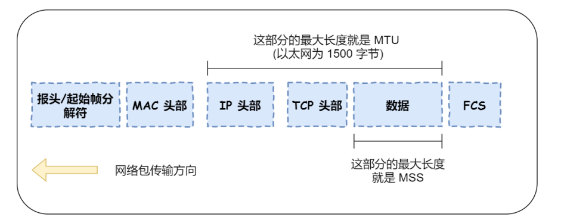
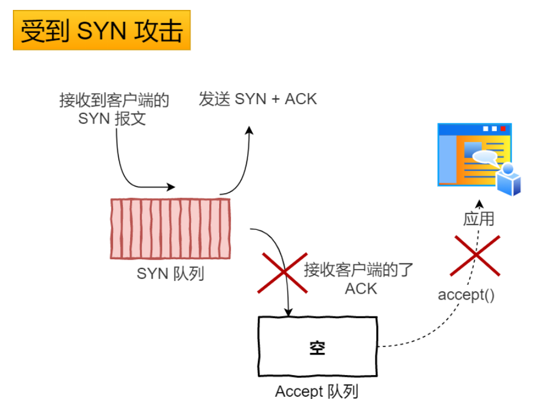
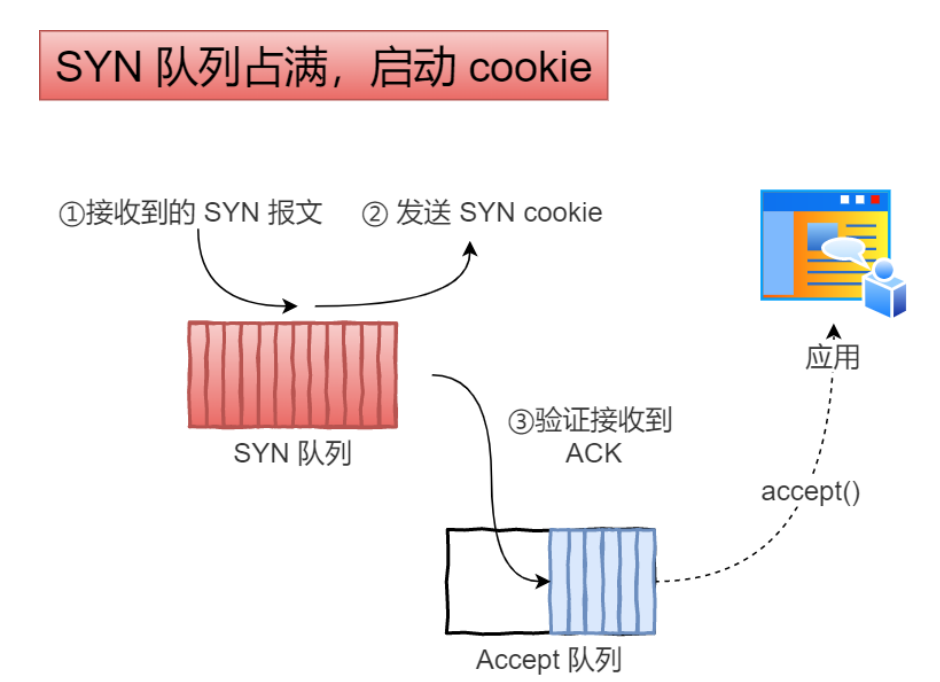

# 1. Linux如何查看TCP状态

```shell
netstat -napt
```

# 2. IP层会分片，为什么TCP层需要MSS



* **MTU**：（**M**aximum **T**ransmission **U**nit）一个IP包允许的最大长度（以太网为1500B），如果IP层发现IP包的大小超过了MTU，就会进行分片
* **MSS**：最大报文段长度——TCP的一个报文段所允许携带的最大数据长度

假设我们有一个很大的数据，如果在IP层进行分片，那么如果一个IP分片丢失，该数据的所有IP分片都需要重传（TCP来做），非常没有效率

所以，为了达到最佳的传输效率，TCP会在建立连接时协商双方的MSS值，如果TCP发现TCP报文段携带的数据超过了MSS，会在TCP层进行分片，如果一个TCP分片丢失，仅需要对该TCP分片重传即可

# 3. SYN攻击与防护

* Server接收到Client的SYN报文段后，会将连接放入半连接队列，如果有一个攻击者，伪造非常多的虚拟IP发出非常多SYN报文段，那么可能会占满Server的半连接队列，导致Server不能正常提供服务
  
  

* **解决方案**
  
  启动 **tcp_syncookies**——net.ipv4.tcp_syncookies=1
  
  
  
  当半连接队列满了后，后续Server收到第一次握手信息后，不会放入SYN队列，而是计算出一个cookie值，放入第二次握手信息的序列号字段中
  
  Server收到第三次握手信息时，会检查其合法性，如果合法才会放入Accept队列

# 4. 如果已经建立了连接，但是客户端突然出现故障了怎么办

TCP有保活机制

如果超过了保活时间，仍没有任何连接相关的活动，TCP保活机制就会开始作用，每隔一段时间，发送一个探测报文，如果连续几个探测报文都没有得到响应，则认为当前的TCP连接已经死亡

* net.ipv4.tcp_keepalve_time=7200（保活时间）
* net.ipv4.tcp_keepalive_intvl=75（保活探测的间隔时间）
* net.ipv4.tcp_keepalve_probes=9（保活探测的次数，如果检测9次还是无响应，那么认为对方不可达，中断连接）

# 5. TCP第一次握手丢包，发生什么

Client会进行超时重传（超时时间随着重传次数的增加而double）

重传次数由/proc/sys/net/ipv4/tcp_syn_retries（默认值为5）决定

# 6. TCP第二次握手丢包了，发生什么

Client会进行超时重传第一次握手信息（重传次数由/proc/sys/net/ipv4/tcp_syn_retries决定）

Server也会超时重传第二次握手信息（重传次数由/proc/sys/net/ipv4/tcp_synack_retries决定）

注意一点，Client每次重传SYN包，Server都会重新发送一个SYN,ACK包，并重置超时计时器

# 7. TCP第三次握手丢包了，发生什么

* Client将第三次握手信息发送后，Client的TCP连接处于Established状态

* Server收不到第三次握手信息，会进行超时重传第二次握手信息（重传次数由/proc/sys/net/ipv4/tcp_synack_retries决定），如果耗尽重传次数还没有成功，那么Server的TCP连接主动断开，但是Client的TCP连接仍然为Established状态

* 后续如果Client向Server发送数据，一定会失败，并进行超时重传（TC建立连接后，数据包的重传次数由/proc/sys/net/ipv4/tcp_retries2决定，默认值15），超过重传次数后，Client的TCP连接也将断开

* 如果Client不向Server发送数据，那么TCP的**保活机制**可以让Client的TCP连接断开
  
  如果超过了保活时间，仍没有任何连接相关的活动，TCP保活机制就会开始作用，每隔一段时间，发送一个探测报文，如果连续几个探测报文都没有得到响应，则认为当前的TCP连接已经死亡
  
  * net.ipv4.tcp_keepalve_time=7200（保活时间）
  * net.ipv4.tcp_keepalive_intvl=75（保活探测的间隔时间）
  * net.ipv4.tcp_keepalve_probes=9（保活探测的次数，如果检测9次还是无响应，那么认为对方不可达，中断连接）
