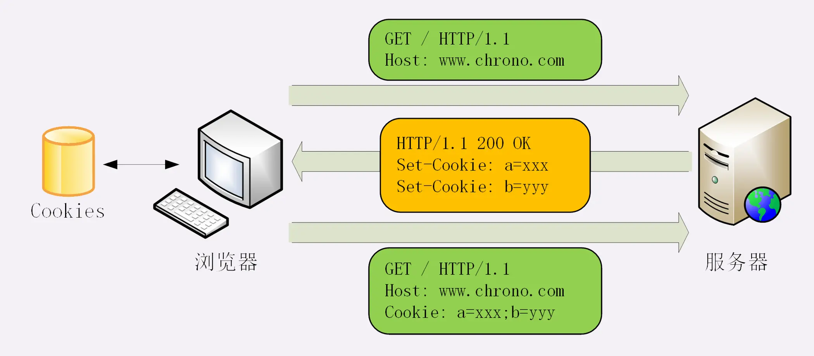

HTTP是无状态协议，但是通过使用**Cookie**，让HTTP有状态

**Cookie是在Client保存用户的状态数据**

* Cookie一般可以用于
  * 身份识别，保存用户的登录信息，实现会话事务
  * 广告跟踪

## Cookie工作流程

Cookie的工作涉及两个字段——请求头字段**Cookie**和响应头字段**Set-Cookie**  

1. 游览器首次访问Web服务器时，请求报文没有**Cookie字段**
2. Web服务器发现游览器没有**Cookie字段**，就知道这是游览器的第一次访问,Web服务器会为游览器生成一个**身份标识**(格式为key=value)，然后放入响应报文的**Set-Cookie**字段
3. 游览器接收到响应报文，看到**Set-Cookie字段**，会把其内容保存到**文件**中，之后的请求都会把该内容加入**Cookie字段**发送给服务器
4. Web服务器发现了Cookie字段，就可以通过其内容识别用户信息   
   （Web服务器可以在响应头中放入多个**Set-Cookie字段**，游览器只需要在请求头的**Cookie字段**中用**分号**隔开即可  



## Cookie属性

响应头的**Set-Cookie字段**可以指定Cookie的一些属性

```aidl
Set-Cookie: favorite=hamburger; Max-age=10; Expires=Fri, 07-Jun-19 08:19:00 GMT;
 Domain=www.chrono.com; Path=/; HttpOnly; SameSite=Strict
```

* **Max-age**（Max-age与Expires同时出现，以Max-age为准）  
  设置Cookie的生存时间，从收到报文开始计时，单位s

* **Expires** 
  设置Cookie的过期时间

* **Domain和Path**
  只要在访问指定的域名和指定的路径时，才会携带Cookie

* **HttpOnly（安全性）** 
  告诉游览器，此Cookie只能通过游览器HTTP协议传输，禁止其他方式访问（防止JS脚本读取Cookie信息）  

* **SameSite（安全性）**
  设置是否可以跨站发送Cookie
  设置成“SameSite=Strict”可以严格限定 Cookie 不能随着跳转链接跨站发送，而“SameSite=Lax”则略宽松一点，允许 GET/HEAD 等安全方法，但禁止 POST 跨站发送。   

* Secure（安全性）
  表示Cookie仅能用于HTTPS协议加密传输，HTTP使用该Cookie会被禁止

## Cookie类型

* Session Cookie：
  
  max-age为负数，该Cookie不会被持久化，不会写入文件，保存在游览器内存中，游览器关闭则消失，Cookie默认的max-age为-1，所以如果没有设置过期时间，那么Cookie是Session Cookie

* 永久性Cookie
  
  max-age>0，或者由expires属性，会持久化到文件中