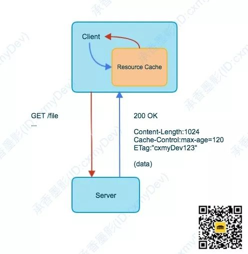
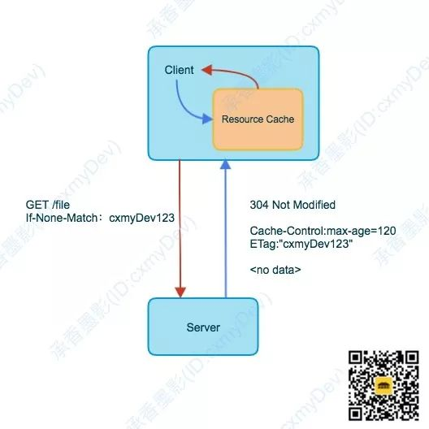

## 1. 缓存策略

* 缓存失效
  
  * Client需要有一个条件来判断当前的缓存是否有效

* 减少读取
  
  * Client判定缓存无效后，会向服务端再次获取数据，但是在一些情况下，服务端上的资源并没有发生变化，但是客户端认为缓存无效，那么此时，应该让服务端通知客户端缓存依然有效，可以继续使用

## 2. HTTP缓存

HTTP缓存主要是通过`header`中的`Cache-Control`和`ETag`来控制缓存的策略

* `Cache-Control`：设定缓存的策略，是否适用缓存，超时时间多少（上古时代还会使用expires来设置过期时间，不过现在已经废弃了，以Cache-Control为准）

* `ETag`：返回数据的验证令牌，下次Client发出请求时携待，让服务端根据ETag来判断Client缓存的数据与服务端上的数据是否一致

### 2.1 只有Cache-Control

1. Server通过Cache-Control告诉Client，可以缓存资源120s，在后续的120s内，如果Client再次请求资源，就直接从自己的缓存中获取即可

2. 超过了120s，Client再次请求资源，那么会重新向Server发送请求

### 2.2 有Cache-Control和ETag

1. Server通过Cache-Control告诉Client，可以缓存资源120s，在后续的120s内，如果Client再次请求资源，就直接从自己的缓存中获取即可

2. 超过了120s，Client在下次请求时，会通过`If-None-Match`这个请求头，将之前服务端传回的ETag值发送给Server，如果该ETag值与Server当前的数据一致，那么表示数据没有发生变化，Server会返回一个**304状态码**，让Client继续使用本地缓存，并刷新超过时间

### 2.3 Cache-Control配置

* **no-cache**和**no-store**
  
  Client每次请求资源，都需要发送网络请求
  
  * **no-cache**：会缓存数据，但每次都会向Server发送请求确认数据是否过期（使用ETag）
  
  * **no-store**：要求Client每次都重新请求数据并下载最新的数据，不做任何缓存

* **public**和**private**
  
  * **public**：表示当前缓存是开放的，任何请求响应的中间环节，都可以对其进行缓存（默认）
  
  * **private**：当前响应是针对单个用户的，并非通用数据，因此不建议任何中间缓存对其进行缓存
