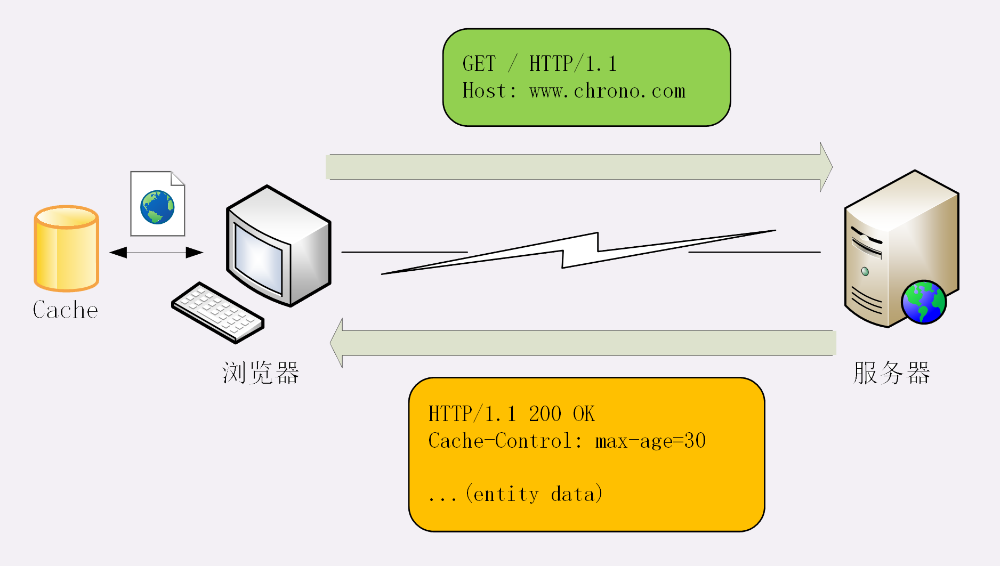
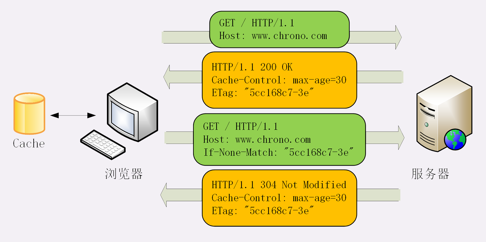

**Cache-Control——请求头，响应头**   
有以下的值  
* max-age=XXX   
生存时间，从响应报文生成开始计算(响应报文的响应头中的Date字段)，单位s   
* no_stroe   
不允许缓存
* no_cache  
可以缓存，但是每次使用前必须向服务器验证是否过期，是否有最新版本
* revalidate  
可以缓存，如果没过期可以直接使用，如果过期了，需要向服务器验证
***

**Cache-Control单独使用**  

1. 游览器检查缓存，未发现，首次访问某个URL请求资源
2. Web服务器返回响应报文，并附有**Cache-Control字段**来表示缓存策略  
   * max-age=x   
    下次再通过URL请求资源，会检查缓存是否过期  
     * 没过期就从Disk读取
     * 过期——向服务器请求最新的资源
   * no_stroe   
    不允许缓存，每次都向服务器请求最新的资源
   * no_cache  
    下次再通过URL请求资源时，需要向服务器**验证**
   * revalidate   
    下次再通过URL请求资源时，会检查缓存是否过期  
     * 没过期——从Disk读取
     * 过期——向服务器**验证**
     **特殊的情况**
* 点击刷新，会再次发送一次请求报文——请求头加上**cache-control: max-age=0**   
  表示游览器要取得最新的资源，会无视缓存，向游览器请求最新的资源
* 按下"Ctrl+F5"强制刷新，会再次发送一次请求报文——请求头加上**cache-control: no-cache**   
  同上，看Web服务器怎么理解
* 进行"前进"，"后退"等操作，是直接从Disk读取缓存

***

**Cache-Control与条件请求同时使用，条件请求与304相关**   
* 条件请求相关字段
    * 响应头字段  
      * last-modify 
      * ETag
    * 请求头字段
      * If-None-Match
      * If-Modified-Since

1. 游览器检查缓存，未发现，首次访问某个URL请求资源
2. Web服务器返回响应报文，并附有**Cache-Control字段**来表示缓存策略，
   并可以带有**last-modify字段**或者**ETag字段**来使用条件请求，
   游览器会缓存**last-modify字段**或者**ETage字段**的值A  
   
3. 再次向Web服务器请求资源时，请求报文会带上**If-None-Match字段**或者**If-Modified-Since字段**
  值为响应报文**last-modify**的值，或者**ETage**的值
4. 服务器会通过**If-None-Match字段**或者**If-Modified-Since字段**的值来检查资源是否发生更新，如果无更新，返回304，并带有新的**last-modify**或**ETage**
5. 游览器看到304，就会从Disk读取缓存，然后更新存储的**last-modify值**或**ETage值**

