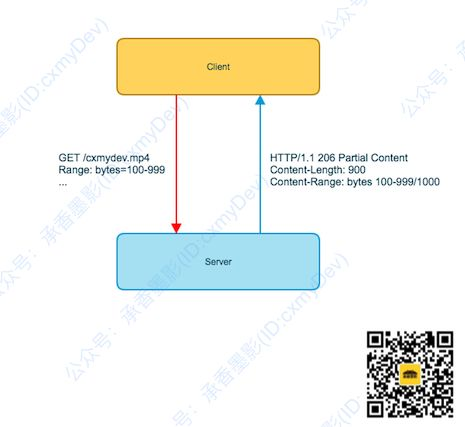
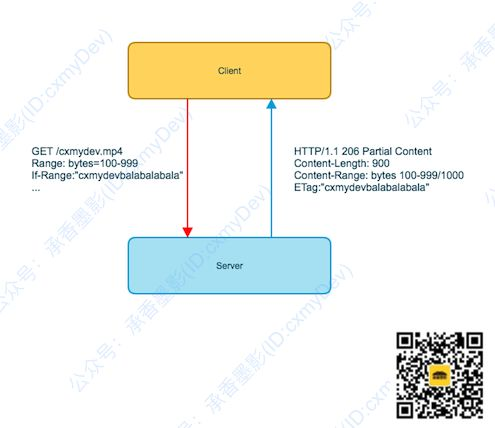

HTTP范围请求——针对较大文件的下载或者上传，在一个HTTP请求中可以仅操作文件的一部分

* **应用**
  
  * **断点续传**——下载文件95%后，网络断了，重新下载时只需要加载剩余5%即可
  
  * **多线程下载**——开启多个线程，每个线程下载文件的某一段，然后在本地拼接成一个完整文件

## 支持范围请求

HTTP1.1后才支持范围请求，通过Response Header中的`Accept-Ranges`来标记是否支持范围请求，仅有一个可选参数`bytes`

```
Response Headers:
    Accept-Ranges: bytes
```

## 使用范围请求

* 将文件以字节为单位进行分割，让HTTP支持请求该文件[n,n+x]范围内的资源

* HTTP在Request Header中有一个`Ranges`来指定请求数据的范围
  
  * `500-1000`：指定开始和结束位置，适用于多线程下载
  
  * `500-`指定开始区间，一直传递到结束，适用于断点续传，在线播放等
  
  * `-500`无开始区间，只需要最后500字节的内容

* 即使Request Header中使用了`Ranges`，在Response Header中也需要使用`Content-Range`来标记数据的范围，还需要使用`Content-Length`来标记这次传输的数据量，HTTP响应状态码是**206Partial Content**
  
  ```
  Content-Length: 900 #这次传输了900字节的数据
  Content-Range: bytes 100-999/1000 #传输100-999的内容，总大小是1000
  ```




## 资源变化

在HTTP范围请求中，可以在Request Header中使用`If-Range`来判断请求的资源是否发生变化，`If-Range`可以使用`ETag`或者`Last-Modified`

* 如果资源没有发生变化，那么Server会返回206

* 如果资源发生了变化，Server会返回200，让Client从头下载




