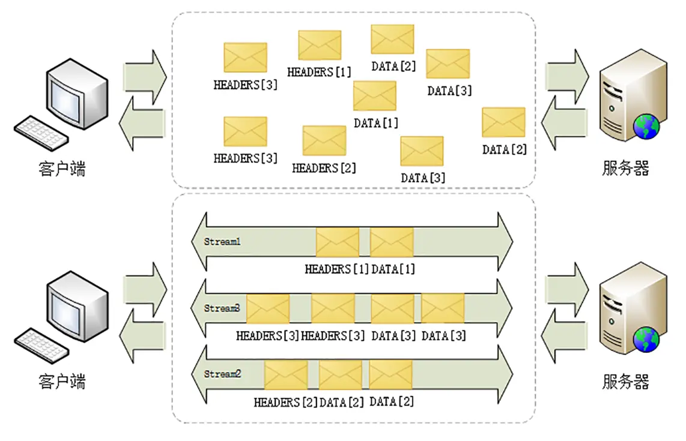

HTTP/2兼容HTTP/1

* 把HTTP分为**"语义"**和**"语法"**
  * 语义——不做修改，语HTTP/1一致
  * 语法——巨大改变


------

## 以下为HTTP/2的改变

* **头部压缩**

  HTTP/1只能对body压缩

  HTTP/2对头部进行压缩，使用压缩算法——"HPACK"算法，包含三个部分
  
  * **静态字典**
  * **动态字典**
  * **Huffman编码**


* **二进制格式**

  HTTP/2全面采用二进制，把Header+Body的报文结构转变为一个个二进制帧，把二进制帧交由TCP传输

  把原来Header+Body的报文——转变为**数个小片的二进制"帧"**

  

  * HEADERS Frame——存放header数据
  * 多个DATA Frame——存放body数据

  

  **二进制帧结构**

  

  * 帧长度：该二进制帧的大小
  * 帧类型：该二进制帧的类型
    * 数据帧
      * HEADERS帧
      * DATA帧
    * 控制帧
      * SETTINGS
      * PING
      * PRIORITY
  * 标志位：携带简单的控制信息——END_HEADERS表示头数据结束，END_STREAM表示单方向数据发送结束
  * 流标识符：表明该二进制帧所属的流


* **流与多路复用**——解决**队头阻塞**问题

  **流**——**二进制帧的双向传输序列**  

  * 客户端向服务器发起请求(或者服务器向客户端发起请求)，该请求-响应过程的数据传输是在一个"流"中进行的

  * 每个流都有自己的流ID，该流中所有的二进制帧共同享有该流ID

  * 一个流中，二进制帧的收发有序的，将二进制帧按照顺序组合在一起就是HTTP/1的报文

  * 流是可以并发的，一个HTTP/2连接上，可以同时有多个流传输数据，不同流之间是无序的——多路服用，解决了**队头阻塞**问题

  * 客户端和服务器都可以主动创建流，向另一方发起通信——**支持服务器推送**

    

  


**连接前言**

TCP握手，TLS握手后，Client必须发送一个"连接前言"，用来建立HTTP/2连接

连接前言是HTTP/1的报文,请求方法是**PRI**，服务器收到这个报文，后面的交流就都使用HTTP/2

```
PRI * HTTP/2.0\r\n\r\nSM\r\n\r\n
```


