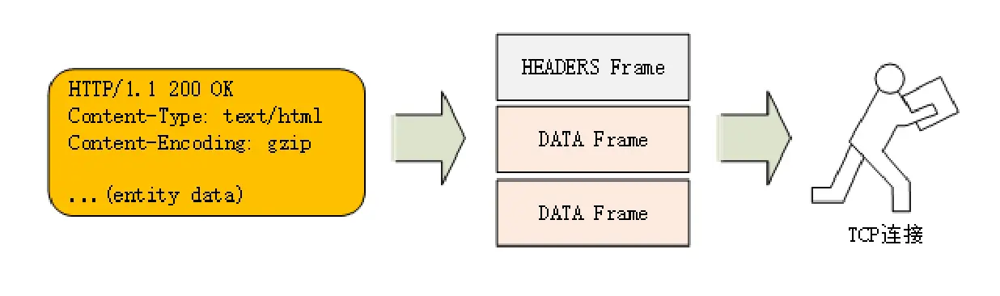

## 1. 头部压缩

HTTP/1只能对body压缩

HTTP/2可以对头部压缩，使用压缩算法——HPACK（静态字典，动态字段，哈夫曼编码）

## 2. 二进制协议

HTTP/2采用二进制协议，把报文结构拆分成一个个二进制帧，把二进制帧交给TCP传输

### 二进制帧的结构

1. **帧长度**：二进制帧的大小

2. **帧类型**：二进制帧的类型
   
   * 数据帧
     
     * header frame（存放header）
     
     * data frame（存放body）
   
   * 控制帧
     
     * settings frame
     
     * ping frame
     
     * priority frame

3. **标志位**：携带简单的控制信息
   
   > END_HEADERS表示报文的header结束

4. 流标识符：表示二进制帧所属的流

## 3. 流

* 通过流实现**多路复用**和**服务器推送**，并且解决HTTP/1的**队头阻塞问题**

* **流——二进制帧的双向传输序列**
1. Client与Server的通信，数据都是在一个流中传输的
2. 每个流都有自己的流ID，该流中所有的二进制帧共享该ID
3. 一个流中，二进制帧的收发是有序的，将二进制帧按顺序组合就是HTTP报文
4. 流可以并发，同时可以存在多个流，可以通过流实现**多工模式**，Client同时发送多个请求，Server同时处理多个请求，避免**队头阻塞问题**
5. Client和Server都可以主动的创建流，可以实现服务端推送

