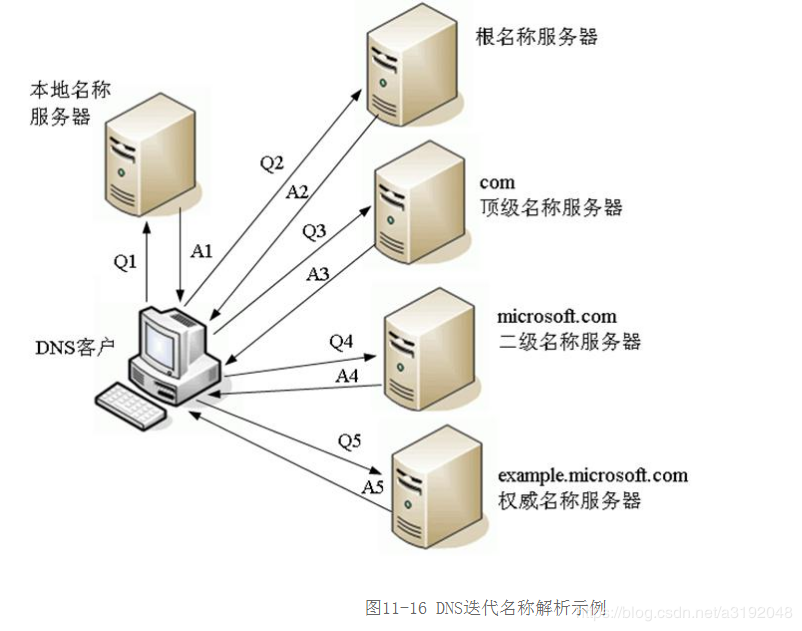

## 1. DNS系统

* **根域名服务器**
  
  管理顶级域名服务器IP（返回"com"等顶级域名服务器的IP）

* **顶级域名服务器**
  
  管理各自域名下的权威域名服务器的IP(com顶级域名服务器返回apple.com权威域名服务器的IP)

* **权威域名服务器**
  
  管理自己域名下主机的IP

* 本地域名服务器（许多公司，网络运营商会建立自己的DNS服务器，作为用户**DNS查询的代理**，可有**缓存**功能）

* 操作系统也会对DNS解析结果**做缓存**

* 另外，操作系统还有一个hosts文件，存储有DNS记录

## 2. 递归查询

## 3.迭代查询

1. 游览器先查询自己的缓存，没有就进行2
2. 先查询操作系统对DNS记录的缓存，没查到进行3
3. 接下来查找操作系统中的hosts文件中是否有对应的DNS记录，没找到进行4
4. 分为递归查询和迭代查询
5. 将DNS查询请求交由**本地域名服务器**进行代理，本地域名服务器查询自己的缓存，没找到进行5
6. 将查询到的结果缓存到OS缓存和游览器缓存

## 4.域名使用

* **重定向**
  
  域名不变，但是IP任意变动，当主机下线时，可更改DNS记录，让域名指向其他主机，保证服务不中断

* **基于域名实现负载均衡**
  
  * 一个域名可以解析得到多个IP——一个域名对应多台服务器，Client收到多个IP后，可以采用轮询算法依次向服务器发送请求

## 5.域名攻击

* **域名屏蔽**
  
  对域名不解析，返回错误

* **域名劫持**（域名污染）
  
  解析A的域名，返回B的

## 6. DNS优化

1. 减少DNS查询——游览器缓存，OS缓存，本地DNS服务器缓存

2. DNS预获取——尝试在请求资源之前解析域名

3. 延长DNS缓存时间

4. 使用CDN加速
