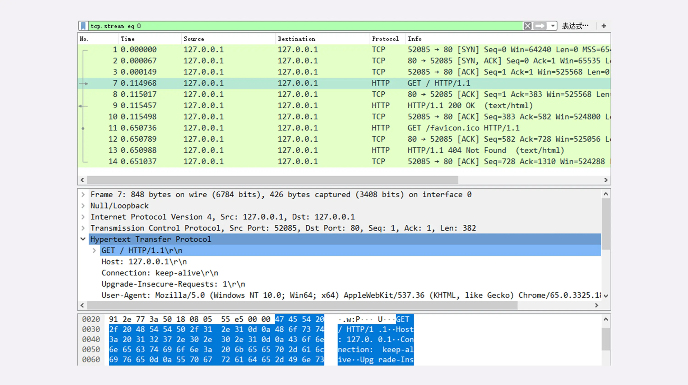
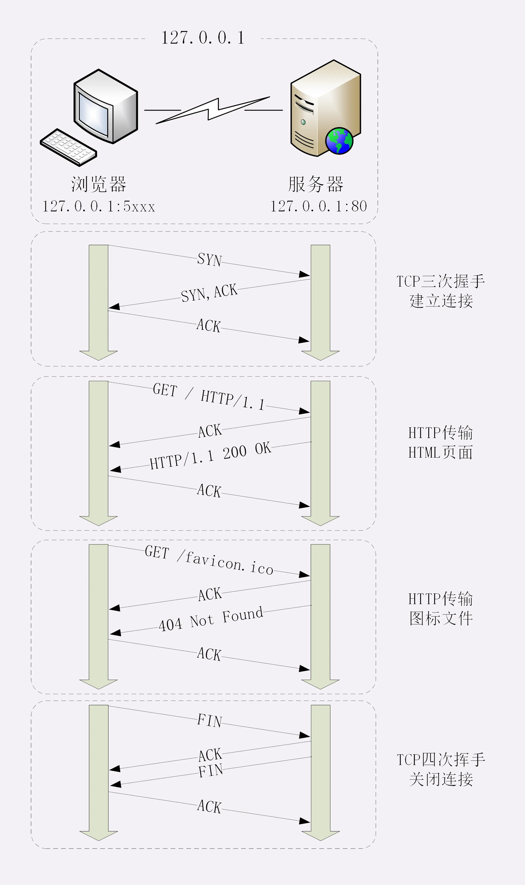
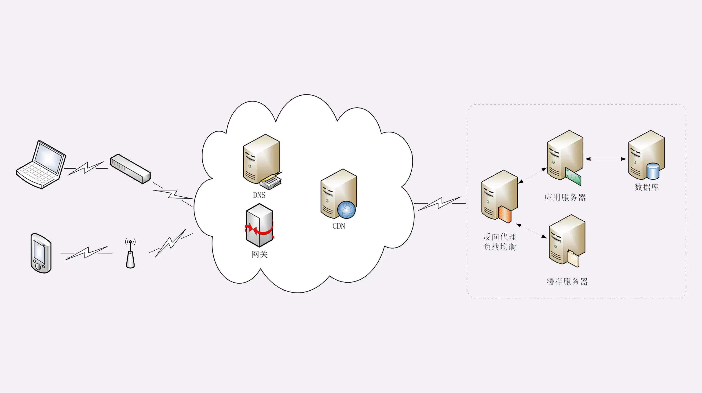

端口52082是游览器的端口，80是web服务器的端口

**只看Http**

* 客户端发送Http请求报文
* Web服务器返回Http响应报文

**全过程**

1. 先判定请求的内容是否被缓存并且缓存是否过期，如果没过期，就从disk读取，否则开始以下流程（cache-controller）
1. 从URL中获取Web服务器的IP和端口号（DNS）
2. 与Web服务器建立TCP连接（三次握手）
3. 游览器向Web服务器发送Http请求报文（底层走的是TCP）
4. Web服务器收到请求后会**先返回一个TCP确认数据报（ACK=1）**，在TCP协议层面确认——刚才的报文我已经收到了
5. Web服务器解析Http请求，对请求进行处理
6. Web服务器向游览前发送Http响应报文（底层走的还是TCP）
7. 游览器接受到响应后，**返回一个TCP确认数据报（ACK=1）**，在TCP协议层面确认——你的响应报文我收到了
8. 游览器解析报文，渲染输出页面
9. 因为HTTP/1.1之后默认是长连接，所以这里没有出现四次挥手，如果没有请求了，可以选择通过"四次挥手"断开连接

**游览器访问的可能不是真的Web服务器**

游览器发出的请求有可能是不会到达Web服务器的，也就是说你以为游览器再跟Web服务器通信，但其实游览器并不是在跟Web服务器通信

* CDN(Content Delivery Network内容分发网络)

  DNS解析域名的时候，CDN可能会插上一脚，导致DNS解析出来的可能是CDN服务器的IP，而不是目标网站的实际IP，因为CDN会缓存网站的大部分资源（CDN无法缓存动态资源），所有请求就不用发到目标网站，CDN就可以响应你的请求

* 复杂的系统

  目标网站对外表现的是一个IP，但内部或许是一个复杂的架构

  

