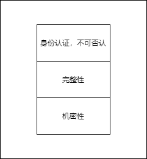
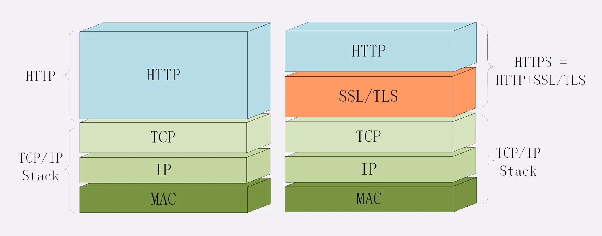

**通信安全**
 
下面的性质是上面的性质的基础

1. 机密性
   他人看不到明文，只能看到乱码
2. 完整性
   组织他人篡改，者他人篡改后可以发现异常
3. 身份认证
4. 不可否认

**什么是HTTPS**
HTTPS就是HTTP增加了上述的四个安全特性，默认端口号443
  

HTTP收发报文——调用SocketAPI
HTTPS收发报文——调用专门的安全接口
SSL：Secure Sockets Layer
TLS：Transport Layer Security 

SSL：安全套接字，一种用于加密和验证client和server之间发送的数据的协议