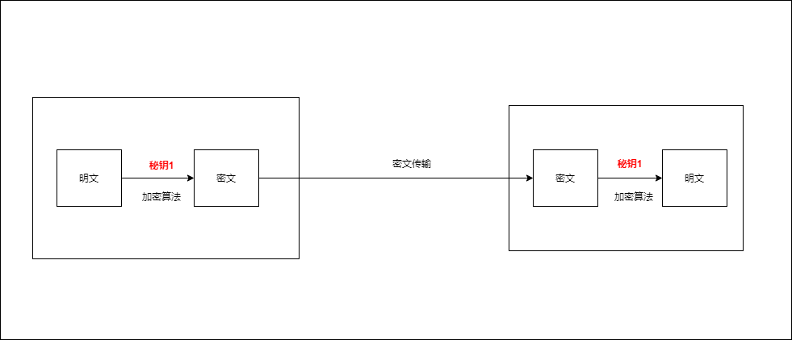
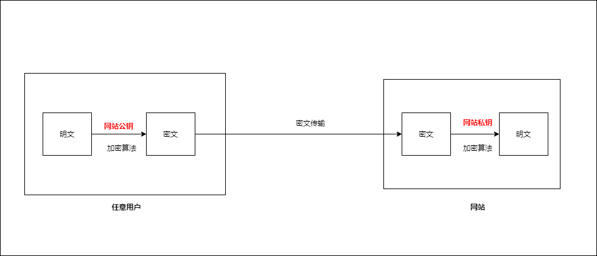
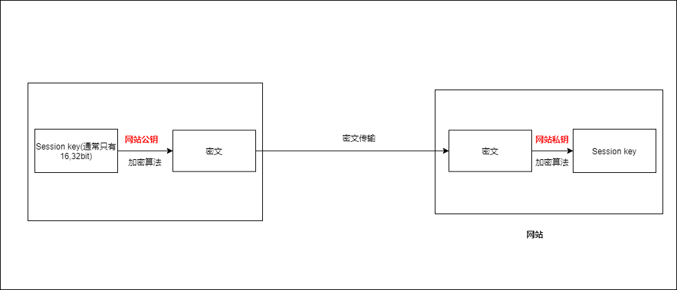

## 1. 对称加密

加密过程和解密过程使用同一个秘钥
对称加密算法

* AES
* ChaCha20     

对称加密缺点   

* 通信的双方需要约定对称秘钥，对称秘钥会在网上"裸奔"
  

## 2. 非对称加密

两把秘钥，一把公钥，一把私钥   

* 公钥：公开给任何人使用  
* 私钥：自己使用，严格保密   
* 解密单向性  
  * 公钥加密，只能用私钥解密 
  * 私钥加密，只能用公钥解密    
1. 网站可以在网站任意分发公钥  
2. 用户用公钥加密明文，发送给网站
3. 只有持有私钥的网站可以解密，黑客无法破解    

非对称加密算法   

* DH
* DSA
* RSA
* ECC  

非对称加密缺点  

* 性能差  

## 3. 混合加密

TLS使用**混合加密**，以下为混合加密的抽象过程，并非TLS的使用方法

1. Client首先需要先获得Server的公钥（公钥一般是通过CA获得，不可以直接跟Server获取，因为直接从Server获取有中间人调包的风险）

2. 用户用随机数生成**对称加密**使用的Session key

3. 用网站公钥对Session key加密，然后发送给网站

4. 网站拿到密文后，用网站私钥解密，得到Session key 

5. 后续的通信，使用Session key作为**对称秘钥**进行**对称加密**
      
