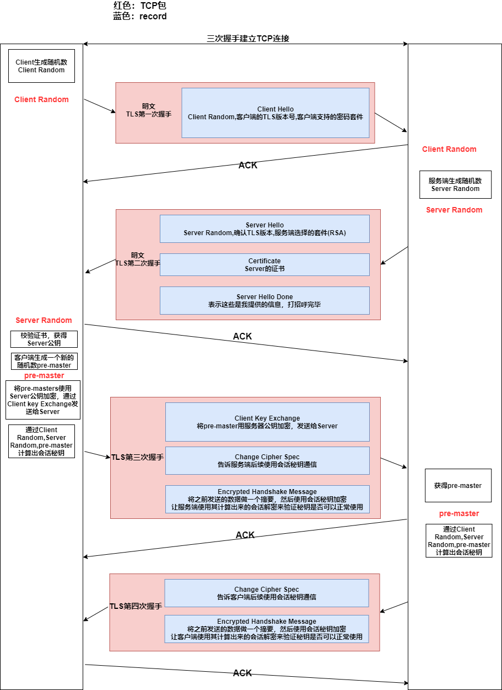

到了这里我们已经实现了四大安全通信，但还有一个问题——**公钥的信任问题**   
谁都可以发布公钥，如何判断这个公钥就是用户的或者网站的公钥？   
为了解决这个问题——我们引入**CA(Certificate Authority证书认证机构)**，由CA对公钥签名，用CA的信誉保证公钥是可信的 

# 1. TLS协议的子协议

* 记录协议

  规定了TLS收发数据的基本单位——记录(record)

  多个record可以在一个TCP包内一次性发出，并且不需要返回ACK

* 警报协议

  向对方发出警报信息

* 握手协议

* 变更密码规范协议

# 2. TLS协议的工作原理

## 2.1 前提

服务器已经向CA申请了证书

## 2.2 工作流程概述

1. 握手——建立连接
   * TCP握手
   * TLS握手——使用的密码套件不同，会有一些细微的差别
     * ECDHE握手（主流）
     * RSA握手（传统）

2. 通信

* TLS握手中，通信的基本单位是 **record**，多个record可以在一个TCP包中一起发送

## 2.3 ECDHE握手详解

### ECDHE算法

* 双方确定好使用哪种曲线和曲线上的基点G
* A方生成一对随机公钥和秘钥A_secret和A_pub，B方生成一对随机公钥和秘钥B_secret和B_pub，双方交换公钥
* A方持有A_secret和B_pub；B方持有B_secret和A_pub
* 双方利用各自持有的参数进行计算，可以得到**共享秘钥**

## 2.4 RSA握手详解

## 2.5 ECDHE和RSA的不同点

1. **ECDHE**可以 **抢跑**，TLS第三次握手结束后就可以开始发送HTTP报文了，不需要等待TLS第四次握手

2. ECDHE的pre-master是通过客户端随机生成的客户端椭圆曲线公钥和私钥，服务端随机生成的服务端椭圆曲线公钥和私钥，通过ECDHE算法计算来的，其中的椭圆曲线公钥**可以明文传输**

   RSA的pre-master是Client随机生成的，必须**用Server公钥加密传输**
