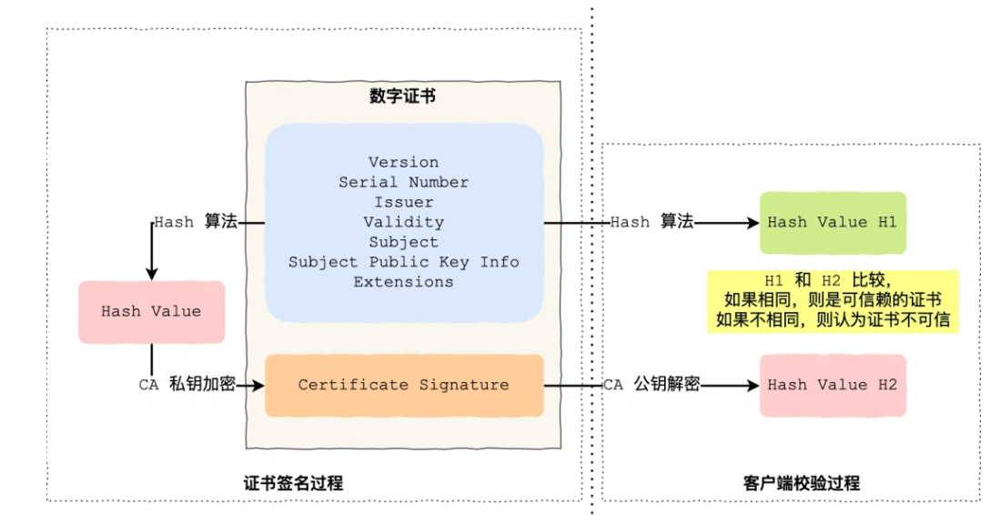
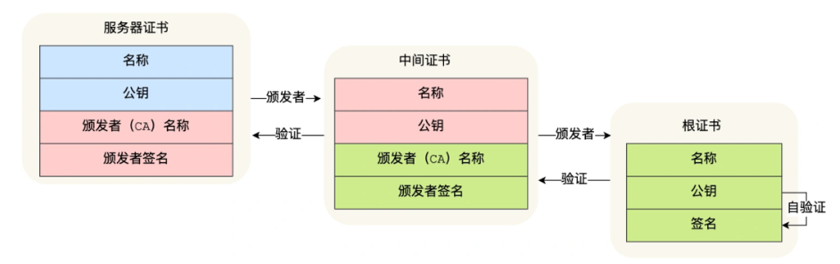

## 证书的作用

证书是为了解决公钥的信任问题——Client如果确定收到的公钥一定是Server的公钥

* Server的公钥不可以直接传递给Client，会有公钥被中间人调包的问题

* 所以我们需要第三方证书机构

## 证书包含的内容

* 明文
  
  * 申请者的公钥
  
  * 申请者的组织信息，个人信息
  
  * 证书机构的信息
  
  * 有效时间

* 数字签名——通过摘要算法对上面的明文信息进行计算，获得摘要字符串，然后使用CA的私钥对摘要字符串进行加密获得

## 证书的使用

1. Client向Server发出请求，Server返回证书

2. Client读取证书中的明文信息，利用相同的摘要算法进行计算，获得摘要，然后将CA中的数字签名通过CA的公钥解密，与计算得到的摘要进行对比，如果一致，就说明证书合法

## 证书信任链

