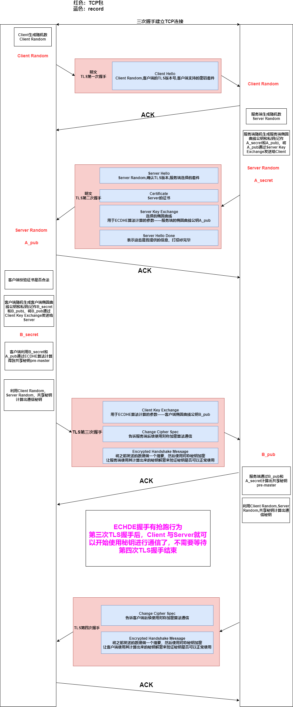
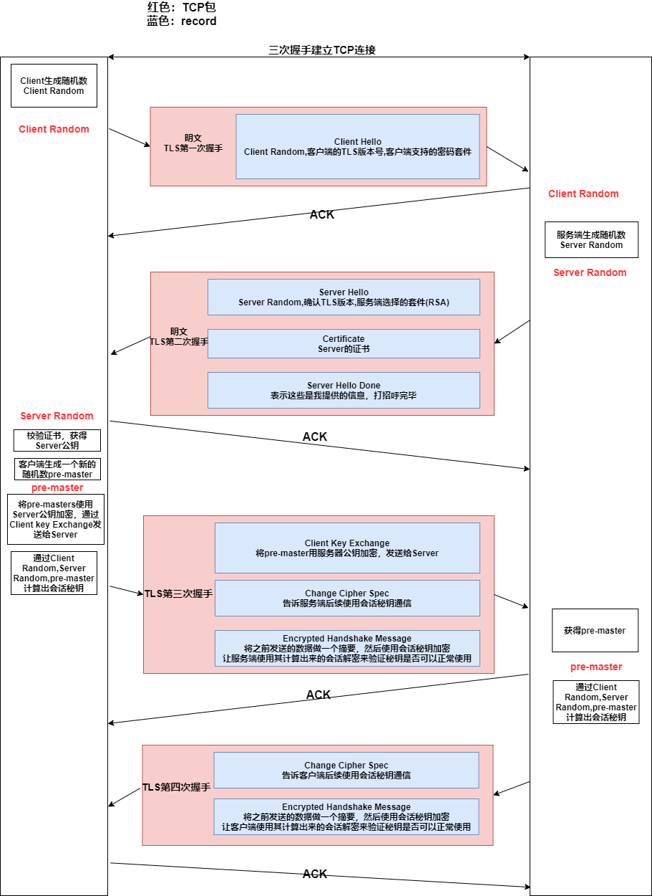
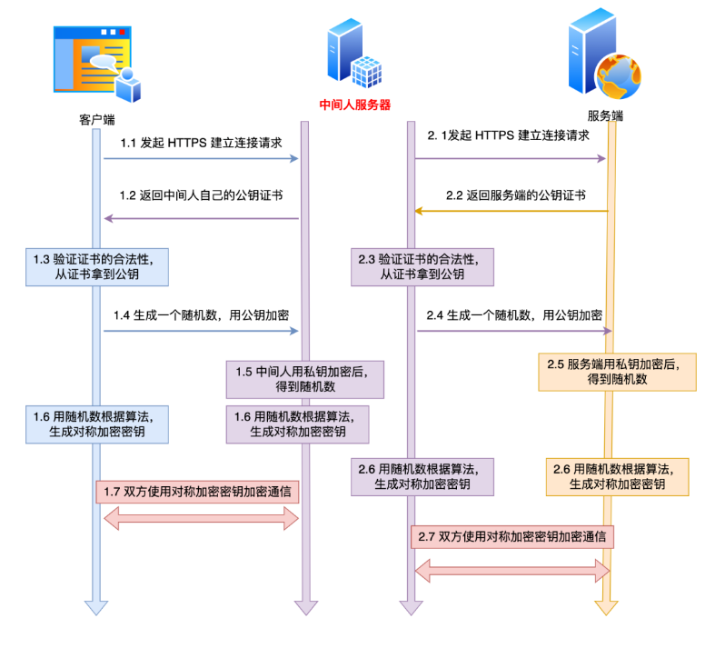

# 1. TLS协议的子协议

* 记录协议
  
  规定了TLS收发数据的基本单位——记录(record)
  
  多个record可以在一个TCP包内一次性发出，并且不需要返回ACK

* 警报协议
  
  向对方发出警报信息

* 握手协议

* 变更密码规范协议

# 2. TLS协议的工作原理

## 2.1 前提

服务器已经向CA申请了证书

## 2.2 工作流程概述

1. 握手——建立连接
   
   * TCP握手
   * TLS握手——使用的密码套件不同，会有一些细微的差别
     * ECDHE握手（主流）
     * RSA握手（传统）

2. 通信
   
   * TLS握手中，通信的基本单位是 **record**，多个record可以在一个TCP包中一起发送

3. 密码套件
   
   * 密钥协商算法（ECDHE）
   
   * 签名算法
   
   * 对称加密算法
   
   * 摘要算法

## 2.3 ECDHE握手详解

### ECDHE算法

* 第一次握手结束后，服务端会进行以下操作
  
  1. 生成Server Random
  
  2. 选定一个椭圆曲线（选好了椭圆曲线现相当于椭圆曲线基点G也定好了），并随机生成椭圆曲线公钥和秘钥，在第二次握手时，会将选定的椭圆曲线和随机生成的公钥发送给Client

* 第二次握手结束后，双方就共享了以下信息
  
  * 选定的椭圆曲线，椭圆曲线基点G
  
  * Client Random
  
  * Server Random
  
  * 服务端生成的椭圆曲线的公钥

* 第二次握手结束后，Client进行以下操作
  
  1. 校验证书，确定服务端的身份
  
  2. Client为椭圆曲线随机生成公钥和秘钥，在第三次握手时，会将这个公钥会发送给Server
  
  3. Client使用选定的椭圆曲线，椭圆曲线基点G，Server为椭圆曲线生成的公钥，Client为椭圆曲线生成的私钥，计算出pre-master
  
  4. 使用pre-master，Client Random，Server Random计算出真正的会话秘钥

* 第三次握手结束后，Server获得了Client为椭圆曲线生成的秘钥，计算出pre-master，然后计算出真正的会话秘钥

## 2.4 RSA握手详解

## 2.5 ECDHE和RSA的不同点

1. **ECDHE**可以 **抢跑**，TLS第三次握手结束后就可以开始发送HTTP报文了，不需要等待TLS第四次握手

2. ECDHE的pre-master是通过客户端随机生成的客户端椭圆曲线公钥和私钥，服务端随机生成的服务端椭圆曲线公钥和私钥，通过ECDHE算法计算来的，其中的椭圆曲线公钥**可以明文传输**
   
   RSA的pre-master是Client随机生成的，必须**用Server公钥加密传输**

# 3. HTTPS一定安全吗

* Client通过游览器向Server发送请求时，被假基站转发给了中间人服务器（如下图）

* 这种情况下，中间人可以获得Client和Server之间的通信内容

* 但是发生这种场景是有前提的——用户点击接受了中间人服务器的证书（中间人服务器伪造的证书可以被游览器识别出来是非法的，会提示用户）

* 所以HTTPS从原理上是安全的，但是可能由于**用户的错误操作**或者是**被恶意导入伪造的根证书**导致信息泄漏

