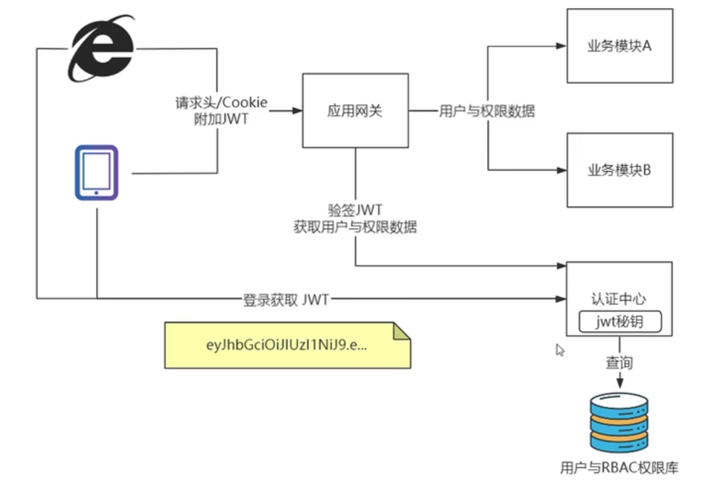
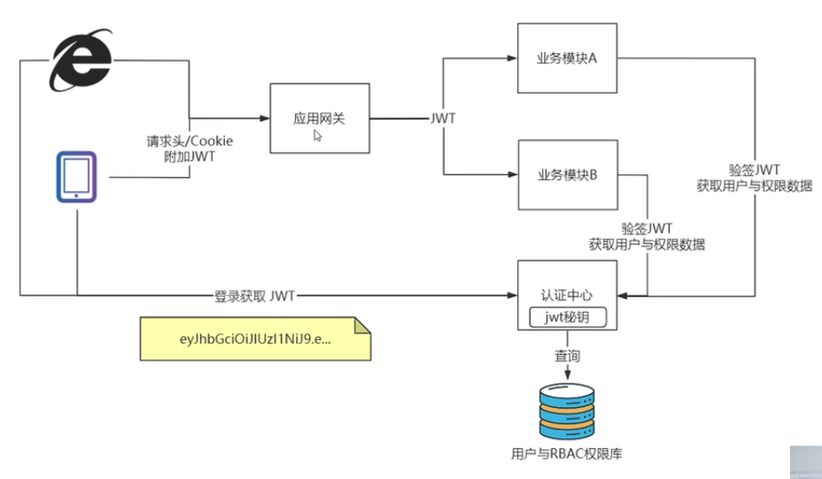
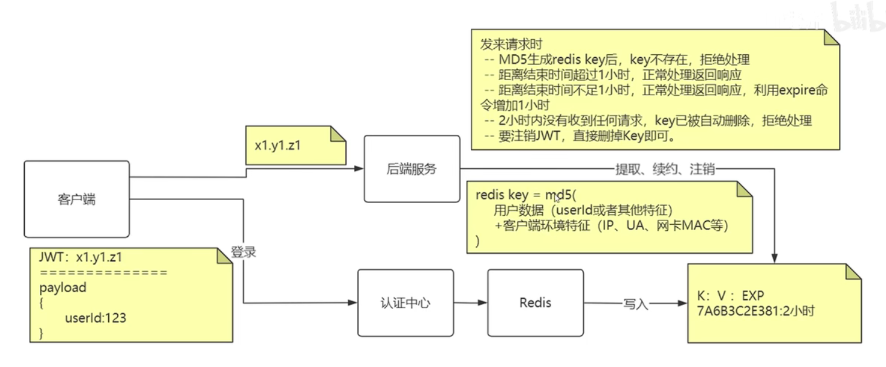
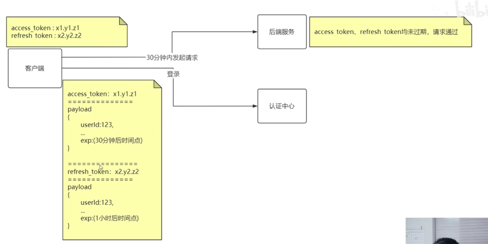
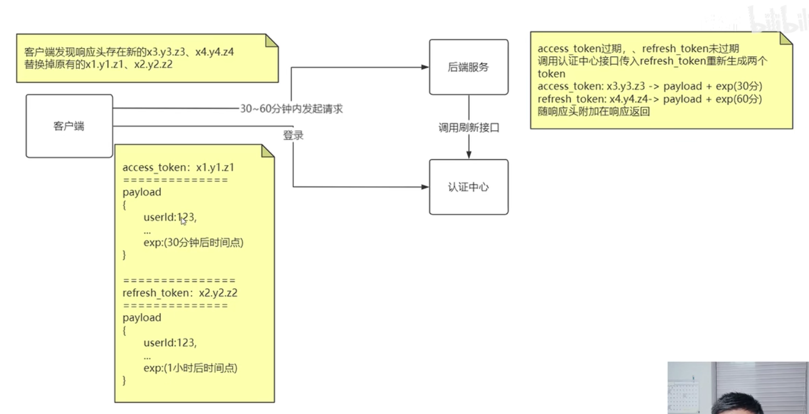

## 1. **Session实现登录**

1、用户向服务器发送用户名和密码。

2、服务器验证通过后，在当前对话（session）里面保存相关数据，比如用户角色、登录时间等等。

3、服务器向用户返回一个 session_id，写入用户的 Cookie。

4、用户随后的每一次请求，都会通过 Cookie，将 session_id 传回服务器。

5、服务器收到 session_id，找到前期保存的数据，由此得知用户的身份。

* **问题**

  如果服务由服务器集群提供的话，就必须共享Session数据


## 2. Token认证的优势

* **无状态**

  Token自身包含了身份验证所需的信息

* **有效避免了CSRF攻击**

* **适合移动端应用**

* **单点登录友好**


## 3. JWT介绍

JWT——Java Web Token

JWT是一个经过加密的，包含用户信息的，具有时效性的固定格式字符串

用户向auth服务器进行登录，auth服务器生成一个JSON对象

```json
{
  "姓名": "张三",
  "角色": "管理员",
  "到期时间": "2018年7月1日0点0分"
}
```


服务器为JSON生成一个JWT，如下

```
eyJ0eXAiOiJKV1QiLCJhbGciOiJIUzI1NiJ9.
eyJmcm9tX3VzZXIiOiJCIiwidGFyZ2V0X3VzZXIiOiJBIn0.
rSWamyAYwuHCo7IFAgd1oRpSP7nzL7BF5t7ItqpKViM

```
JWT用.分成三个部分

* **Header** 

  解析后是一个JSON对象啊，通常如下结构（Header就是该对象用Base64算法转成的String）

  ```json
  {
      "alg": "HS256",
      "typ": "JWT"
  }
  ```

  * alg：生成签名的算法，默认为HMAC SHA256(写成HS256)
  * typ：表示token的类型，JWT的typ一律为 "JWT"

* **Payload**

  解析后也是一个JSON，存储实际需要传递的数据（Payload就是该对象用Base64算法转成的String）

  JWT规定了7个官方字段，除此之外，可以自定义一些字段

  * iss(issuer)：签发人
  * exp(expiration time):过期时间
  * sub(subject)：主题
  * aud(audience)：受众
  * nbf(Not Before)：生效时间
  * iat(Issued At)：签发时间
  * jti(JWT ID)：编号

* **Signature**

  对Header和Payload的签名，防止数据篡改

  首先要指定一个秘钥，秘钥只有服务器知道，然后使用Header指定的签名算法,

  利用该算法和秘钥，对Header和Payload进行计算，得到Signature


>生成的JWT发送给用户，用户之后访问服务器都带上JWT (Header',Payload',Signature')，服务器利用秘钥和Header'中指定的算法，对Header'和Payload‘进行计算得到 Signature''，只要signature’‘跟signature’相同，就能确认用户的身份,如果signature''与signature'不相同，就会返回401


## 4. JWT实现权限认证

###  4.1 统一认证



### 4.2 应用认证




## 5. JWT续签

* JWT必须有过期时间，但JWT不建议设置长时有效期
* JWT应该可以续签，但是续签JWT必须有退出机制（不能无限续签）


### 5.1 不改变Token实现续签

 

### 5.2 允许改变Token实现续签

* 认证中心给客户端2个token——access_token和refresh_token，两个token除了过期时间不同，其他都相同


* 30分钟内访问

  

* 30-60分钟内访问

  调用刷新接口，让认证中心重新生成2个Token返回给客户端，替换原本的2个Token

  

* 60分钟后访问

  两个token都过期了，让用户重新登陆  


>为什么需要2个Token？
>
>access_token——用于与业务系统交互，是核心数据
>
>refresh_token——用于向认证中新获取新的access_token和refresh_token
>
>用户超过30min后，access_token失效，此时access_token无法被认证中心解析，而refresh_token还未失效，并且存储的信息与access_token一致，因此被送达认证中心后可以被正确解析，进而生成新的access_token和refresh_token


#### 存在问题——重复生成JWT

假设在access_token过期后，refresh_token过期前，客户端进行如下操作


会出现2种问题

* q1将q2的access_token和refresh_token全都覆盖掉（可以接受）
* q1将q2的access_token和refresh_token中的一个覆盖掉（不可以接受）


#### 解决方法

* 认证中心设计一个Map——只记录过去n秒的（key=原始jwt，value=新生成的jwt）
* 如果发现相同的原始jwt在n秒内再次请求，从Map中取出value返回
