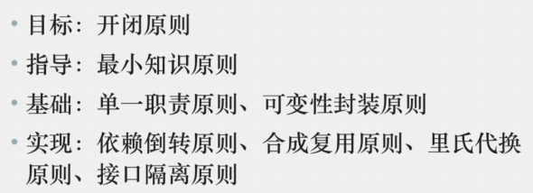
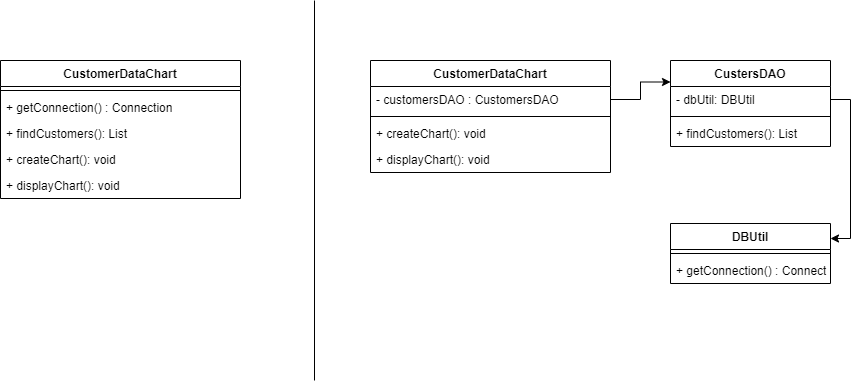
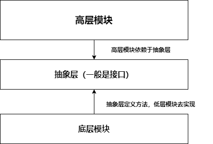
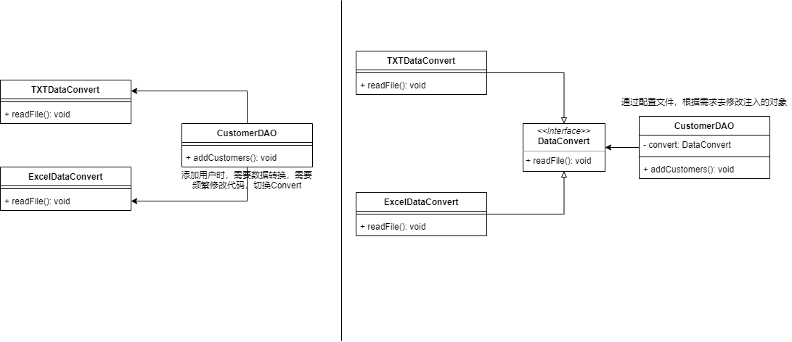
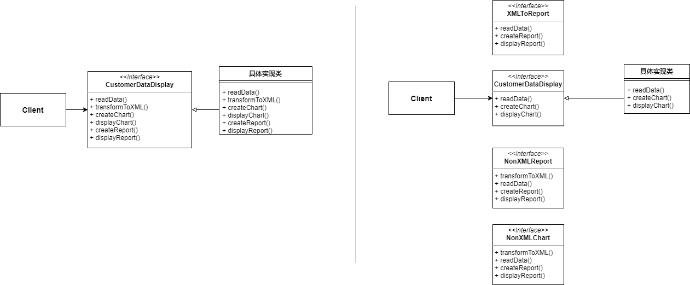
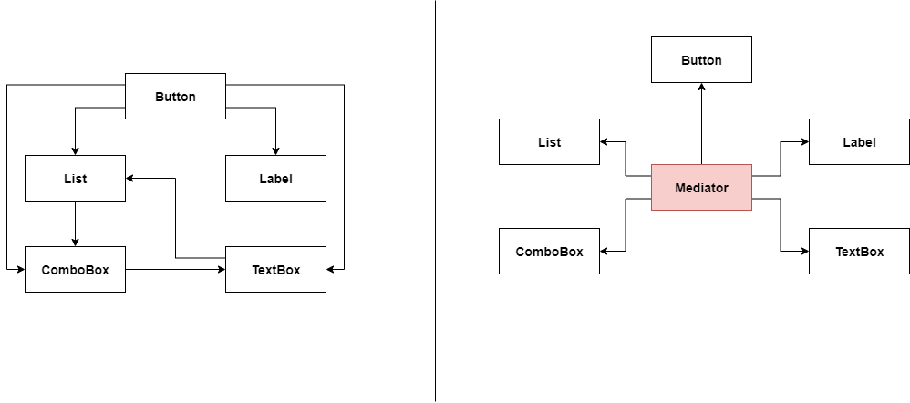

| 设计原则名称 | 定义                                      |
|:------:|:---------------------------------------:|
| 单一职责原则 | 一个对象应该只包含单一的职责                          |
| 开闭原则   | 对扩展开放，对修改关闭                             |
| 里氏代换原则 | 所有引用父类的地方可以透明的使用其子类的对象                  |
| 依赖倒置原则 | 高层模块不应该依赖低层模块，应该依赖抽象，抽象不应该依赖于细节，细节依赖于抽象 |
| 接口隔离原则 | 客户端不应该依赖那些它不需要的接口                       |
| 合成复用原则 | 优先使用组合，而不是继承来达到复用的目的                    |
| 最少知识原则 |                                         |

## 1. 单一职责原则

* **Single Responsibility Principle**

* 一个对象应该只包含单一的职责，并且职责被完整地封装在一个类中

* 一个类承担的职责越多，它被复用的可能性越小

* 一个类承担多个职责时，相当于这些职责耦合到一起，当其中一个职责发生变化时，可能会影响其他职责的运作

## 2. 开闭原则

* Open-Closed Principle

* 软件实体应该对拓展开放，对修改关闭

* 让系统可以灵活的拓展，而无需修改已有的代码

* 抽象化是开闭原则的关键——提供一个抽象层，将具体代码实现放在实现层，使用者只会创建抽象层引用，如果需要修改行为逻辑，无需修改抽象层，直接在实现层增加新的实现类即可

## 3. 里式替换原则

* Liskov Substitution Principle

* 所有使用父类对象的地方必须可以透明地使用其子类

* 在使用父类对象的地方都可以使用其子类对象

* 在定义引用时——尽量时候父类(接口)进行定义，运行时再确定其为某个子类类型

* 运用里式替换原则——我们应该将父类设计为 **抽象类or接口**，让子类去实现其中的方法；在使用时，声明父类引用，运行时用子类对象去替换父类对象（这样，如果需要增新的功能，可以通过增加一个新的子类实现，然后在父类引用处替换对象即可）

## 4. 依赖倒置原则

* Dependency Inversion Principle

* 高层模块不应该依赖低层模块，而应该依赖于抽象；抽象不依赖于细节，细节依赖于抽象

* 依赖倒置原则要求 **面向接口编程**
  
  

* 依赖倒置原则要求程序代码尽量使用**抽象层类型**——使用接口和抽象类来进行变量声明，方法参数声明，方法返回类型声明

* 依赖倒置原则**针对抽象层**进行编程，具体的实现类通过依赖注入来使用——如果需要对逻辑进行修改，增加一个新的实现类注入即可

* 这个重构过程中使用了 **开闭原则**，**里式替换原则**，**依赖倒置原则**
  * 开闭原则是目标
  * 里式替换原则是基础
  * 依赖倒置原则是手段

## 5. 接口隔离原则

* Interface Segregation Principle

* 客户端不应该直接依赖那些它不需要的接口

* 将大接口分割为**多个更细小的接口**，使用接口的客户端只需要知道与之相关的方法即可

* 每个接口承担一种独立的角色

* 为客户端提供尽可能小的接口，确保每个接口使用起来都承担某一个角色

## 6. 合成复用原则

* Composite Reuse Principle

* 优先使用对象组合来达到复用，而不是继承

* 使用继承实现复用——如果父类发生改变，子类中的实现也会发生改变

* 使用组合实现复用——将已有的对象引入新对象中，新对象可以调用已有的对象的功能，已有对象发生改变，对新对象影响不大

## 7. 最少知识原则(迪米特法则)

* Law of Demeter

* 定义
  
  * Don't talk to strangers(不要与陌生人讲话)
  * Talk only to your immediate friends(只与你的直接朋友通信)
  * 每一个软件单位只需要对与自己密切相关的其他单位有少量知识即可

* 尽量减少对象之间的交互，如果两个对象之间不应该发生直接交互，可以**引入第三者做转发**

