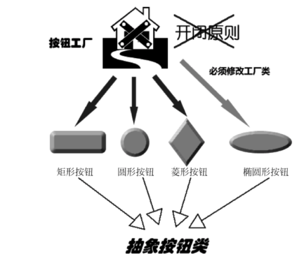
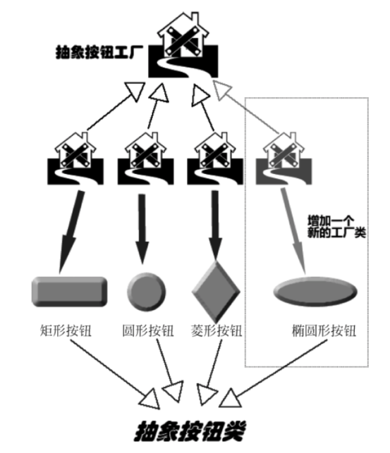
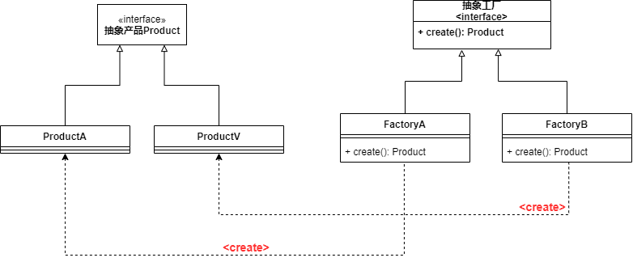
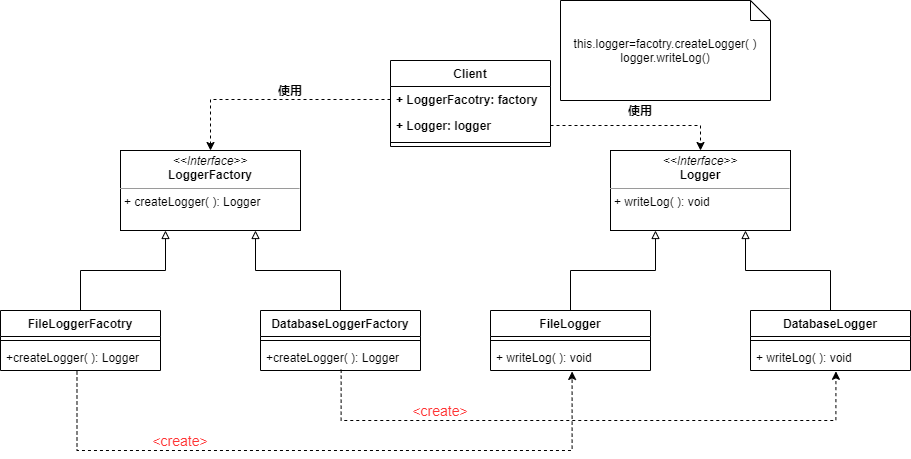

## 简单工厂模式的缺点

在**简单工厂模式**中，如果需要添加一个新的产品，那么除了创建新的产品类外，还需要修改工厂类中的代码——违背了开闭原则

比如我们现在有一个按钮工厂，用于生产按钮实例（圆形按钮，矩形按钮，菱形按钮），现在我需要增加椭圆形按钮，那么除了需要增加这个类之外，还需要改动工厂类的代码




但是**工厂方法模式**——可以在不修改原有代码的情况下增加新的产品，如下图

我们定义一个抽象工厂，每种类型的按钮都有一个专门的子工厂来生产，如果我们需要添加椭圆形按钮，只需要实现一个新的工厂+椭圆形按钮类即可




## 工厂方式模式实现



* 定义一个抽象工厂
* 一个工厂生成一个具体的产品

```JAVA
public interface ButtonFacotry{
    BUtton create();
}

public class CycleButtionFactory implements ButtonFacotry{
    @Override
    public Product create(){
        return new ProductA();
    }
}

public class TriangleButtonFactory implements ButtonFacotry{
    @Override
    public Product create(){
        return new ProductB();
    }
}

public interface Button{
    
}

public class CycleButton implements BUtton{
    
}

public class TriangleButton implements BUtton{
    
}
```


## 工厂方法模式应用实例

程序的日志记录器需要通过多种方式保存系统的日志——通过保存在文件中，也可以保存在数据库中，让用户在配置文件中通过配置选择日志记录器




## 工厂方法模式的优点

1. 工厂方法向Client隐藏了哪种具体产品将被实例化，用户只需要关心所需产品对应的工厂即可，无需关心创建细节，甚至无需知道具体产品类的名称
2. 在系统需要加入新产品时，无需修改已有代码，只需要添加新的产品和新的工厂即可


## 工厂方法模式的适用场景

如果需要创建**同一类产品的不同产品实例**（例如需要创建电脑，但是有台式电脑，win本，Mac等），此时适合适用工厂方法模式
