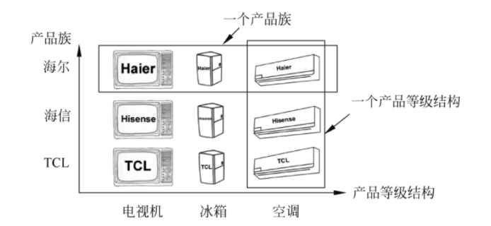
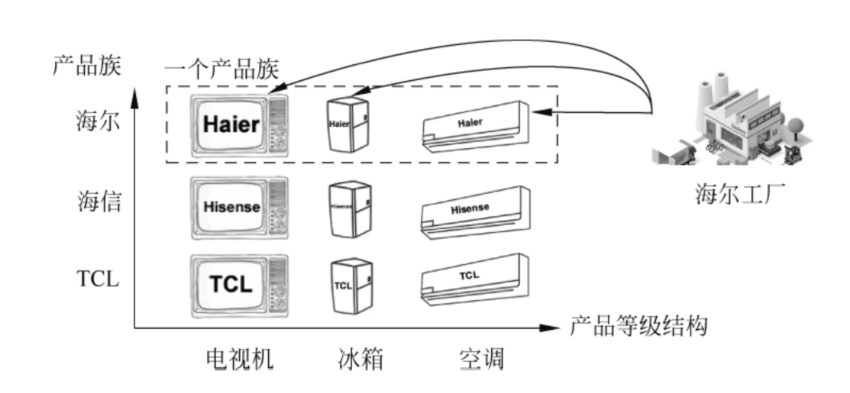
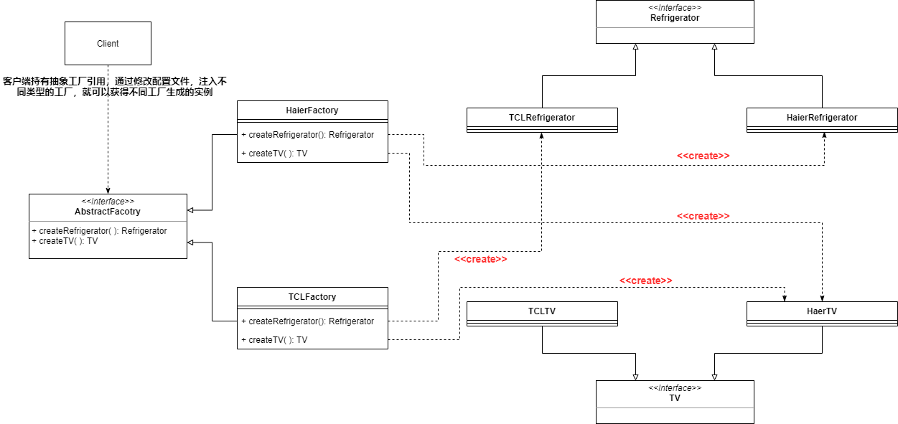
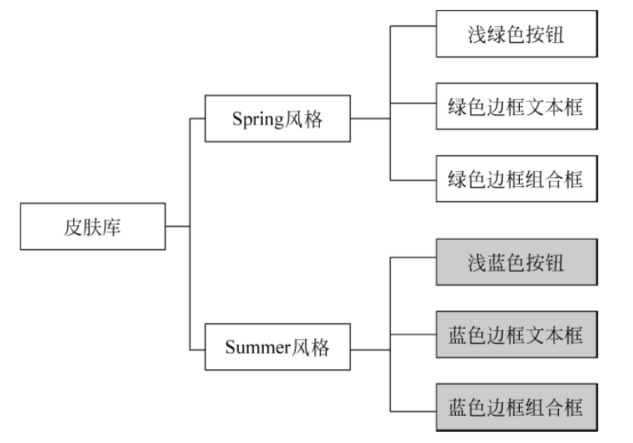
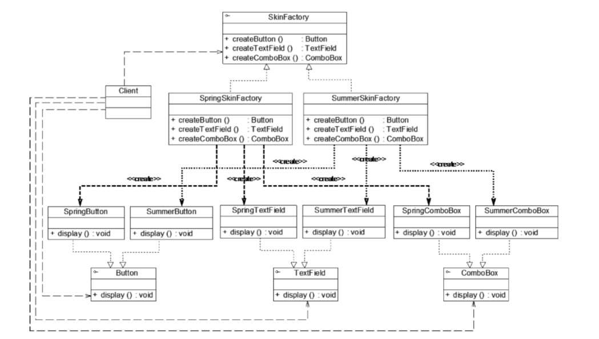

* 抽象工厂模式中一个具体的工厂可以生产一组相关的产品

* 产品等级结构：同一类产品的不同产品实例（一个抽象和多个子类，例如抽象类电视机，其子类有海尔电视机，海信电视机，TCL电视机）

* 产品族：多个不同类产品（海尔电视机，海尔冰箱，海尔空调）

  

* 工厂方法模式——针对同一类产品的不同产品实例（一个产品等级结构），一个具体的工厂生产一个具体的产品

* 抽象工厂模式——针对多个的类产品（多个产品等级结构），让一个具体的工厂可以生产一个产品组

  

#### 抽象工厂模式的定义

提供一个可以创建一系列 相关的对象(相互依赖的对象)的接口，无需指定具体的类

#### 抽象工厂模式的实现

#### 抽象工厂应用实例

需要开发一款皮肤库，提供两种风格——Spring风格，Summer风格

通过抽象工厂模式来实现

#### 抽象工厂模式的缺点——开闭原则的倾斜性

* 在抽象工厂模式中**添加新的产品族**很容易——创建新的工厂子类和新的产品子类即可
* 在抽象工厂模式中**添加新的产品类型**很麻烦——需要在抽象工厂和工厂子类中添加新的方法

#### 抽象工厂模式优点

1. 抽象工厂模式隔离了具体类的生成，使得Client并不需要知道什么被创建——更换一个具体工厂变得容易
2. 一个具体的工厂生产一个产品族——保证Client始终只使用同一个产品族中的对象
3. 增加新的产品族十分容易

#### 抽象工厂模式缺点

1. 增加新的产品类型十分麻烦

#### 抽象工厂模式适用场景

1. 一个系统不应当依赖产品实例如何被创建，组合和表达的细节——让用户无须关心对象的创建过程，将对象的创建和使用解耦
2. 系统中有多种类型的产品，形成多个产品族
3. 系统后续不会增加新类型的产品，只会增加新的产品族