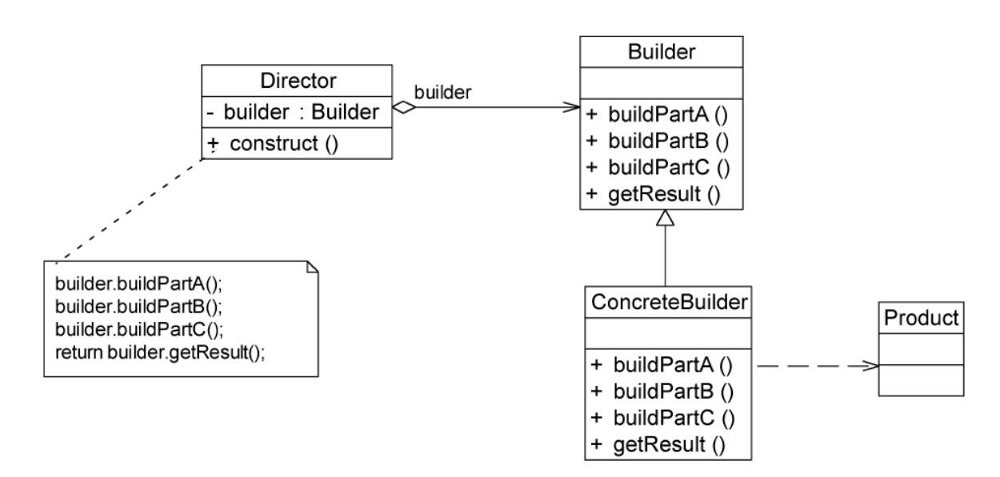
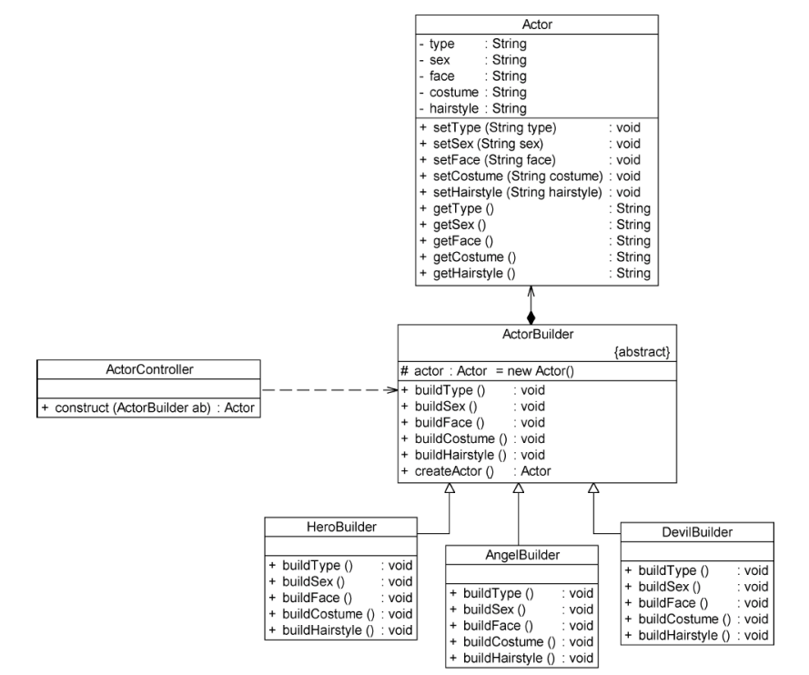

* 一个复杂的对象由多个不同的组件组装而成，将这些组件进行组装，才能得到这个复杂的对象（电脑是一个复杂对象，由主板，内存，磁盘，CPU等组件，将这些组件组装后才能得到电脑）


* 1. 建造者模式——**将这些组件和组件的组装过程分开**

  2. 建造者中负责安排组件的组装顺序，将组件组装成复杂对象，用户只需要关心建造者会返回什么类型的复杂对象，不需要关心这个复杂对象有哪些组件，这些组件是如何组装的

  3. 用户只需要知道什么样的构造者可以创建什么样的复杂对象，然后只需要指定建造者的类型，就可以获得该建造者构建出来的复杂对象


#### 建造者模式结构

1. Builder（抽象建造者）——抽象接口，定义了**各种组件的创建方法**（buildPartX()），**将组件拼装为复杂对象的方法**
2. ConcreteBuilder（具体建造者）——实现抽象建造者
3. Product——复杂的产品，包含多个组件
4. Director（指挥者）
   * 隔离Client与复杂对象的创建过程（Client通过Director，指定**具体的构造者**，就可以获得**对应的复杂对象**，不需要关心这个对象如何组装的）
   * 指挥者控制复杂对象的创建过程——组件的创建顺序，如果将组件组装成复杂对象
   * 指挥者其实也可以省略，**将Director与抽象建造者合并**，但这种方法加重了抽象建造者的职责

（电脑导购是Director，电脑组装人员是构建者，我们只需要确定需要的电脑类型，电脑导购就会通知电脑组装人员拼装电脑）



```java
public class Product{//复杂对象
    private String partA;//组件A
    private String partB;//组件B
    private String partC;//组件C
}

public abstract class Builder{ //抽象构建者
    private Product product=new Product();
    public abstract void buildPartA();//定义创建组件A的方法
    public abstract void buildPartB();//定义创建组件B的方法
    public abstract void buildPartC();//定义创建组件C的方法
    
    public Product getResult(){//拼装组件，返回复杂对象的方法
        product;
    }
}

public class ConcreteBuilder extend Builder{}//具体构建者

public class Director{
    private Builder builder; //由客户端指定具体的构建者
    
    public Product construct(){
        builder.buildPartA();
        builder.buildPartB();
        builder.buildPartC();
        return builder.getResult();
    }
}
```


#### 构建者模式运用例子

一个游戏内，需要创建游戏角色（复杂对象）——角色由 性别，脸型，衣服，发型等组件构成



* Actor：复杂产品
* ActorBuilder：抽象构建者
* ActorController：指挥者

Client持有ActorController的引用，指定不同类型的Builder，就可以创建出不同的角色


#### 建造者模式优点

1. 在建造者模式中，Client不必知道产品的内部的组成细节（不需要知道产品有哪些组件，这些组件如何组建成产品），讲产品的创建与产品的使用解耦
2. 每一个具体构建者实现一个复杂产品，与其他构建者无关，客户端可以很方便的通过更换构建者获得不同的产品


#### 建造者模式适用环境

1. 需要的产品有复杂的内部结构（例如包含很多需要特殊处理的成员变量）
2. 产品内部的属性相互依赖，需要指定赋值顺序