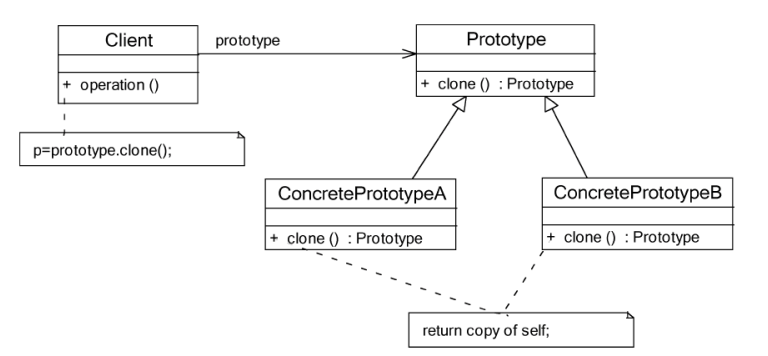
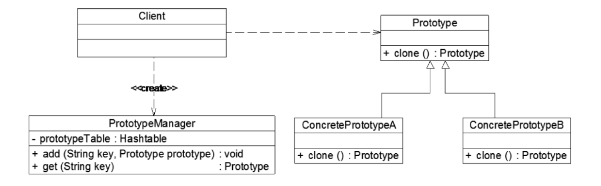

* 原型模式——使用原型实例，通过复制原型实例来创建新对象
* 原型模式克隆出来的是全新的对象，在内存中拥有新的地址，克隆对象都是独立的

#### 原型结构实现

* Prototype（抽象原型类）：声明克隆方法的接口
* ConcretePrototype（具体原型类）：实现抽象原型类中声明的克隆方法，返回一个自己的克隆对象
* 使用原型模式时，注意浅拷贝和深拷贝的区别，Java提供的clone()默认是浅拷贝



```JAVA
public abstract class Prototype{
    public abstract Prototype clone();
}

public class ConcretePrototype extends Prototype{

    @Override
    public Prototype clone(){
        Prototype prototype=new ConcretePrototype();
        return prototype;
    }
}
```

#### 原型管理器



```java
public class PrototypeManager{
    private Map<String,Prototype> prototypeTable=new HashMap<>();
    public PrototypeManager(){
        prototypeTable.put("A",new ConcretePrototypeA());
        prototypeTable.put("B",new ConcretePrototypeB());
    }

    public Prototype get(String key){
        Prototype prototype= prototypeTable.get(key);
        if(prototype!=null){
            return (Prototype)prototype.clone();
        }
        return null;
    }
}
```

#### 原型模式优点

1. 如果创建新的对象比较复杂，使用原型模式可以简化对象的创建过程，通过复制一个已有实例可以提高新实例的创建效率

#### 原型模式适用场景

1. 创建新对象的成本比较大，并且新对象可以通过复制已有对象来获得
2. 系统要保存对象的状态，并且对象的状态变化很小