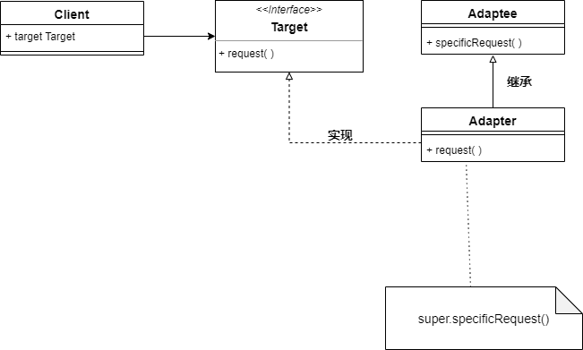
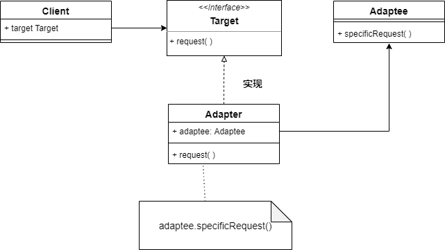
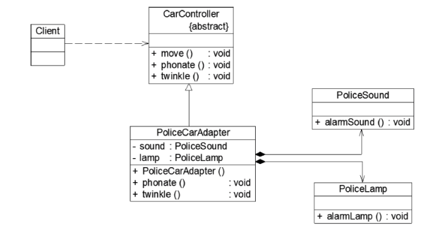
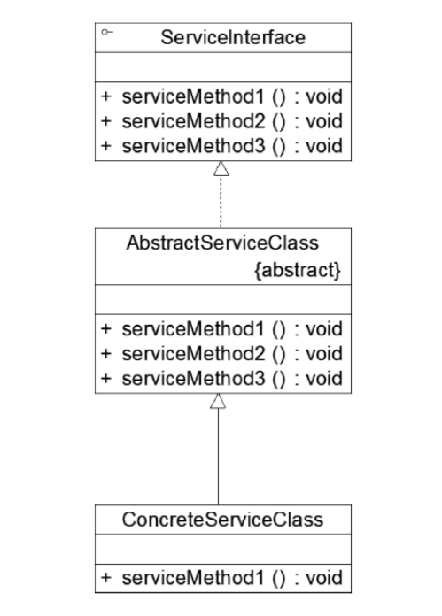
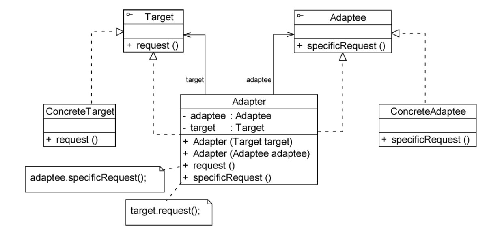

* 适配器的实现就是把客户类的请求转化为对适配者接口的调用，客户端使用适配器提供的接口，适配器内部会调用适配者的接口，客户端不直接访问适配者（例如，变压器是适配器，插头插在变压器提供的充电口上，变压器内部调用的是220V电源的接口）
* 适配器模式可以让原本因为接口不兼容而不能一起工作的两个类协同


### 适配器模式实现

* **Target**：定义客户端需要的接口
* **Adaptee**：被适配的角色，一个已经存在的接口，包含了客户希望使用的业务代码，但是由于接口不兼容，无法使用
* **Adapter**：适配器类，调用Adaptee的接口，作为一个转换器，对Apaptee和Target进行适配


#### 类适配器

* 客户端持有Target的引用，无法直接调用Adaptee中的方法
* Target的实现类实Adapter，**Adapter继承自Adaptee**，在request()中调用了Adaptee中的方法
* 客户端通过Target引用，注入Adapter对象，即可调用Adaptee的方法逻辑



```java
public class Adatper extends Adaptee implements Target{
    @Override 
    public void request(){
        super.specificRequest();
    }
}
```


#### 对象适配器

* 客户端持有Target的引用，无法直接调用Adaptee中的方法
* Target的实现类实Adapter，**Adapter持有Adaptee的引用**，在request()中调用了Adaptee中的方法（转发调用）
* 客户端通过Target引用，注入Adapter对象，即可调用Adaptee的方法逻辑



```java
public class Adpater extends Target{
    private Adaptee adaptee;//持有一个对适配者对象的引用
    
    @Override
    public void request(){
        adaptee.secificRequest();//转发调用
    }
}
```


### 例子

现在要开发一款儿童汽车，儿童汽车能灯光闪烁和声音提示，之前已经实现了警灯闪烁和警笛音效，想复用这些代码再儿童骑车上，但是儿童汽车使用的接口与警车的接口不兼容



```java
public abstract class CarController{
    public void move(){
        System.out.println("玩具汽车移动");
        
        public abstract void phonate();//发出声音
        public abstract void twinkle();//灯光闪烁
    }
}

public class PoliceCarAdapter extends CarController{
    private PoliceSound sound;//定义是配置PoliceSound对象
    private PoliceLamp lamp;  //定义适配者PoliceLamp对象
    
    @Override
    public void phonate(){
        sound.alarmSound();//调用适配者PoliceSound的方法
    }
    
    @Override
    public void twinkle(){
        lamp.alarmLamp();  //调用适配者类PoliceLamp的方法
    }
}
```


### 缺省适配器

* 不需要实现一个接口提供的所有方法时，可以先设计一个抽象类实现该接口，并为接口中的每个方法提供一个默认实现——该抽象类的子类可以选择性地覆盖父类的某些方法来实现需求，而不需要实现接口中的所有方法
* **ServiceInterface**：适配者接口，通常声明大量方法
* **AbstractServiceClass**：缺省适配器类，使用空方法实现了再ServiceInterface接口中声明的方法
* **ConcreteServiceClass**：缺省适配器类的子类，选择性覆盖再AbstractServiceClass中定义的方法




### 双向适配器

适配器中同时包含对目标类的引用和对适配者的引用——目标类可以通过适配器调用适配者的方法，适配者也可以通过适配器调用目标类的方法



```java
public class Adapter implements Target,Adaptee{
    private Target target;
    private Adaptee adaptee;
    
    @Overrode
    public void request(){
        adaptee.specificRequest();
    }
    
    @Override
    public void specificRequest(){
        target.request();
    }
}
```


### 适配器模式的优点

1. 将现有接口转换为客户类期望的接口，实现代码复用
2. 将目标类和适配者类解耦，通过引入一个适配器类来重用现有的适配者类，无需修改原有结构
3. 灵活性和拓展性都非常好，通过使用配置文件可以很方便地更换适配器，也可以再不修改原有代码地基础上增加新的适配器类
4. 一个适配器可以将多个不同地适配者适配到同一个目标类中

