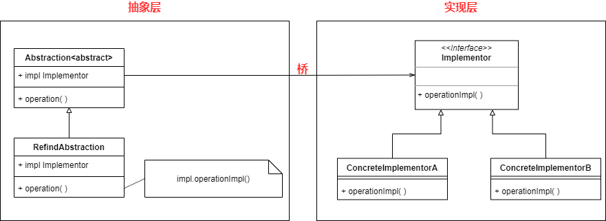
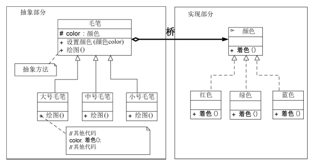
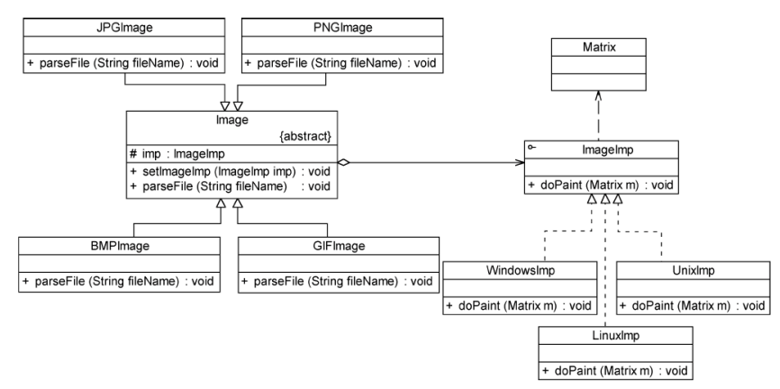

* 如果系统中的某个类存在两个独立变化的维度——通过桥接模式将这两个维度分离出来，使二者可以独立拓展

  ```
  蜡笔，颜色和型号是两个不同的变化维度，每种型号都有12种颜色，那么我们每增加一种型号，就要增加该型号的12种颜色的蜡笔（增加12个类）
  但是如果我们将颜色和型号这两个维度分离开，增加新的型号时，只需要增加一个类
  ```

* 桥接模式需要识别出一个类所具有的两个独立变化的维度，将其设计为两个独立的继承等级结构，两个维度之间采用动态的对象组合关系

  * 将类的一些普通方法和与之关系最密切的维度设计为 **抽象层**
  * 另一个维度设计为 **实现层**

* **桥接模式适用场景**

  * 一个类存在多个独立变化的维度，并且这个多个维度都需要独立进行拓展
  * 对于那些不希望适用继承或因为多层继承关系导致类的个数急剧增加的系统，桥接模式非常适合


### 桥接模式实现



* **Abstraction**：抽象类，定义抽象业务方法
* **RefindAbstraction**：扩充抽象类，实现了在Abstraction中声明的抽象业务方法
* **Implementor**：实现类接口
* **ConcreteImplementor**：具体实现类，为抽象类提供不同的业务操作


### 例子1

毛笔的大小和颜色是两个独立变化的维度——将毛笔的大小设计为抽象层，颜色设计为实现层

如果需要增加一种新型号的毛笔，只需要拓展抽象部分，如果需要增加一种新的颜色，只需要拓展实现部分




### 例子2

要求开发一个跨平台图形游览系统——可以显示多种格式的文件，并且可以在不同的OS上运行

系统首先将各种格式的文件转换为像素矩阵，然后调用不同OS提供的绘制函数来绘制像素矩阵

有2个维度——文件格式，OS类型



* parseFile中，会根据文件格式的不同采用不同的逻辑将文件转换为像素矩阵，然后调用imageImpl.doPaint()对像素矩阵进行绘制