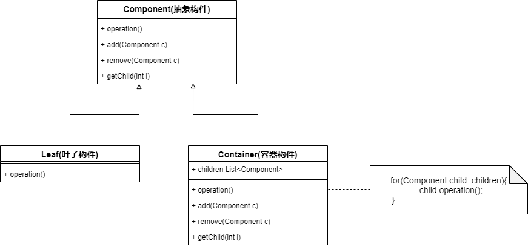
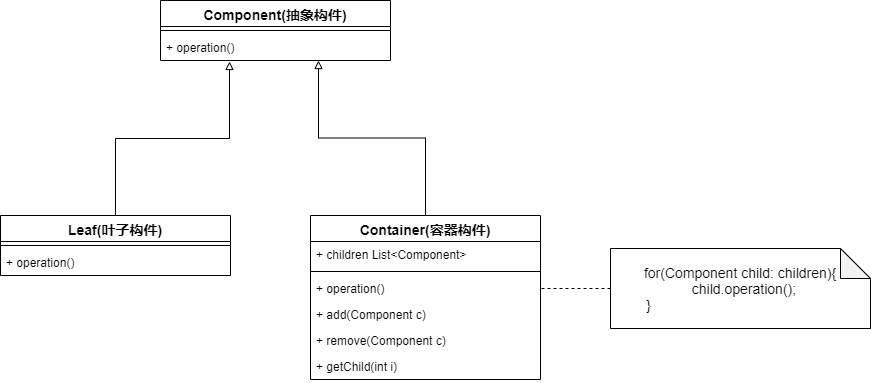
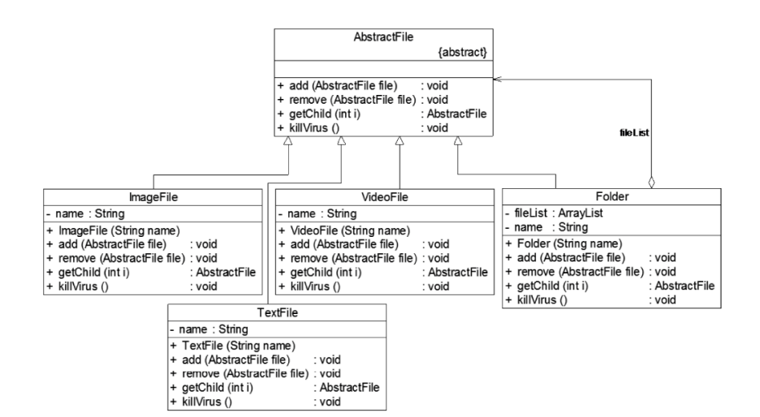

* 组合模式关注哪些包含叶子构件和容器构件的结构，以及它们的组织形式，在叶子构件中不包含成员对象，容器构件中可以包含成员对象，这些对象组合成一个树形结构
* **组合模式的关键在于定义了一个抽象构件类——Client只需要对抽象构件类进行编程，无需知道它到底是叶子构件还是容器构件，进行统一处理**
* **文件系统中**，文件是叶子构件，文件夹是容器构件，我们删除一个文件夹时，会递归删除文件夹中的所有对象


### 组合模式实现

#### 透明组合模式



* 透明组合模式在抽象构件Component中声明了所有方法，缺点是不够安全，如果在运行阶段调用了Leaf的add()之类的方法，会报错

* **Component(抽象构件类)**：叶子构件和容器构件的共同接口，定义了子类的所有行为，客户端针对抽象构件类进行编程
* **Left(叶子构件)**：没有子节点
* **Container(容器构件)：**容器对象，包含子节点

```java
public abstract class Component{
    public abstract void add(Component c);
    public abstract void remove(Component c);
    public abstract Component getChild(int i);
    public abstract void operation(Component c);
}

public class Left extends Component{
    public void add(Component c){
        //异常处理;
    }
    public void remove(Component c){
        //异常处理;
    }
    public Component getChild(int i){
        //异常处理;
    }
    public void operation(Component c){
        //叶子构件的业务逻辑
    }
}

public class Container extends Component{
    private List<Component> list=new ArrayList<>();
    public void add(Component c){
        list.add(c);
    }
    public void remove(Component c){
        list.remove(c);
    }
    public Component getChild(int i){
        list.get(i);
    }
    public void operation(Component c){
        for(Component child:list){
            child.operation();
        }
    }
}
```


#### 安全组合模式



* 抽象构件类Component中没有声明任何用于管理成员对象的方法——Leaf中没有管理成员对象的方法


### 运用实例

我们要开发一款杀毒软件——可以对文件夹杀毒，也可以对文件杀毒，针对不同类型的文件有不同的杀毒逻辑



```java
public class ImageFile extends AbstractFile{
    public void killVirus(){
        System.out.println("对image文件进行杀毒")
    }
}

public class Folder extends AbstractFile{
    private List<AbstractFile> fileList=new ArrayList<>();
    
    public void killVirus(){
        System.out.println("对文件夹进行杀毒");
        for(Abstract file:fileList){
            file.killVirus();
        }
    }
}
```


### 组合模式适用场景

1. 在具有整体和部分的层次结构中希望通过一种方式来忽略部分与整体的差异，让Client可以一致对待他们（引入抽象构件类）
2. 需要处理一个树形结构
3. 一个系统中能够分离出叶子构件和容器构件

