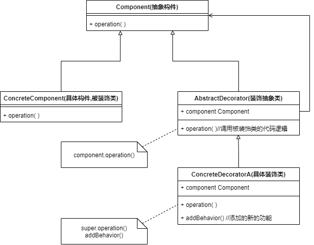
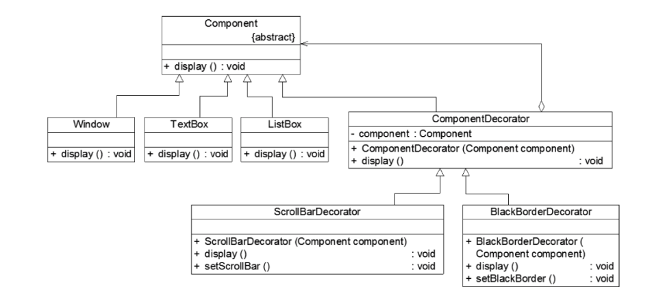

* 装饰模式是一种用于替代继承的技术——使用对象之间的关联关系替代类之间的继承关系，可以动态增加或删除对象的职责，并使被装饰类和装饰类可以独立变化，以便增加新的被装饰类和新的装饰类
* 装饰模式可以在不改变一个对象本身功能的基础上，给对象增加额外的功能，例如一张照片，不改变照片本身，给它增加一个相框，使它具有防潮的功能
* 装饰模式中引入装饰类，在装饰类中既可以调用被装饰类的方法，还可以增加新的方法，拓展被装饰类的功能
* 通过装饰模式，还可以对被装饰类进行多次装饰，获得功能更强大的对象
* **适用场景**
  1. 在不影响对象原本功能的情况下，动态透明地添加新的功能
  2. 当不能使用继承的方式对系统进行拓展或者继承不利于系统拓展和维护时，使用装饰模式


### 装饰模式实现



```java
public interface Component{
    void operation();
}

public class ConcreateComponent implments Component{
    public void operation(){
        //具体业务逻辑
    }
}

public class AbstractDecorator implements Component{
    private Component component;
    
    public void operation(){
        component.operation();
    }
}

public class ConcreteDecoratorA() extends AbstractDecorator{
    @Override
    public void operation(){
        super.operation();
        addBehavior();
    }
    
    public void addBehavior(){
        //增加的功能
    }
}

//客户端面向抽象构件类编程，透明地使用被装饰类和装饰类
public static void main(){
    Component component=null;
    component=new ConcreteComponent();
    component.operation();//使用被装饰类
    component=new ConcreteDecoratorA(component);
    component.operation();//使用装饰类 
    component=new ConcreteDecorator(component);//多次装饰
    component.operation();
}
```

**无论是被装饰类，还是装饰类，对于Client来说都是同名的，客户端面对抽象构件编程，一致性地处理被装饰类和装饰类，让客户端透明地使用装饰前的对象和装饰后的对象，无需去了解它们的区别，还可以对一个已经装饰过的对象进行多次装饰**


### 例子

现在要开发一个图形界面构件库，里面有非常多基本构建，但是经常需要对构建进行拓展增加功能

我们实现构件的基础功能，当构件需要增加功能时，为其创建一个装饰器来实现新功能

