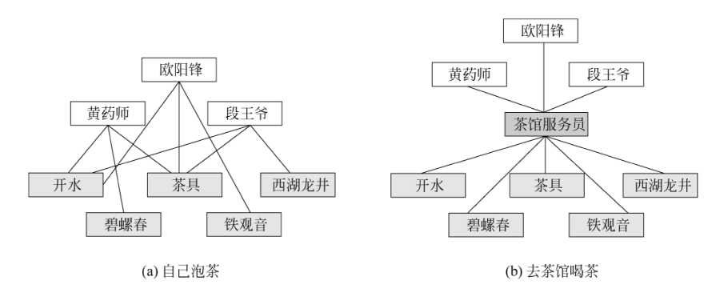
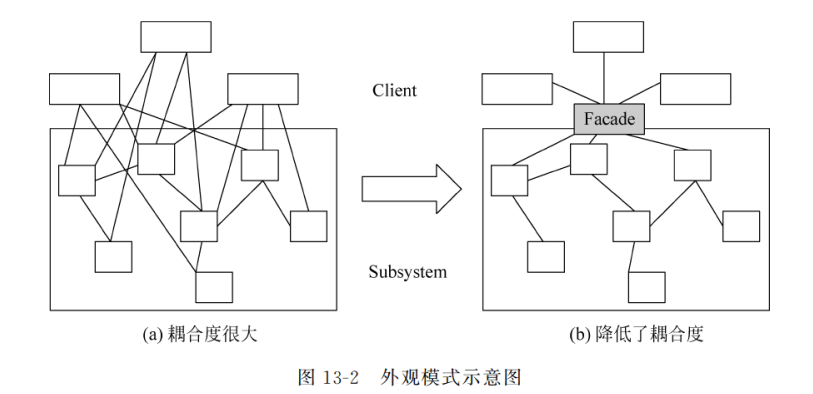
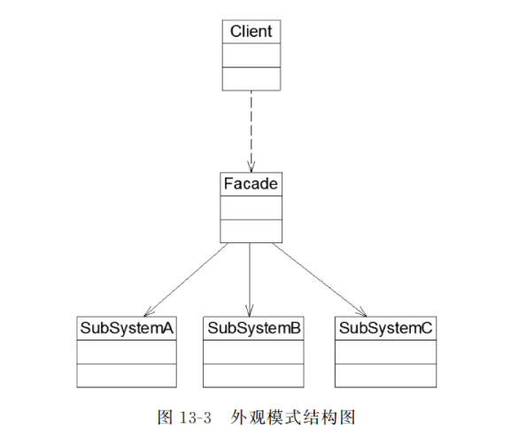
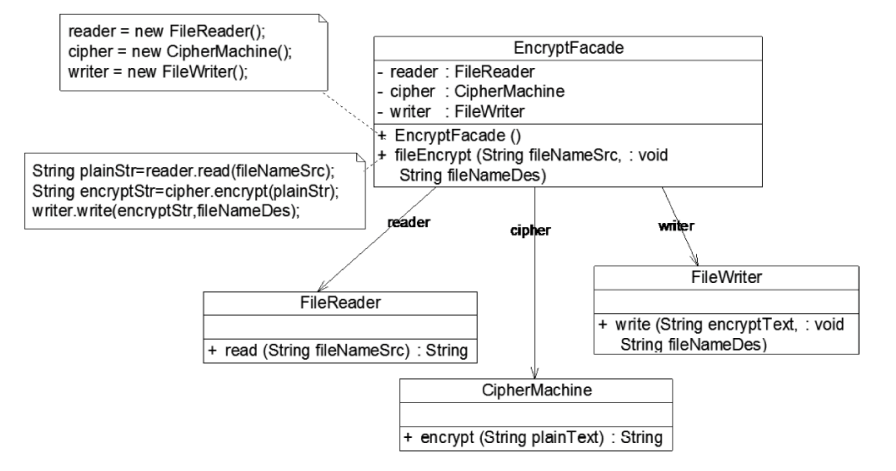
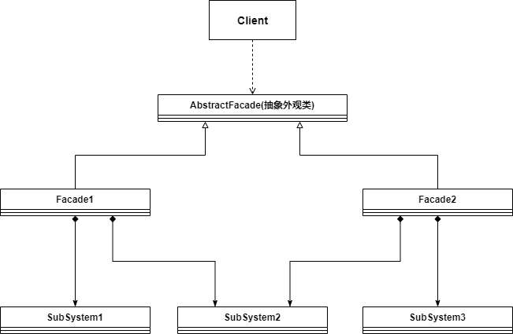

* 外观模式引入一个外观角色来简化客户端与子系统之间的交互，**为复杂的子系统调用提供一个统一的入口**，客户端只需要与外观角色交互即可

  ```
  自己泡茶需要自备茶叶，茶具，开水（复杂的子系统调用），去茶馆喝茶只需要跟服务员说想要一杯什么茶即可（引入外观角色）
  客户与服务员交互，即可获得茶水（客户端只需要与外观角色交互即可）
  ```

  

* 在软件开发过程中，**一个客户类需要与非常多个业务类交互（客户端需要与多个子系统交互）**，此时需要一个**类似服务员的角色(外观角色)**，负责与多个业务类进行交互，而客户类与外观角色交互即可，这个外观角色为多个业务类的调用提供一个统一的入口

  

* 在引入外观系统后，增加子系统or移除子系统都非常方便，只需要在外观角色中增加or删除对子系统的引用即可


### 外观模式实现



* **Facade(外观角色)**：客户端直接与外观角色交互，外观角色负责处理客户端的请求，然后传递给相应的子系统角色处理
* **SubSystem(子系统角色)**

```java
public class SubSystemA{
    public void methodA(){};
}
public class SubSystemB{
    public void methodB(){};
}
public class Facade{
    private SubSystemA systemA=new SubSystemA();
    private SubSystemB systemB=new SubSystemB();
    
    public void method(){
        systemA.methodA();
        systemB.methodB();
    }
}

public static void main(){
    Facade facade=new Facade();
    facade.method();
}
```


### 应用例子

现在要开发一个对文件进行加密的加密慕课，可以对文件中的数据进行加密，并将加密后的数据存储在一个新文件中，具体流程有3步

1. 读取源文件
2. 加密
3. 保存加密文件

这三步相互独立（因为不同的文件需要有不同的加密方式，读取方式，保存方式），现用外观模式实现，客户端只需要与EncyptFacade交互即可




### 抽象外观模式

* 在标准外观模式中，如果需要增加，删除，更换与外观类交互的子系统，必须修改外观类的代码，所以引入抽象外观模式可以改变这一问题
* 抽象外观模式下，客户端针对抽象外观类进行编程， 对于新的业务需求，不改变原有的外观类，而是增加一个新的外观类



