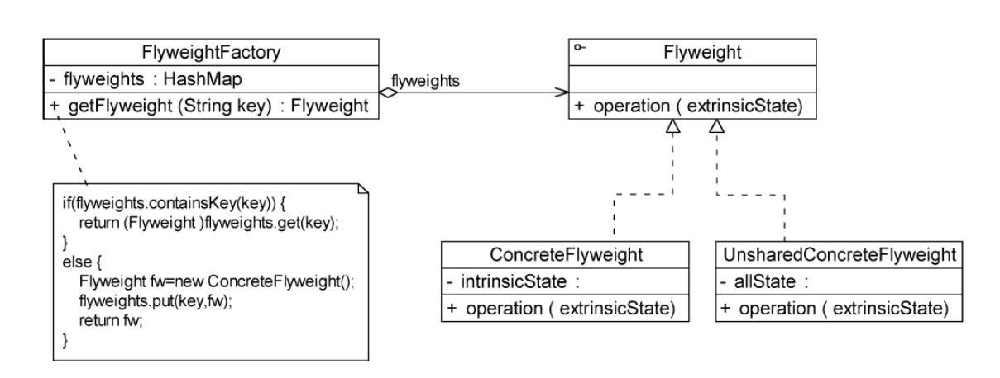

* 当系统中存在**大量相同或相似的对象**时，享元模式可以通过共享技术实现相同或相似对象的复用
* 在享云模式中提供了一个**享云池**用于存储已经创建好的享云对象，并通过享云工厂类将享云对象提供给客户端使用
* 享云对象可以做到共享的关键是**区分了内部状态和外部状态**
  * 内部状态——存储在祥云对象内部，不会改变的状态，内部状态是可以被共享的
  * 外部状态——外部状态可以改变，不可以被共享，同一个祥云对象的多个外部状态之间是相互独立的


### 享云模式结构



* **Flyweight(抽象享云类)：**定义了具体享云类公共的方法，方法会接收外部状态，外部状态由Client传入
* **ConcreteFlyweight(具体享云类)**：具体享云类为**内部状态**提供存储空间，可以结合单例模式来设计具体享云类，为每一个具体享云类提供唯一的享云对象
* **UnsharedConcreteFlyweight(非共享具体享云类)**：用于处理不需要共享的享云对象
* **FlyweightFacotry(享云工厂类)**：享云工厂类用于创建并管理享云对象，将各种类型的享云对象都存储在一个享云池中

```java
public abstract class Flyweight{
    public abstract void operation(String extrinsicState);//传入外部状态
}

public class ConcreteFlyweight extends Flyweight{
    private String intrinsicState;//存储内部状态
    
    //外部状态extrinsicState在使用时由外部设置，不存储在享云对象中
    public void operation(String extrinsicState){
        //具体业务方法
    }
}

public class UnsharedConcreteFlyweight extends Flyweight{
    public void operation(String extrinsicState){
        //具体业务方法
    }
}

public class FlyweightFacotry{
    private static Map<String,Flyweight> flyweights=new HashMap<>();
    
    public static Flyweight getFlyweight(String key){
        Flyweight fw=flyweights.get(key);

        if(fw==null){
            fw=new ConcreteFlyweight();
            flyweights.put(key,fw);
        }
        return fw;
    }
}
```

