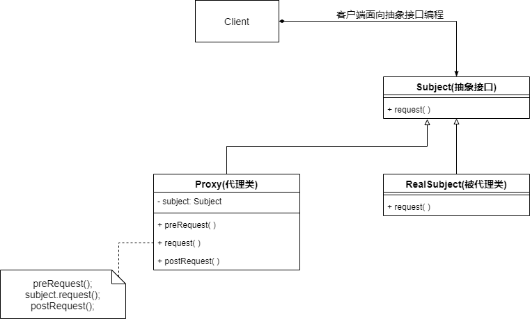
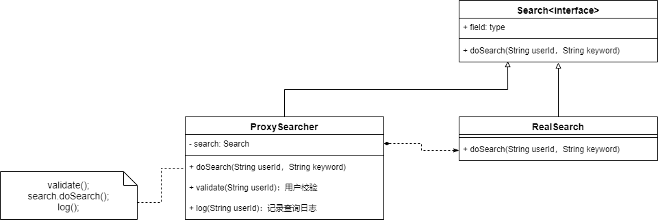

* 无法直接访问某个对象或访问某个对象存在困难时可以通过一个代理对象来间接访问

* 为了保证客户端使用的透明性，所访问的真实对象与代理对象要实现相同的接口

  


### 代理模式结构(静态代理)



```java
public interface Subject{
    void request();
}

public class RealSubject implements Subject{
    @Override
    public void request(){
        //真实业务逻辑
    }
}

public class Proxy implments Subject{
    private Subject subject=new RealSubject();
    public void preRequest(){
        //增加的逻辑
    }
    public void postRequest(){
        //增加的逻辑
    }
    @Override
    public void request(){
        preRequest();
        subject.request();//调用真实业务逻辑
        postRequest();
    }
}
```


### 应用实例

* 现在需要进行商务信息查询
* 在商务信息查询之前需要进行身份验证
* 在商务信息查询之后需要记录查询日志




### 动态代理

动态代理——让系统在运行时根据实际需要来动态创建代理类——一个代理类能够代理多个不同的真实主体类，并且可以代理不同的方法

* **Proxy类**
* **InvocationHandler接口**

```java
public interface Service{
    void service();
}

public class UserService implements Service{
    @Override
    public void service(){
        System.out.println("用户服务")
    }
}

public class UserServiceHandler implements InvocationHandler{
    private Object target;//被代理对象
    public UserServiceHandler(Object target){
        this.target=target;
    }
    @Override
    public Object invoke(Object proxy,Method method,Object[] args) throws Exception{
        before();
        Object result=method.invoke(target,args);//调用被代理对象的逻辑
        after();
        return result;
    }
    
    public void before(){
        System.out.println("before");
    }
    
    public void after(){
        System.out.println("after");
    }
}

public static void main(String[]args){
    InvocationHandler handler=new UserSerivceHandler(new UserSerivce());
    Service proxy=(Service)Proxy.newProxyInstance(UserSerivce.claass.getClassLoader(),UserService.class.getInterfaces(),handler);//创建代理对象
    proxy.service();//执行U
}
```


