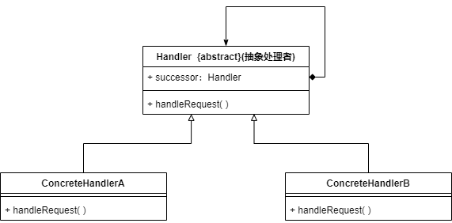

* 如果系统中存在多个对象可以处理同一请求，可以通过职责链模式**将这些处理请求的对象串成一条链**，让请求沿着该链进行传递，如果链上的对象可以处理该请求就处理请求，否则将请求转发给下个对象
* 职责链模式将请求的发送者和接受者解耦，多个对象都有机会处理请求，客户端不用关心是谁来处理请求
* **适用场景**
  1. 有多个对象可以处理同一个请求，具体哪个对象处理请求需要在运行时再确定，客户端只需要将请求提交到处理链上即可，不用关心如何处理的
  2. 不确定处理者的情况下提交请求

### 职责链模式实现



* **Handler（抽象处理者）**：定义了一个Handler类型的引用，指向下一个处理者，通过该引用可以构成一条处理者链
* **ConcreteHandler（具体处理者）**：处理用户请求，如果可以处理就处理，如果不行就转发给职责链中的下一个处理者

```java
public abstract class Handler{
    private Handler successor;
    public abstract void handleRequest();
}

public class ConcreteHandler extends Handler{
    @Override
    public void handleRequest(){
        if(满足请求处理条件){
            //处理请求
        }else{
            this.successor.handleRequest();//转发请求给下一个处理者
        }
    }
}
```

### 纯的职责链模式与不纯的职责链模式

#### 纯的职责链模式

* 只要求一个具体处理者只能在2个行为中二选一，要么承担全部职责，要么将职责推给下个处理者
* 不允许出现某个请求没有被任何一个处理者处理的情况

#### 不纯的职责链模式

* 允许某个请求被一个处理者部分处理后再向下传递
* 允许一个请求不被任何处理者处理