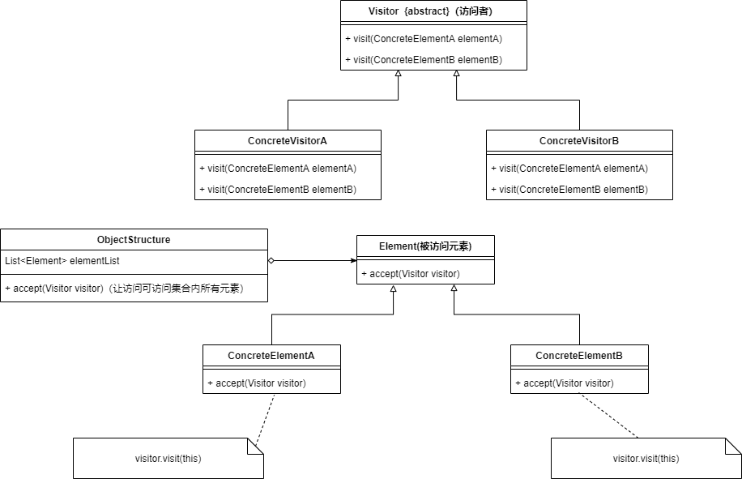
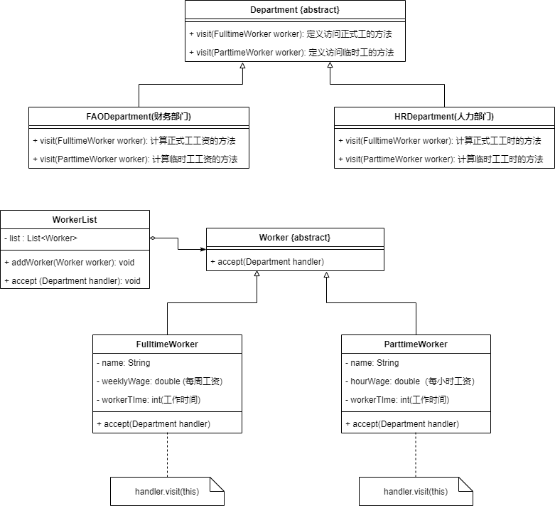
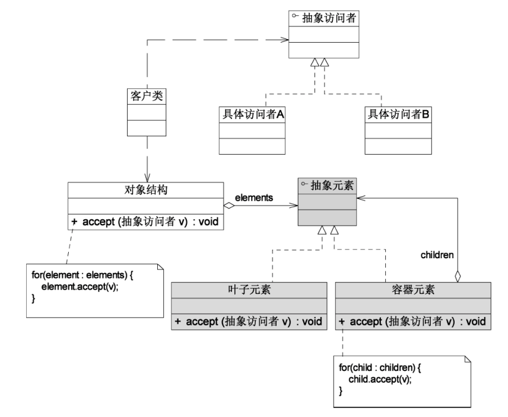

* 访问者模式包含——访问者和被访问元素 两个组成部分
* **不同的访问者**需要对被访问元素进行**不同的访问操作**
* 使用访问者模式时，被访问元素通常不是单独存在，而是存储在一个集合中（这个集合叫对象结构）
* **优点**
  1. 在访问者模式中增加新的访问操作很容易——增加一个新的访问者即可
  2. 将有关元素对象的访问行为集中到一个访问者对象中
* **缺点**
  1. 增加新的访问元素比较困难——需要在抽象访问者中增加一个新的抽象访问操作and在每个访问者中增加对该元素的访问逻辑
* **适用场景**
  1. 一个对象结构包含多种类型的对象，并且希望对这些对象进行一些访问操作——访问者为每种类型的对象都提供一个访问操作
  2. 一个对象结构中的对象要进行很多不同的操作，访问者模式将对这些对象的访问集中在访问者中，让**对象本身**与**对对象的访问操作**分离

### 访问者模式结构



* **Visitor(抽象访问者)**：为对象结构中的每一个具体元素声明一个访问操作
* **ConcreteVisitor(具体访问者)**：实现了抽象访问者中声明的操作
* **Element(抽象元素)**：定义一个accept()方法，用来接受访问者的访问
* **ConcreteElement(具体元素)**
* **ObjectStructure(对象结构)**：一个元素集合，存放具体元素，并提供一个方法，让访问者可以访问集合内的所有元素

```java
public interface Element{
    void accept(Visitor visitor);
}

public class ConcreteElementA implements Element{
    public void accept(Vivistor visitor){
        visitor.visit(this);
    }
}

public class ObjectStructure{
    private List<Element> list=new ArrayList<>();//存储元素对象的集合
    
    //接受访问者的访问操作
    public void accept(Visitor visitor){
        for(Element ele:list){
            visitor.visit(ele);//遍历访问集合中的每一个元素
        }
    }
}
```


### 应用实例

现在有一个员工信息管理系统，员工分为正式工和临时工，部门有人力资源部和财务部

人力资源部要统计每个员工的工作时间，财务部要统计每个员工这个月要发的工资（正式工和临时工统计公式不同）




### 访问者模式和组合模式联用



