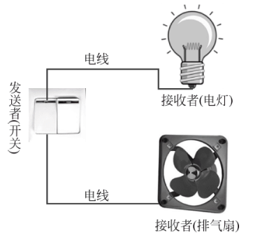
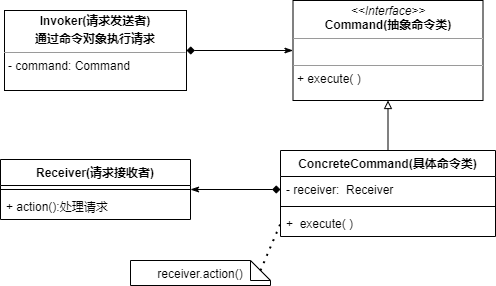
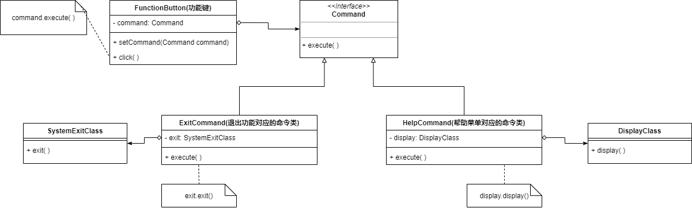
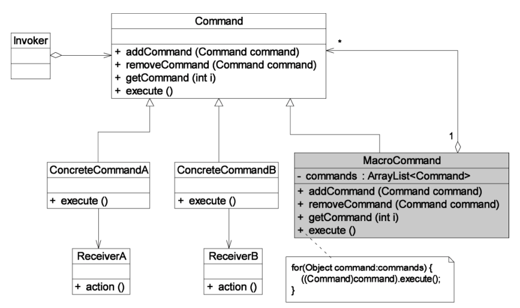

* 命令模式会将请求发送者与请求接收者解耦，发送者和接收者之间没有直接引用关系，而是通过命令对象来间接引用，可以在不修改原有代码的情况下让相同的发送者对应到不同的接收者

* 在生活中，人们可以通过使用开关来控制电器的打开和关闭，一个开关可以通过不同的电线控制不同的电器

  开关——请求发送者，电器——请求接收者，开关使用不同的电线就可以连接不同的请求接收者

  
  
* **使用场景**

  1. 系统需要将请求发送者和请求接收者解耦，使得发送者和接收者不直接交互


### 命令模式实现

* 命令模式，在请求发送者和请求接收者之间引入新的命令对象

  **将请求发送者的请求传递给命令对象，再通过命令对象来调用接收者的方法**

* 命令模式的本质是对请求进行封装，一个请求对应一个命令，将**发出命令的职责**和**执行命令的职责**分割开

* 命令模式的核心在于引入了 **抽象命令类** 和 **具体命令类**，通过命令类降低发送者和接收者的耦合度，请求发送者只需要指定一个命令对象，通过命令对象来调用请求接收者的处理方法



```java
public interface Command{
    void execute();
}

public class ConcreteCommand implements Command{
    private Receiver receiver;//请求接收者
    @Override
    public void execute(){
        receiver.action();
    }
}

public class Receiver{
    public void action(){//请求处理逻辑}
}
    
public class Invoke{
    private Command command;
    
    //请求发送者发送请求
    public void call(){
        coommand.execute();
    }
}
```


### 应用场景

某系统为用户提供一系列功能键，功能键可以用于退出系统，也可以用于显示帮助文档，由用户自定义——给FunctionButton绑定不同的命令对象，就可以在按下按钮时实现不同的功能



* FunctionButton是请求发送者，可以绑定不同的Command，将请求发送给不同的请求接收者


### 命令队列

* 请求发送者发送的请求需要让多个请求接收者处理，此时可以使用命令队列

```java
public class CommandQueue{
    private List<Command> commandList=new ArrayList<>();
    public void execute(){
        for(Command command: commandList){
            command.execute();
        }
    }
}

//请求发送者
public class Invoker{
    private CommandQueue commandQueue=new CommandQueue();
    //请求发送者发送请求
    public void call(){
        commandQueue.execute();
    }
}
```


### 宏命令模式(组合命令)



* 宏命令是一个具体命令类，拥有一个命令对象集合
* 宏命令接受到请求后，将请求转发给其拥有的命令对象
* 宏命令的execute()会逐个调用其拥有的每个命令对象的execute()——执行一次宏命令会触发多个具体命令的执行，可以实现命令的批处理
