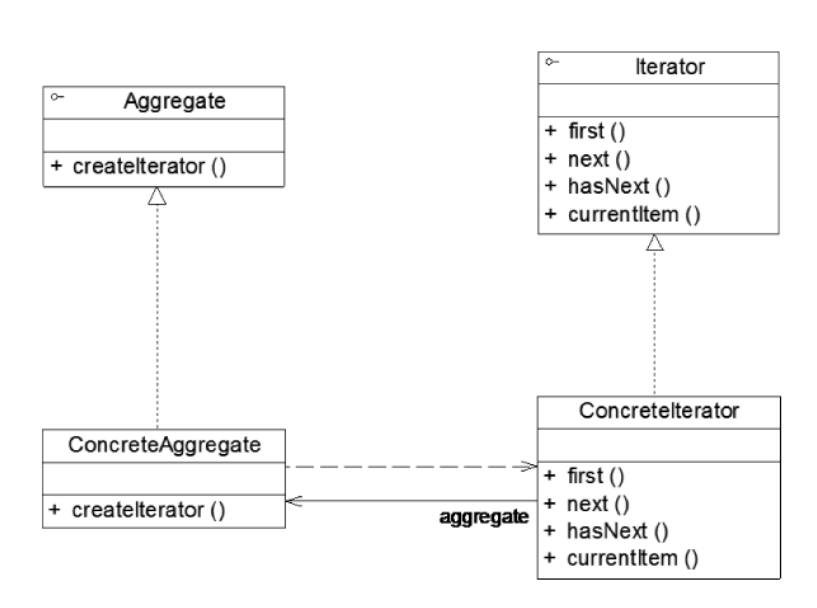

* 迭代器用于对一个聚合对象（容器）进行遍历
* 引入迭代器，将数据的遍历功能从聚合对象中分离出来，**聚合对象只负责存储数据**，**遍历数据由迭代器完成**——将**存储数据职责**和**遍历数据职责**分离
* 引入迭代器后，Client无须了解聚合对象的内部结构即可实现对聚合对象中成员的遍历，还可以根据需要很方便地添加新的遍历方法
* **优点**
  1. 可以用不同的方式来遍历一个聚合对象，如果一个聚合对象需要多种遍历方式，实现一个新的迭代器即可
  2. 简化了聚合类的设计，移除其遍历数据职责
* **适用场景**
  1. 访问一个聚合对象的内容，而无需了解其内部结构，将数据的存储和数据的遍历分离
  2. 一个聚合对象可以拥有多种遍历方式
  3. 为遍历不同的聚合对象提供一个统一的接口，即使不同的聚合对象由不同的遍历方式，客户端也可以通过该接口进行一致性地操作


### 迭代器模式结构



* **Aggregate(抽象聚合类)**：存储和管理元素，定义一个创建迭代器的方法
* **ConcreteAggregate(具体聚合类)**
* **Iterator(抽象迭代器)**：定义了遍历聚合类中元素的方法
* **COncreteIterator(具体迭代器)**：实现遍历方法

```java
public interface Aggragate{
    Iterator createIterator();
}

public class ConcreteAggregate implements Aggragate{
    @Override
    public Iterator createIterator(){
        return new COncreteIterator(this);
    }
}

public interface Iterator<E>{
    E first();
    E next();
    boolean hasNext();
}

public class ConcreteIterator implements Iterator<COncreteAggregate>{
    private Aggragate aggragate;
    public ConcreteIterator(Attragate aggragate){
        this.aggragate=aggragate;
    }
    
    //实现Iterator中声明的各种方法
}
```


