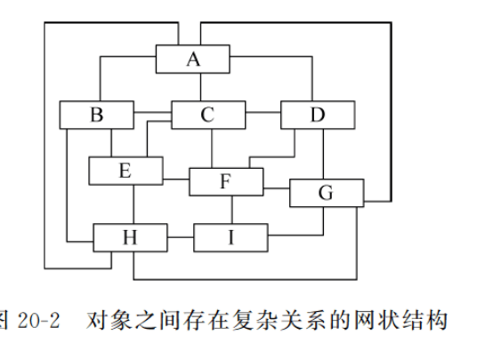
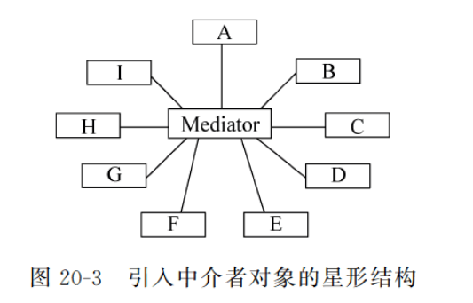
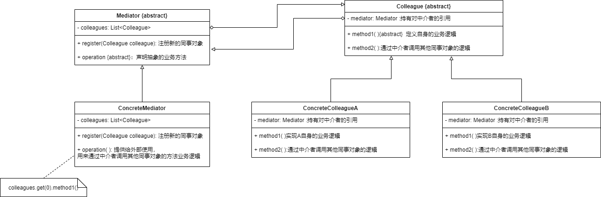

* 如果对象之间存在复杂的交互关系，可以通过中介者模式进行简化——中介者可以将对象之间的两两交互转化为每个对象与中介者之间的交互

* 如果没有QQ群，那么一个用户想要将信息发送给多个用户，就需要逐个交互

  有个QQ群，用户只需要将信息发送到群中，其他用户就都会收到消息，QQ群会将收到的消息发送给群中的每一个人，QQ群就是中介者

* 如果一个系统中，对象之间的关系呈现复杂的网状结构，对象之间存在大量的多对多关系，导致系统非常复杂

  

  通过引入中介者，将系统由网状结构转换为以中介者为中心的星形结构

  在星型结构中，对象之间不会直接交互，而是通过中介者进行交互

  

* 如果一个系统中对象之间存在多对多的交互关系，那么可以将对象中的交互行为分离出来，封装在中介者中，由中介者统一协调

* 中介者模式的核心在于中介者类的引入，其承担2个作用

  * **中转作用**：通过中介者的中转作用，各个同事对象之间不需要显式地引用其他同事对象，当需要和其他同事对象进行通信时，可以通过中介者实现间接调用
  * **协调作用**：中介者可以更进一步地对同事对象之间的关系进行封装，同事对象可以一致性地和中介者进行交互

* **中介者模式适用场景**

  * 系统中对象之间存在复杂的引用关系
  * 一个对象由于引用了其他许多对象并且直接和这些对象通信，导致难以复用该对象


### 中介者模式结构



* **Mediator**：抽象中介者，用于同事对象之间进行通信
* **ConcreteMediator**：具体中介者，持有对各个同事对象的引用，用来协调各个同事对象之间的行为
* **Colleague**：抽象同事类，持有一个对中介者的引用
* **ConcreteColleague**：具体同事类，通过中介者与其他同事对象通信

```java
public abstract Mediator{
    private List<Colleague> colleagues=new ArrayList<>();
    //注册方法，增加同事对象
    public void register(Colleague colleague){
        colleagues.add(colleague);
    }
    //声明抽象的业务方法
    public abstract void operation();
}

public class ConcreteMediator extends Mediator{
    //实现业务方法，封装同事对象之间的调用
    public void operation(){
        colleagues.get(0).method1();//通过具体中介者来调用同事类的方法
    }
}

public abstract class Colleague{
    private Mediator mediator;
    
    public abstract void method1();//声明自身方法,处理自己的行为
    
    //与中介者通信，通过中介者来调用其他同事类的方法
    public void method2(){
        mediator.operation();
    }
}
```

