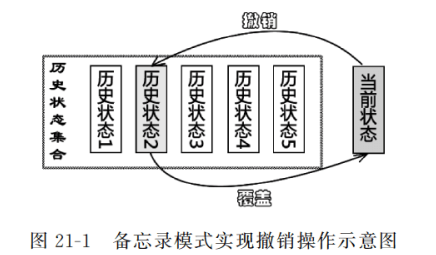
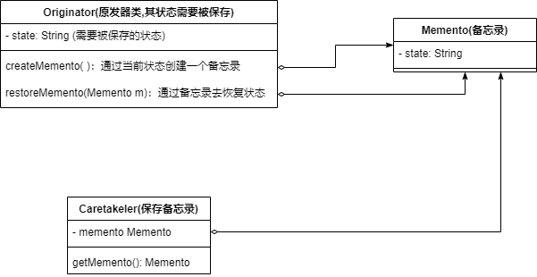
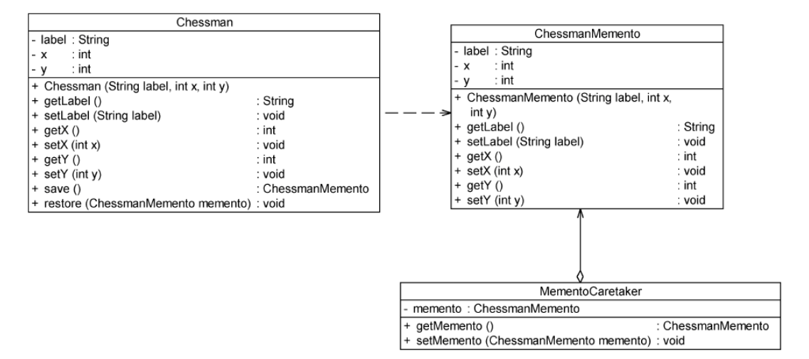

* 备忘录模型——提供一种对象状态的撤销实现机制（可以让系统中的某个对象恢复到某一历史状态）

  


### 备忘录模型实现



* **Originator(原发器类)**：原发器类就是状态需要被保存的类，它可以通过创建一个备忘录来保存状态，也可以通过备忘录来恢复状态

* **Memento(备忘录)**：保存原发器的状态

* **Caretaker(负责人)**：负责保存备忘录，但是不能对备忘录的内容进行修改，无需知道备忘录的实现细节，当原发器类需要使用备忘录时，从Caretaker中取出

  （如果想要支持多次撤销操作，那么Caretaker中要用List来存储备忘录）

```java
//一个状态需要被保存的类
public class Originator{
    private String state;//不断变化的状态
    
    //创建一个备忘录来保存当前的状态
    public Memento createMemento(){
        return new Memento(this);
    }
    //通过备忘录来恢复状态
    public void restoreMemento(Memento m){
        state=m.getState();
    }
}

//备忘录
public class Memento{
    private String state;
    public Memento(Originator o){
        this.state=o.getState();
    }
}

public class Caretaker{
    private Memento memento;
    public Memento getMemento(){
        return memento;
    }
}
```


### 应用例子

现在要开发一款象棋软件，提供悔棋功能



* **Chessman**：原发器，其状态需要被保存
* **ChessmanMemento**：备忘录，保存状态
* **MementoCaretaker**：保存备忘录