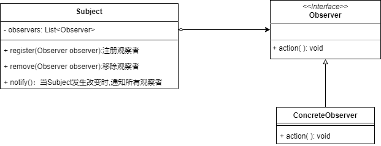
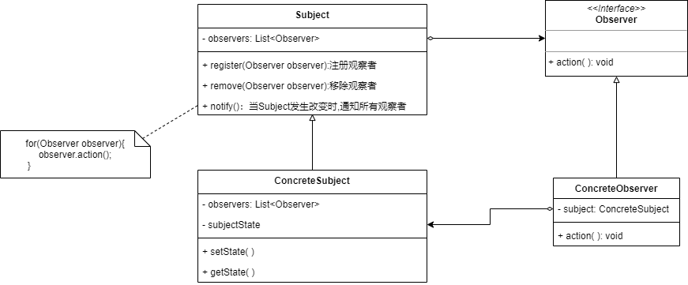

* **观察者模式**也叫 **发布—订阅模式**
* 一个对象的状态或行为的变化导致其他对象的状态和行为也要发生改变，这时候用 **观察者**模式
* 观察者模式定义对象之间的一种**一对多的依赖关系**，让一个对象发生改变时，可以通知其他对象，让其他对象做出反应
* 一个目标可以有任意多个观察者，一旦目标的状态发生改变，所有的观察者都会收到通知，并且每个观察者都会监控目标的状态


### 简单的观察者模式结构



* **Subject**：主题，被观察的对象，定义了通知方法notify()，用来在状态发生变化时，通知所有观察者

```java
public class Subject{
    //存储所有观察者
    private List<Observer> observers=new ArrayList<>();
    
    //注册方法，向观察者集合中注册一个观察者
    public void register(Observer observer){
        observers.add(observer);
    }
    
    //注销方法，从观察者集合中移除观察者
    public void remove(Observer observer){
        observers.remove(observer);
    }
    
    //当Subject发送改变时，调用该通知方法通知所有观察者
    public void notify(){
        for(Observer observer:observers){
            observer.action();
        }
    }
}

public interface Observer{
    void action();
}

public ConcreteObserver implements Observer{
    @Override
    public void action(){
        //具体响应代码
    }
}
```


### 复杂的观察者模式

* 如果观察者在执行action()时，需要用到被观察对象的状态




### JDK对观察者模式的支持

Java有 **Observer接口** 和 **Observable类**提供了对观察者模式的支持