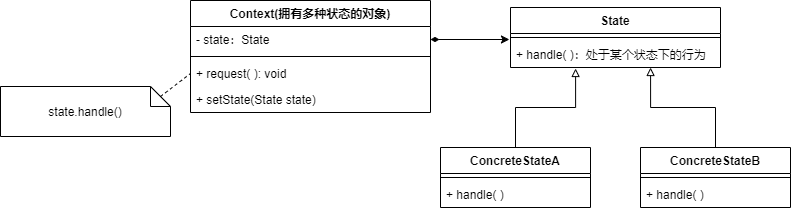

* 如果系统中某个对象**存在多个状态**，并且这些**状态之间可以进行转换**，并且对象在**不同状态下的行为不相同时**，可以使用状态模式
* 状态模式将一个对象的状态从对象中分离出来，封装到专门的状态类中，使得对象状态可以灵活变化


### 状态模式结构

```java
public interface State{
    void handle();
}
public class Context{
    private State state;//一个对状态对象的引用
    private int value;//其他属性值
    public void request(){
        //其他代码
        state.handle();
        //其他代码
    }
}
```




* **Context**——拥有多种状态的对象

* **具体状态类**——每个具体状态类都对应一个具体的状态，不同的具体状态类拥有不同的行为

* 在状态模式的使用过程中，**一个对象的状态之间可以进行相互转换**，通常有2种实现方式

  1. **由Context自己负责**——通过对某些属性值的判断实现状态转换

     比较推荐这种方式，对状态转换代码进行集中管理

     ```java
     public class Context{
         private State state;
         private int value;
         public void changeState(){
             //进行状态转换
         }
     }
     ```

  2. **由具体状态类负责**——在具体状态的方法中判断Context的某些属性值，根据情况设置state为新的状态对象

     该方式不是很推荐，因为如果增减一种状态，需要修改所有的具体状态类

     ```java
     public class ConcreteStateA{
         public void handle(){
             //业务逻辑
         }
         public void changeState(Context context){
             //进行状态转换
         }
     }
     ```

     


