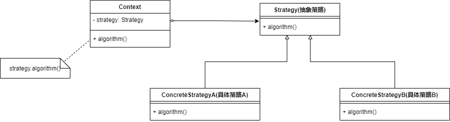

* 策略模式用于算法的自由切换和扩展

* 在策略模式下，我们有一个算法族，用户可以从算法族中任选一个算法解决某一问题，同时可以很方便地更换算法，在算法族中增加新的算法

* 策略模式将**算法的定义**和**算法的使用**分离

* **硬编码的缺点**
  
  如果实现一个功能有多种算法
  
  * 一种常用的方法是通过硬编码将所有代码集中在一个类中，该类中提供多个方法，每个方法对应一个具体的算法
  * 也可以将这些算法封装在同一个方法中，通过if...else...进行选择
  
  如果需要增加一种新的算法，需要修改算法类的源代码，也需要修改客户端的调用代码

* **策略模式**——定义一个个独立的类来封装不同的算法，每一个类封装一种具体的算法，每一个封装算法的类都可以称为一种**策略**

* **优点**
  
  * 策略模式用于算法的自由切换和拓展
  * 策略模式用于解决某一问题的一个算法族，允许用户从算法族中任选一个算法来解决一个问题，同时可以方便地更换算法或者增加新的算法

* **缺点**
  
  * 客户端必须知道所有的策略类，并自行决定使用哪一个策略类
  * 客户端每次只能使用一个策略类

* **适用场景**
  
  1. 一个系统需要动态地在多个算法中选择一种
  2. 一个对象有很多行为，使用策略模式避免使用难以维护的if-else语句

#### 策略模式实现

* **Context**：环境类，算法的使用者
