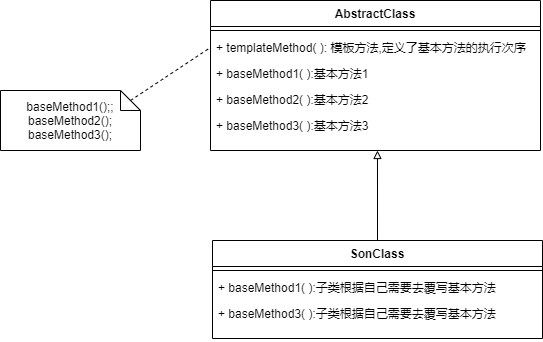

* 模板方法模式是基于继承的代码复用技术

* 将实现功能的每一个步骤所对应的方法称为基本方法

  将调用这些基本方法并且规定了基本方法的执行次序的方法称为模板方法

* 父类中，定义了基本方法，提供一个模板方法来定义基本方法的执行次序（模板方法定义了算法的框架）

  子类中，根据自己的需要去覆写基本方法

* **优点**

  1. 在父类中形式化定义一个算法的执行步骤，让子类来处理实现细节
  2. 代码复用，将公共代码放在父类
  3. 子类可以通过覆写钩子方法来控制算法逻辑

* **适用场景**

  1. 对一些复杂算法进行分割，将固定不变的父类设计为模板方法和父类中的具体方法，将可以改变的部门交由子类去实现
  2. 将公共代码抽取到父类中，实现复用
  3. 让子类通过覆写钩子方法来控制算法逻辑


### 模板方法结构



* **AbstractClass**：定义了一系列的基本方法，同时实现了一个模板方法（模板方法中定义了基本方法的执行次序，当然也可以调用其他对象的方法）
* **SonClass**：子类，根据自己的需要，覆写父类的基本方法


### 基本方法

* 抽象方法——要求一定由子类去实现

* 具体方法——子类可以去覆写，也可以直接继承

* **钩子方法**——子类可以通过钩子方法去控制算法的行为

  * 在不同条件下执行模板方法中的不同步骤

    ```java
    //模板方法
    public void templateMethod(){
        if(isPrint()){
            print();
        }
    }
    //钩子方法——决定print()是否执行，如果子类不希望执行print()，覆写该方法即可
    public boolean isPrint(){
        return true;
    }
    ```

  * 实现体为空的具体方法——子类根据需要去覆盖or继承

    ```java
    //模板方法
    public void templateMethod(){
        baseMethod1();
        baseMethod2();
    }
    //具体方法
    public void baseMethod1(){
        //具体实现
    }
    //钩子方法——交由子类去发挥
    public void baseMethod2(){}
    ```

    