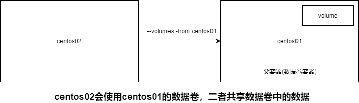

[toc]

#### 1. 数据卷的作用

容器可以挂载数据卷，通过数据卷，容器中的数据与本地文件系统数据进行同步（数据卷是一种双向绑定）

同样的，容器之间还可以通过数据卷进行数据共享

#### 2. 挂载类型

* **匿名挂载**

  -v 容器内路径，Docker随机生成卷名

  没有指定主机目录，Docker会在主机的默认目录下随机生成一个目录作为主机目录（关掉，重新run一个，使用的目录是不一样的）

* **具名挂载**

  -v 卷名:目录内路径

  没有指定主机目录，Docker会在主机的默认目录下随机生成一个目录作为主机目录（关掉，重新run一个，使用的目录是不一样的）


#### 3. 容器对数据卷的权限

* ro：只读
* rw：可读可写

```
docker run XXXXX -v juming-nginx:/etc/nginx:ro nginx
docker run XXXXX -v juming-nginx:/etc/nginx:rw nginx
```


#### 4. 数据卷容器



```
docker run -d -P -it --name centos02 --volumes-from centos01 centos
```

其实就是centos02拷贝了centos01的数据卷设置，映射到同一个主机目录上，即使关闭centos01，centos02的数据不受影响

