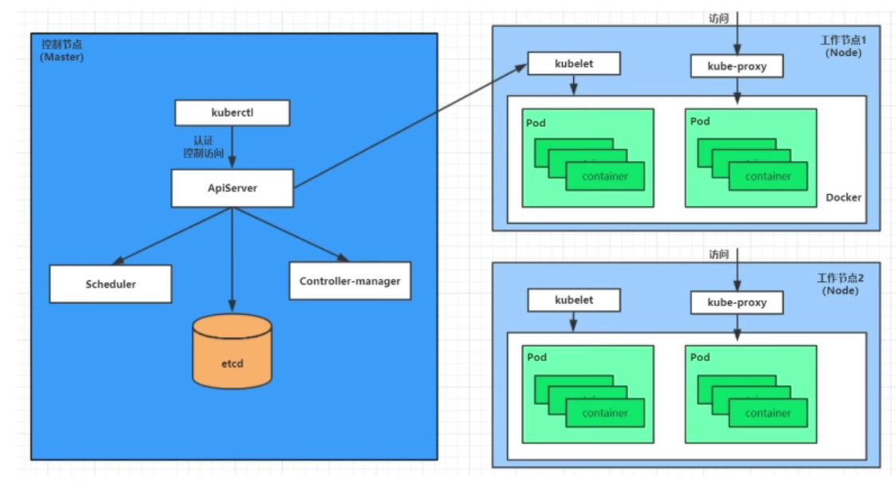
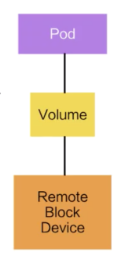

Kubernetes的本质是一组服务器集群，它可以在集群的每个节点上运行特定的程序，来对节点中的容器进行管理，它的目的是实现资源管理的自动化

## 1. Kubernetes提供的功能

* **自我修复**：一旦某一个容器崩溃，能够在1s中左右迅速启动新的容器；一个主机崩溃，那么Kubernetes会将该主机上运行的容器迁移到其他主机上
* **弹性伸缩**：可以根据需要，对容器数目进行动态扩缩容（例如根据CPU利用率来动态调整容器数目）
* **服务发现**：服务可以通过自动发现的形式找到它所依赖的服务
* **负载均衡**：如果一个服务启动了多个容器，能够自动实现请求的负载均衡
* **应用的自动发布与版本回退**
* **存储编排**：可以根据容器自身的需求自动创建存储卷
* **容器调度**：将容器放置在集群中的某一个节点上

## 2. Kubernetes架构

一个Kubernetes集群由 **控制节点(master)**和 **工作节点(node)**构成

### 2.1 master

* **ApiServer**：操作集群资源的唯一入口，接收用户命令
* **Scheduler**：负责集群资源调度，按照调度策略选择node节点来运行Pod
* **ControllerManager**：集群状态的管理（动态扩缩容，自动修复都是这个干）
* **Etcd**：分布式存储系统，将元数据存储在其中

### 2.2 node

* **Kubelet**：负责维护Pod的生命周期
* **kube-proxy**：利用iptable的能力来组件Kubernetes得到网络，提供集群内部的服务发现和负载均衡
* **Container Runtime**：容器运行时，用于创建容器

### 2.3 各个组件的调用关系

1. 一旦Kubernetes启动后，master和node都会将自身信息存储到etcd数据库中
2. 一个Nginx服务建立请求发送给master的ApiServer
3. ApiServer将这个请求信息写入etcd，随后Scheduler通过 API Server的Watch机制收到这个请求信息
4. 此时Scheduler根据各个node节点的信息进行计算，并将结果告诉ApiServer
5. ApiServer将调度结果写入etcd，然后ApiServer通知对应的节点来启动这个pod，对应节点的Kubelet会收到这个通知
6. node节点的Kubelet接收到指令后，会调用Container Runtime来真正启动这个容器
7. 一个Nginx服务就运行了，如果外界想要访问nginx,就需要通过kube-proxy来对Pod产生访问代理

## 3. Kubernetes核心概念

### 3.1 Pod

* Pod是Kubernetes中的最小调度单位（最小资源单位）
* Pod由一组容器组成，是对一组容器的抽象，为这些容器提供一个共享的运行环境（例如网络环境）
* Pod中可以定义容器所需要的运行方式（运行容器的Command，运行容器的环境变量）
* 同一个Pod中的容器可以通过localhost直接进行通信

### 3.2 Volume

* 用来管理Kubernetes存储
* 声明在Pod中的容器可以访问的文件目录
* 一个卷可以被挂载到Pod中的一个容器或者多个容器的指令路径下面
* 支持多种后端存储的持续（本地存储，分布式存储，云存储等）

