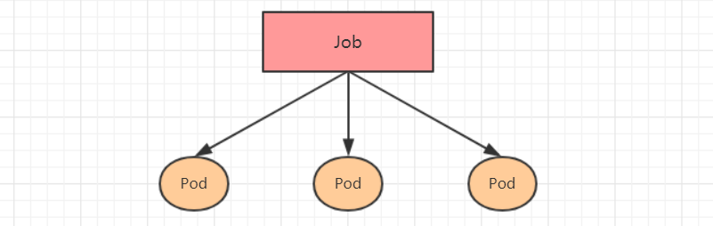

在Kubernetes中，Pod按照创建方式分为两种

* **自主式Pod**：kubernetes直接创建出来的Pod，这种pod删除后就没有了，也不会重建
* **控制器创建的Pod**：kubernetes通过控制器创建的pod，由控制器控制


**Pod控制器分为**

- ReplicationController：比较原始的pod控制器，已经被废弃，由ReplicaSet替代
- ReplicaSet：保证副本数量一直维持在期望值，并支持pod数量扩缩容，镜像版本升级
- Deployment：通过控制ReplicaSet来控制Pod，并支持滚动升级、回退版本
- Horizontal Pod Autoscaler：可以根据集群负载自动水平调整Pod的数量，实现削峰填谷
- DaemonSet：在集群中的指定Node上运行且仅运行一个副本，一般用于守护进程类的任务
- Job：它创建出来的pod只要完成任务就立即退出，不需要重启或重建，用于执行一次性任务
- Cronjob：它创建的Pod负责周期性任务控制，不需要持续后台运行
- StatefulSet：管理有状态应用


## 1. ReplicaSet

ReplicaSet主要作用是**保证一定数量的Pod正常运行**，会持续监听这些Pod的状态，一旦Pod发生故障，就会重启or重建，还支持扩缩容和镜像版本的更换


#### **资源清单**

```yaml
apiVersion: apps/v1 # 版本号
kind: ReplicaSet # 类型       
metadata: # 元数据
  name: # rs名称 
  namespace: # 所属命名空间 
  labels: #rs的标签
    controller: rs
spec: # 详情描述
  replicas: 3 # 副本数量
  selector: # 选择器，通过它指定该控制器管理哪些pod
    matchLabels:      # Labels匹配规则
      app: nginx-pod
    matchExpressions: # Expressions匹配规则
      - {key: app, operator: In, values: [nginx-pod]}
  template: # 模板，当副本数量不足时，会根据下面的模板创建pod副本
    metadata: #pod的元数据
      labels: #pod的标签
        app: nginx-pod
    spec: #pod的详情描述
      containers:
      - name: nginx
        image: nginx:1.17.1
        ports:
        - containerPort: 80
```

#### 扩缩容

* **kubectl edit**指令

  ```shell
  kubectl edit rs rs_name
  ```

* **kubectl scale**指令

  ```shell
  kubectl scale rs rs_name --replicas=4
  ```

#### 镜像版本变更

* **kubectl edit**指令

  ```shell
  kubectl edit rs rs_name
  ```

* **kubectl set image** 指令

  ```shell
  kubectl set image rs nginx-rs nginx=nginx:1.17.1
  ```


## 2. Deployment

* Deployment用于做应用的真正管理，可以定义Pod的数目，Pod的版本
* 通过控制器维持Pod的数目（自动恢复失败的Pod）
* 通过控制器以指定的策略控制版本（滚动更新，回滚等）

Deployment管理ReplicaSet，ReplicaSet管理Pod


**Deployment支持如下功能**

* 支持ReplicaSet所有功能
* 支持发布的停止，继续
* 支持滚动升级和回滚版本

#### 资源清单

```yaml
apiVersion: apps/v1 # 版本号
kind: Deployment # 类型       
metadata: # 元数据
  name: # rs名称 
  namespace: # 所属命名空间 
  labels: #标签
    controller: deploy
spec: # 详情描述
  replicas: 3 # 副本数量
  revisionHistoryLimit: 3 # 保留多少个历史版本
  paused: false # 暂停部署，默认是false
  progressDeadlineSeconds: 600 # 部署超时时间（s），默认是600
  strategy: # 指定新Pod替换旧Pod的策略，有两种——RollingUpdate和Recreate,Recreate会先杀掉正在运行的Pod，然后创建新的Pod;RollingUpdate是以滚动
    type: RollingUpdate 
    rollingUpdate: # 滚动更新
      maxSurge: 30% # 最大额外可以存在的副本数，可以为百分比，也可以为整数
      maxUnavailable: 30% # 最大不可用状态的 Pod 的最大值，可以为百分比，也可以为整数
  selector: # 选择器，通过它指定该控制器管理哪些pod
    matchLabels:      # Labels匹配规则
      app: nginx-pod
    matchExpressions: # Expressions匹配规则
      - {key: app, operator: In, values: [nginx-pod]}
  template: # pod模板
    metadata:
      labels:
        app: nginx-pod
    spec:
      containers:
      - name: nginx
        image: nginx:1.17.1
        ports:
        - containerPort: 80
```

#### 扩缩容

使用方法同ReplicaSet


#### 镜像版本变更

**使用方法同ReplicaSet**

Deployment支持两种策略——**重建策略**和**滚动更新**，可以通过 **spec.strategy**来指定使用哪种策略**(默认使用滚动更新)**

```yaml
strategy: 
  type: #指定策略; Recreate:重建策略，在创建出新的Pod之前会先杀掉所有已存在的Pod;RollingUpdate:滚动更新
  rollingUpdata: #当type为RollingUpdate时生效
    maxUnavailable: #用来指定在升级过程中不可用Pod的最大数量，默认为25%
    maxSurge： #用来指定在升级过程中可以超过期望的Pod的最大数量，默认为25%。
```

**使用滚动更新策略**

每次更新，Deploy都会再创建一个新的ReplicaSet，新ReplicaSet每成功启动一个新的Pod后，旧ReplicaSet才会关闭一个旧的Pod

**使用重建策略**

每次更新，Deploy先关闭旧ReplicaSet的所有Pod，然后创建一个新的ReplicaSet


#### 版本回滚

**kubectl rollout**： 版本升级相关功能，支持下面的选项：

- status 显示当前升级状态
- history 显示 升级历史记录
- pause 暂停版本升级过程
- resume 继续已经暂停的版本升级过程
- restart 重启版本升级过程
- undo 回滚到上一级版本（可以使用--to-revision回滚到指定版本）


## 3. Horizontal Pod Autoscaler(HPA)

HPA可以获取每个Pod利用率，然后和HPA中定义的指标进行对比，同时计算出需要伸缩的具体值，最后实现Pod的数量的调整**（自动伸缩）**

Kubernetes内置了基于Pod的CPU使用率来进行自动扩缩容的机制，开发者也可以自定义指标来实现自动扩缩容


```yaml
apiVersion: autoscaling/v1
kind: HorizontalPodAutoscaler
metadata:
  name: pc-hpa
  namespace: dev
spec:
  minReplicas: 1  #最小pod数量
  maxReplicas: 10 #最大pod数量
  targetCPUUtilizationPercentage: 3 # CPU使用率指标
  scaleTargetRef:   # 指定要控制的nginx信息
    apiVersion:  /v1
    kind: Deployment
    name: nginx
```


## 4. DaemonSet(DS)

DaemonSet类型的控制器可以保证在集群中的每一台（或指定）节点上都运行一个副本。一般适用于日志收集、节点监控等场景


**DaemonSet控制器的特点：**

- 每当向集群中添加一个节点时，指定的 Pod 副本也将添加到该节点上
- 当节点从集群中移除时，Pod 也就被垃圾回收了


#### 资源清单

```yaml
apiVersion: apps/v1 # 版本号
kind: DaemonSet # 类型       
metadata: # 元数据
  name: # rs名称 
  namespace: # 所属命名空间 
  labels: #标签
    controller: daemonset
spec: # 详情描述
  revisionHistoryLimit: 3 # 保留历史版本
  updateStrategy: # 更新策略
    type: RollingUpdate # 滚动更新策略
    rollingUpdate: # 滚动更新
      maxUnavailable: 1 # 最大不可用状态的 Pod 的最大值，可以为百分比，也可以为整数
  selector: # 选择器，通过它指定该控制器管理哪些pod
    matchLabels:      # Labels匹配规则
      app: nginx-pod
    matchExpressions: # Expressions匹配规则
      - {key: app, operator: In, values: [nginx-pod]}
  template: # 模板，当副本数量不足时，会根据下面的模板创建pod副本
    metadata:
      labels:
        app: nginx-pod
    spec:
      containers:
      - name: nginx
        image: nginx:1.17.1
        ports:
        - containerPort: 80
```

## 5. Job

Job用于批处理——创建多个Pod，每个Pod执行一个任务，任务执行完，Pod结束

**特点**

- 当Job创建的pod执行成功结束时，Job将记录成功结束的pod数量
- 当成功结束的pod达到指定的数量时，Job将完成执行



#### 资源清单

```yaml
apiVersion: batch/v1 # 版本号
kind: Job # 类型       
metadata: # 元数据
  name: # 名称 
  namespace: # 所属命名空间 
  labels: #标签
    controller: job
spec: # 详情描述
  completions: 1 # 指定job需要成功运行Pods的次数。默认值: 1
  parallelism: 1 # 指定job在任一时刻应该并发运行Pods的数量。默认值: 1
  activeDeadlineSeconds: 30 # 指定job可运行的时间期限，超过时间还未结束，系统将会尝试进行终止。
  backoffLimit: 6 # 指定job失败后进行重试的次数。默认是6
  manualSelector: true # 是否可以使用selector选择器选择pod，默认是false
  selector: # 选择器，通过它指定该控制器管理哪些pod
    matchLabels:      # Labels匹配规则
      app: counter-pod
    matchExpressions: # Expressions匹配规则
      - {key: app, operator: In, values: [counter-pod]}
  template: # 模板，当副本数量不足时，会根据下面的模板创建pod副本
    metadata:
      labels:
        app: counter-pod
    spec:
      restartPolicy: Never # 重启策略只能设置为Never或者OnFailure;如果指定为OnFailure，则job会在pod出现故障时重启容器，而不是创建pod，failed次数不变;如果指定为Never，则job会在pod出现故障时创建新的pod，并且故障pod不会消失，也不会重启，failed次数加1
      containers:
      - name: counter
        image: busybox:1.30
        command: ["bin/sh","-c","for i in 9 8 7 6 5 4 3 2 1; do echo $i;sleep 2;done"]
```


## 6. CronJob(CJ)

CronJob管理Job，Job控制器定义的作业任务在其控制器资源创建之后便会立即执行，CronJob控制Job的**运行时间点**和**重复运行方式**——**CronJob可以在特定的时间点(反复的)去运行job任务**


#### 资源清单

```yaml
apiVersion: batch/v1beta1 # 版本号
kind: CronJob # 类型       
metadata: # 元数据
  name: # rs名称 
  namespace: # 所属命名空间 
  labels: #标签
    controller: cronjob
spec: # 详情描述
  schedule: # 使用cron表达式——用于控制任务在什么时间执行
  concurrencyPolicy: # 并发执行策略，用于定义前一次job运行尚未完成时是否以及如何运行后一次的job;Allow:允许Jobs并发运行(默认);Forbid:禁止并发运行,如果上一次Job运行尚未完成,则跳过下一次运行;Replace:替换，取消当前正在执行的job,运行新的Job
  failedJobHistoryLimit: # 为失败的任务执行保留的历史记录数，默认为1
  successfulJobHistoryLimit: # 为成功的任务执行保留的历史记录数，默认为3
  startingDeadlineSeconds: # 启动作业错误的超时时长
  jobTemplate: # job控制器模板，用于为cronjob控制器生成job对象;下面其实就是job的定义
    metadata:
    spec:
      completions: 1
      parallelism: 1
      activeDeadlineSeconds: 30
      backoffLimit: 6
      manualSelector: true
      selector:
        matchLabels:
          app: counter-pod
        matchExpressions: 规则
          - {key: app, operator: In, values: [counter-pod]}
      template:
        metadata:
          labels:
            app: counter-pod
        spec:
          restartPolicy: Never 
          containers:
          - name: counter
            image: busybox:1.30
            command: ["bin/sh","-c","for i in 9 8 7 6 5 4 3 2 1; do echo $i;sleep 20;done"]
```


## 7. StatefulSet

* StatefulSet：面向有状态应用的控制器
* 特点
  * 每个Pod都有Order序号，按照序号创建，删除，更新Pod（序号从0开始）
  * 通过配置headless-service，可以让每个Pod都有唯一的一个域名，其他Pod可通过该域名直接访问Pod
  * 通过配置pvc template，每个Pod都可以有一块独享的PV存储盘


```yaml
apiVersion: v1
kind: Service
metadata:
  name: nginx
  labels:
    app: nginx
spec:
  ports:
  - port: 80
    name: web
  clusterIP: None
  selector:
    app: nginx
---
apiVersion: apps/v1
kind: StatefulSet
metadate:
  name: nginx-web
spec:
  selector:
    matchLabels:
      app: nginx
  serviceName: nginx #给StatefulSet绑定Service，这样每个Pod可以获得唯一的域名
  replicas: 3
  template:
    metadata:
      labels:
        app: nginx
    spec:
      containers:
      - name: nginx
        image: nginx
        ports:
        - containerPort: 80
          name: web
        volumeMounts:
        - name: www-storage
          mountPath: /usr/share/nginx/html #挂载路径
  volumeClaimTemplates:
  - metadate:
      name: www-storage
    spec:
      accessModes: ["ReadWriteOnce"]
      resources:
        requests:
        
```

