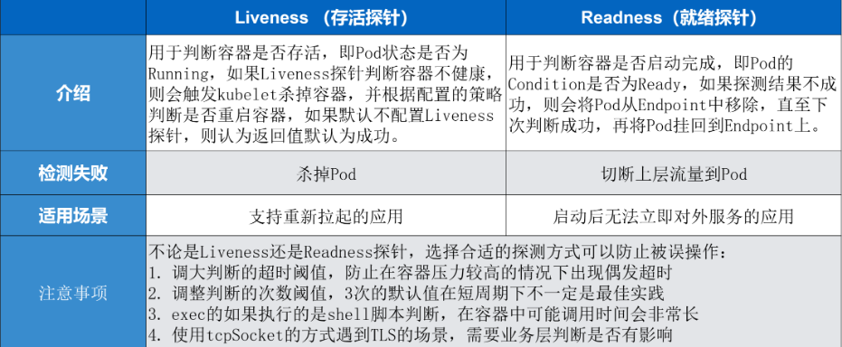

## 1. 保证应用的健康稳定

* 为了保证应用的健康与稳定，可以从两个方面进行增强
  1. 提高应用的可观测性
  2. 提供应用的可恢复能力
* 可以从三个方面去增强
  1. 实时监控应用健康状态
  2. 获取应用的资源使用情况
  3. 拿到应用的实时日志


## 2. Liveness和Readiness

* **liveness probes：存活性探针**，用于检测一个Pod是否处于存活状态，如果Pod不存活，那么k8s会kill掉Pod，然后根据**restartPolicy**执行响应操作

  * **如果livenessProbe探测失败，那么k8s执行Pod设定的重启策略——重启策略有三种**

    * **Always**：容器失效时，自动重启该容器（默认值）

    * **OnFailuer**：容器终止运行且退出码不为0时重启

    * **Never**：不重启容器

      ```yaml
      apiVersion: v1
      kind: Pod
      metadata:
        name: pod-restartpolicy
        namespace: dev
      spec:
        containers:
        - name: nginx
          image: nginx:1.17.1
          ports:
          - name: nginx-port
            containerPort: 80
          livenessProbe:
            httpGet:
              scheme: HTTP
              port: 80
              path: /hello
        restartPolicy: Never # 设置重启策略为Never
      ```

      

* **readiness probes：就绪性探针**，用于检测一个Pod是否处于就绪状态，只有Pod处于就绪状态才能对外提供服务（如果未处于就绪状态，那么k8s的流量就不会打到该Pod，就是将该Pod从Service的Endpoint中移除）




### 2.1 三种探测方式

#### 2.1.1 httpGet

* 通过http Get请求进行判断，返回码是200-399之间，那么应用是健康的

```yaml
apiVersion: v1
kind: Pod
metadata:
  labels:
    test: liveness
spec:
  containers:
  - name: liveness
    image: nginx
    livenessProbe:
      httpGet:
        path: /health #URL路径
        host: 127.0.0.1 #主机IP
        scheme: HTTP #协议，http/https
        port: 8080
        httpHeaders:
        - name: Custom-Header
          value: Awesome
        initialDelaySeconds: 3 #Pod启动后延迟多久进行一次检查
        periodSeconds: 3       #检测的时间间隔
        timeoutSeconds: 10     #检测的超时时间，在超时时间之内没有检测成功，认为失败
        successThreshold: 3    #连续探测成功多少次才认为成功(默认值为1)
        failureThreshold: 3    #探测失败的重试次数(默认值为3)，一个健康的状态连续探测3次失败，那么判断Pod处于失败状态
```


#### 2.1.2 exec

* 通过在Pod中执行一个命令来判断当前的服务是否正常，命令的返回结果是0，标识容器是健康的

```yaml
apiVersion: v1
kind: Pod
metadata: 
  labels:
    test: liveness
spec:
  containers:
  - name: liveness
    image: nginx
    livenessProbe: #存活性探测
      exec:
        command:
        - cat
        - /home/work/spring.log
        initialDelaySeconds: 5
        periodSeconds: 5
#通过cat一个具体的文件来判断当前Liveness Probe状态，
```


#### 2.1.3 tcpSocket

* 探测容器的IP和Port进行TCP健康检查，如果TCP连接可以被正确简历，那么标识这个容器时健康的

```yaml
  livenessProbe:
    tcpSocket:
      port: 8080
```


## 3. 故障排查

### 3.1 pod处于pending

pending 表示调度器没有进行介入。此时可以通过 kubectl describe pod 来查看相应的事件，如果由于资源或者说端口占用，或者是由于 node selector 造成 pod 无法调度的时候，可以在相应的事件里面看到相应的结果

### 3.2 pod处于waiting

pod 的 states 处在 waiting 的时候，通常表示说**这个 pod 的镜像没有正常拉取**，原因可能是由于这个镜像是私有镜像，但是没有配置 Pod secret；那第二种是说可能由于这个镜像地址是不存在的，造成这个镜像拉取不下来；还有一个是说这个镜像可能是一个公网的镜像，造成镜像的拉取失败

### 3.3 pod处于crashing

pod 已经被调度完成了，但是启动失败，那这个时候通常要关注的应该是这个应用自身的一个状态，并不是说配置是否正确、权限是否正确，此时需要查看的应该是 pod 的具体日志

### 3.4 pod处于running但没有正常工作

那此时比较常见的一个点就可能是由于一些非常细碎的配置，类似像有一些字段可能拼写错误，造成了 yaml 下发下去了，但是有一段没有正常地生效，从而使得这个 pod 处在 running 的状态没有对外服务，那此时可以通过 apply-validate-f pod.yaml 的方式来进行判断当前 yaml 是否是正常的，如果 yaml 没有问题，那么接下来可能要诊断配置的端口是否是正常的，以及 Liveness 或 Readiness 是否已经配置正确