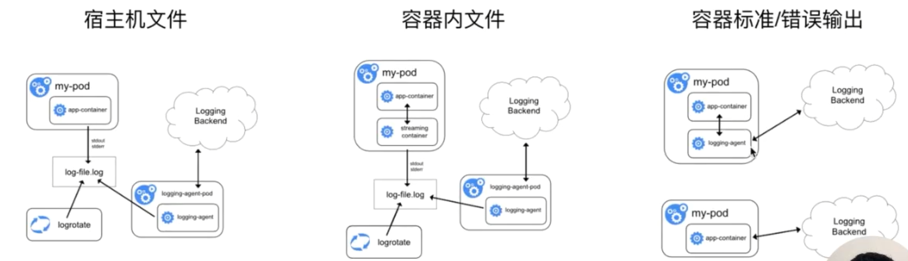
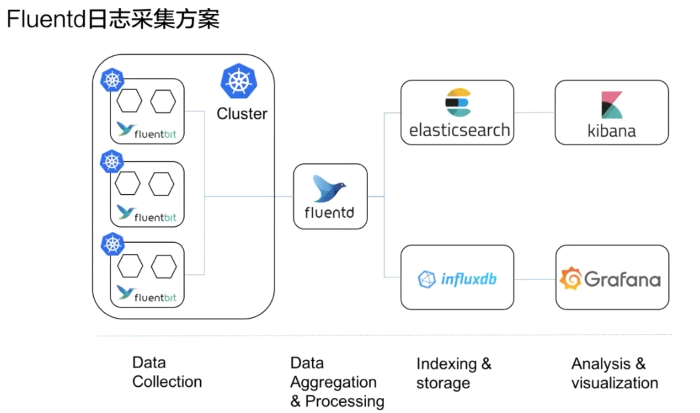

# 1. 监控

## 1.1 监控类型

### 1.1.1 资源监控

* CPU，内存，网络监控

### 1.1.2 性能监控

* 性能监控指的就是 APM 监控，也就是说常见的一些应用性能类的监控指标的检查

* 通常是通过一些 Hook 的机制在虚拟机层、字节码执行层通过隐式调用，或者是在应用层显示注入，获取更深层次的一个监控指标，一般是用来应用的调优和诊断的
* 通过一些常见的 Hook 机制，拿到类似像 jvm 里面的 GC 的次数，各种内存代的一个分布以及网络连接数的一些指标

### 1.1.3 安全监控

* 安全监控主要是对安全进行的一系列的监控策略，类似像越权管理、安全漏洞扫描等等。

### 1.1.4 事件监控

* 监控k8s的事件

# 2. 日志

## 2.1 日志类型

### 2.1.1 主机内核日志

1. 主机内核的日志
2. 驱动异常
3. 文件系统异常
4. 节点的异常（内核中的一些kernel panic或者OOM）

### 2.1.2 Runtime日志

* 常见的是Docker的日志

### 2.1.3 核心组件日志

* 在 K8s 里面核心组件包含了类似像一些外置的中间件，类似像 etcd，或者像一些内置的组件，类似像 API server、kube-scheduler、controller-manger、kubelet 等等这一系列的组件。而这些组件的日志可以帮我们来看到整个 K8s 集群里面管控面的一个资源的使用量，然后以及目前运行的一个状态是否有一些异常
* 还有的就是类似像一些核心的中间件，如 Ingress 这种网络中间件，它可以帮我们来看到整个的一个接入层的一个流量，通过 Ingress 的日志，可以做到一个很好的接入层的一个应用分析

### 2.1.4 部署应用的日志

* 可以通过应用的日志来查看业务层的一个状态

## 2.2 日志采集

