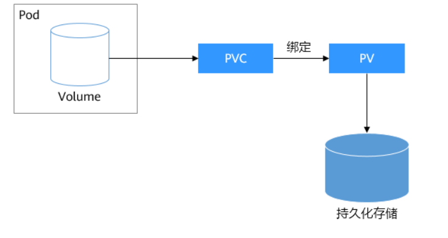

# 1. Volume

* volume的生命周期与封装它的Pod相同，Pod不存在时，Volume也不存在，Pod中的容器重启时，Volume不受影响

* Pod中的多个容器可以共享Volume
* Volume
  * cephfs
  * emptyDir
  * fc
  * hostPath
  * nfs
  * persistentVolumeClaim
  * secret
  * vsphereVolume


## 1.1 emptyDir

* Pod被分配给node时，首先创建emptyDir卷，只要该Pod还在该node上运行，该卷就仍然存在，Pod中的容器可以对卷中的文件进行读写
* enptyDir可以挂载到Pod中每个容器的相同路径or不同路径上，让同一个Pod中的多个容器可以共享数据
* 如果Pod从node上移除了，那么emptyDir中的数据也会消失

* 用法
  * 暂存空间，例如用于基于磁盘的合并排序
  * 用作长时间计算服务崩溃恢复时的检查点
  * Web服务器容器提供数据时，保存内容管理器容器提取的文件

​	

```yaml
apiVersion: v1
kind: Pod
metadata:
  name: xx
spec:
  containers:
  - image: k8s.gcr.io/test-webserver
    name: test-container
    volumeMounts:
    - mountPath: /cache #挂载到容器的哪个目录下
      name: cache-volume
    volumes:
    - name: cache-volume
      emptyDir: {}
```

* 给容器挂载后，容器启动后，会自动创建一个挂载时指定的目录，然后容器在这个目录下所有创建的文件，都会映射到node的/var/lib/kubelet/pods/podID/volumes/kubernetes.io~empty-dir/cache-volume/目录下，所以一个Volume可以挂载到同一个Pod中每个容器的不同路径下，让同一个Pod中的容器共享数据
* Pod消失后，在/var/lib/kubelet/pods目录下，其PodId对应的目录也会消失，所以Pod消失，emptyDir里面的数据会丢失


## 1.2 hostPath

* 将主机节点文件系统中的文件或者目录挂载到集群中，Pod消失，其容器在卷中写入的数据不会消失
*  用法
  * 如果Pod中的容器需要使用到node上的一些文件

* type
  * DirectoryOrCreate：如果在给定的路径上没有任何东西存在，那么将根据需要再哪里创建一个空目录，权限设置为0755
  * Directory：指定的路径下必须存在目录
  * FileOrCreate：如果在给定的路径上没有任何东西存在，那么会根据需要创建一个空文件，权限设置为0644，与kubelet具有相同的组和所有权。
  * File：指定的路径下必须存在文件
  * Socket：指定的文件下必须存在Socket
  * CharDevice：指定的路径下必须存在字符设备
  * BlockDevice：指定的路径下必须存在块设备

```yaml
apiVersion: v1
kind: Pod
metadata:
  name: xx
spec:
  containers:
    - image: busybox
      name: test-container1
      command: ["/bin/sh","-c","sleep 6000s"]
      volumeMounts:
        - mountPath: /test1 #挂载到容器的哪个目录下
          name: cache-volume
    - image: busybox
      name: test-container2
      command: [ "/bin/sh","-c","sleep 6000s" ]
      volumeMounts:
        - mountPath: /test2 #挂载到容器的哪个目录下
          name: cache-volume
  volumes:
    - name: cache-volume
      hostPath:
        path: /hxq-pod-test
        type: DirectoryOrCreate
  nodeName: hxq-node01

#Pod调度到Node上后，会检测node上是否存在/hxq-pod-test目录，如果不存在会创建
#然后在容器test-container1中会创建/test1目录，容器中的/test1映射到node上的/hxq-pod-test中
#然后在容器test-container2中会创建/test2目录，容器中的/test2映射到node上的/hxq-pod-test中
#test-container1在容器目录/test1中写入的文件，会同步到node的/hxq-pod-test中，这样实现了Pod中多个容器共享数据
```


# 2. PV和PVC

## 2.1 介绍

* Kubernetes引入PV和PVC，将存储管理抽象为如何提供存储和如果使用存储两个关注点
* 如果我们使用网络存储（块存储，文件存储，对象存储），那么为了让使用者不要关心具体的基础设施的细节，当需要存储资源的时候，只需要声明自己需要多少即可——引入PV和PVC
* PV——PersistentVolume，集群中的一块存储空间，是集群中的资源，用于将持久化存储如何提供存储的细节抽象出来
* PVC——PersistentVolumeClaim，描述Pod所希望使用的持久化存储的属性（如存储空间大小，读写权限）
* Kubernetes管理员设置好网络存储的类型，提供对应的PV描述（PV绑定对应的持久化存储），使用者需要存储时只需要创建PVC，然后在Pod中使用Volume关联PVC，即可让Pod使用到存储资源



## 2.2 PV配置

**PV配置**——静态和动态

* **静态——**集群管理员手动创建一些PV，带有可供集群用户使用的实际存储的细节，可用于消费
* **动态**——管理员部署**PV配置器**，然后定义对应的**StorageClass**，开发者在创建PVC时可以选择需要创建存储的类型，PVC将StorageClass传递给PV配置器，PV配置器自动创建PV

## 2.3 PV绑定

* **绑定**——在动态配置下，用户创建PVC（指定了特定存储量和访问模式），master会监控新的PVC，寻找匹配匹配的PV，如果找得到，就将PV与PVC绑定在一起，PVC的绑定是排他性的，PVC与PV的绑定是一对一的关系（一个PV被绑定后，就不能被其他PVC绑定了）

## 2.3 PV使用

* **使用**——用户通过在Pod的volume中配置persistentVolumeClaim来调度Pod使用PV

## 2.4 PV回收

* **回收**——Pod使用完volume后，允许删除PVC对象，PV的回收策略决定如果处理该卷——有保留，回收，删除
  * 保留——当PVC被删除后，PV仍然存在，数据保留
  * 回收——当PVC被删除后，删除PV上的所有数据，PV仍然存在，可以被新的PVC使用
  * 删除——当PVC被删除后，PV也被删除

## 2.5 PV生命周期

Provisioning—> Binding—>Using—>Released—>Recycling

* Provisioning供应准备
* Binding绑定——用户创建pvc并指定需要的资源和访问模式
* Using
* Released——用户删除pvc，pv变为released
* Recycling——根据设备的回收策略

## 2.6 PV静态配置

* PV的生命周期独立于Pod的声明周期

```yml
apiVersion: v1
kind: PersistentVolume
metadata:
  name: pv-example
spec:
  accesssModes:     #访问模式,有ReadWriteOnce(该卷可以被单个节点以读写模式挂载),ReadOnlyMany,ReadWriteMany(该卷可以被多个节点以读写挂载)
  - ReadWriteMany   #读写模式
  capacity:
    storage: 10Gi   #定义PV的大小
  volumeMode: Filesystem #卷模式，Filesystem,Block
  persistentVolumeReclaimPolicy: Recycle #回收策略,有Retain,Recycle,Delete
  storageClassName: slow #存储类的名字，一个特定类的PV只能绑定到请求该类的PVC上，如果storageClassName的PV没有类，只能绑定定到不需要特定类的PVC上
  moutOptions:
    - hard
    - nfsvers=4.1
  nfs:
    path: /temp
    server: 172.17.0.2

```


## 2.7 PVC配置

```yml
apiVersion: v1
kind: PersistentVolumeClaim
metadata:
  name: myclaim
spec:
  accessModes: ReadWriteMany
  volumeMode: Filesystem
  resource:
    requests:
      storage: 8Gi #需要的资源，只会挑选满足要求的PV
  storageClassName: slow #指定特定类，只用特定类的的PV才可以绑定到PVC
  selector:
    matchLabels: #标签选择器
      release: "stable"
    matchExpressions: #标签选择器，只会选择符合选择器的PV
      - key: environment
        operator: In
        values: [dev]
```


## 2.8 PVC使用PV

```yml
apiVersion: v1
kind: Pod
metadata:
  name: mypod
spec:
  containers:
    - name: nginx
      iamge: nginx
      volumeMounts:
      - mountPath: "/var/www/html" #将卷挂载目录
        name: my-volume
  volumes: #定义卷
    - name: my-volume
      persistentVolumeClaim: #使用PVC作为卷
        claimName: myclaim
```

