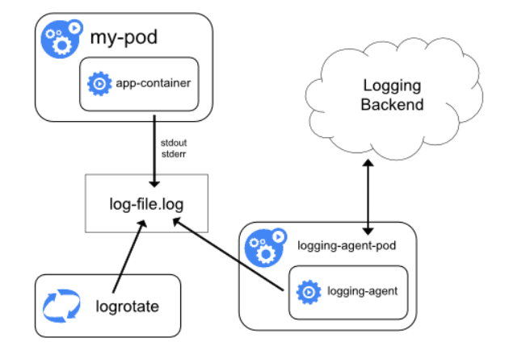
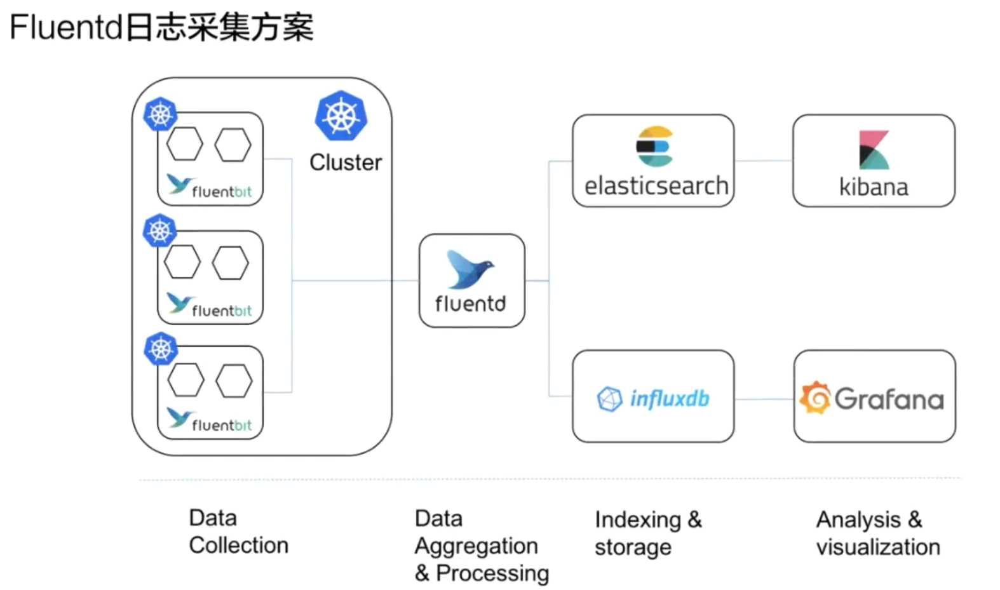

# 1. 监控类型

## 1.1 资源监控

* CPU，内存，网络监控

## 1.2 性能监控

* 性能监控指的就是 APM 监控，也就是说常见的一些应用性能类的监控指标的检查

* 通常是通过一些 Hook 的机制在虚拟机层、字节码执行层通过隐式调用，或者是在应用层显示注入，获取更深层次的一个监控指标，一般是用来应用的调优和诊断的
* 通过一些常见的 Hook 机制，拿到类似像 jvm 里面的 GC 的次数，各种内存代的一个分布以及网络连接数的一些指标

## 1.3 安全监控

* 安全监控主要是对安全进行的一系列的监控策略，类似像越权管理、安全漏洞扫描等等。

## 1.4 事件监控

* 监控k8s的事件


# 2. 日志类型

## 2.1 主机内核日志

1. 主机内核的日志
2. 驱动异常
3. 文件系统异常
4. 节点的异常（内核中的一些kernel panic或者OOM）

## 2.2 Runtime日志

* 常见的是Docker的日志

## 2.3 核心组件日志

* 在 K8s 里面核心组件包含了类似像一些外置的中间件，类似像 etcd，或者像一些内置的组件，类似像 API server、kube-scheduler、controller-manger、kubelet 等等这一系列的组件。而这些组件的日志可以帮我们来看到整个 K8s 集群里面管控面的一个资源的使用量，然后以及目前运行的一个状态是否有一些异常
* 还有的就是类似像一些核心的中间件，如 Ingress 这种网络中间件，它可以帮我们来看到整个的一个接入层的一个流量，通过 Ingress 的日志，可以做到一个很好的接入层的一个应用分析

## 2.4 部署应用的日志

* 可以通过应用的日志来查看业务层的一个状态


# 3. 日志采集

## 3.1 k8s基于DockerEngine提供的基础日志功能

* Kubernetes，Pod中应用程序的标准处理方式——将日志通过标准输出流和标准错误流打印（System.out.println()和System.out.error() ）

* Pod分配到一个Node上运行，容器中的标准输出会将日志输出到stdout和stderr，DockerEngine会接管stdout和stderr文件描述符，日志接手后按照DockerEngine配置的LogDriver规则进行处理

>以JSON LogDriver为例:stdout—DockerEngine—LogDriver—序列化为Json—保存到文件中(默认情况下存储到`/var/lib/docker/containers/$(containerId)`目录中的临时日志文件中)
>
>另外还有2个软链接——`/var/log/containers`进而`/var/log/pods/`

* `kubectl logs`查看的是`/var/lib/docker/containers/$(containerId)`下的日志

* 上述这种情况下，Pod运行产生的日志是存储在Node上的，有2个明显缺陷

  * 如果没有给Pod分配Volume做日志持久化，那么Pod死亡，Node会删除Pod的日志

  * 如果Pod持续运行，那么Node上该Pod产生的日志会越来越大
* Kubernetes没有提供一个可以持久化日志的解决方案，但是有许多日志方案可以与Kubernetes集成


## 3.2 节点级别的日志控制

### 3.2.1 kubelet处理

* 如果使用CRI Container Runtime，那么kubelet可以负责进行日志轮转和管理日志目录结构
* kubectl向CRI Container Runtime发送信息，让Container Runtime将容器日志写到指定位置
* kubectl有两个参数
  * `containerLogMaxSize`：每个日志文件允许的最大大小
  * `containerLogMaxFiles`：每个容器允许拥有的最大日志文件数目
* 运行`kubectl logs`时，kubelet直接从这些log file中读取日志


### 3.2.2 特殊处理

* 不想将应用程序的日志输出到标准输出，而是将日志直接存储到某个路径下——在Pod启动时候挂载一个Volume
* 这样做
  1. Pod宕机，日志不丢失，因为日志直接写入Volume中，而不是在Node上进行临时存储
  2. 但这样做，kubectl logs就无法查看日志了（因为kubectl logs底层是查看`/var/lib/docker/containers/$(containerId)`下的日志，这样做的话`/var/lib/docker/containers/$(containerId)`目录下的日志文件是空的，`/var/log/containers`下Pod对应的日志文件也是空的


## 3.3 集群级别的日志控制

|              |    DockerEngine    |        业务直写        |            DaemonSet             |             Sidecar             |
| :----------: | :----------------: | :--------------------: | :------------------------------: | :-----------------------------: |
| 采集日志类型 |   stdout/stderr    |        业务日志        |           stdout+文件            |              文件               |
|   部署运维   |    低,原生支持     |  低,维护配置文件即可   |               一般               | 高,每个Pod都需要独立部署Sidecar |
| 日志分类存储 |      无法实现      |      业务独立配置      |      可通过容器/路径等映射       |    每个Pod独立配置，灵活性高    |
|  多租户隔离  |         弱         |           弱           |               一般               |               强                |
| 支持集群规模 |   本地存储无限制   |         无限制         |           取决于配置数           |             无限制              |
|   资源占用   |     低，docker     |                        |                                  |                                 |
|  engine提供  | 最低，省去采集开销 |          较低          |               较高               |                                 |
|  查询便捷性  |    低，只能grep    | 高，可根据业务提点定制 |   较高，可进行自定义查询,统计    |     高，可根据业务特点定制      |
|   使用场景   |     非生产环境     |  对性能要求极高的场景  | 日志分类明确，功能较为单一的集群 |    大型，混合型，PaaS型集群     |

### 3.3.1 DockerEngine

* DockerEngine本身有LogDriver功能，可以通过配置将不同的LogDrive将容器的stdout和stderr通过DockerEngine写入到远端存储

* 可定制化，灵活性，资源隔离性低，不建议在生产环境中使用


### 3.3.2 业务直写

* 应用中继承日志采集的SDK，通过SDK直接将日志发送给服务器
* 不需要额外部署Agent，对系统的资源消耗最低，但是由于业务和日志SDK强绑定，整体灵活性很低，适用于日志量极大的场景


### 3.3.3 DaemonSet

* 使用DaemonSet在每个Node上部署一个日志Agent，负责采集该Node上的所有日志
* 拓展性，租户隔离性受限，比较适用于功能单一或者业务不是很多的集群



### 3.3.4 Sidecar

* 每个Pod独立部署日志Agent，Agent只会负责采集该Pod的日志
* Sidecar占用资源较多，但灵活性和多租户隔离性较强，推荐大型的K8S集群或作为PaaS平台为多个业务方服务的集群使用该方式


### 3.3.5 DaemonSet和Sidecar合用


* 应用容器将日志写到volume中持久化
* sidecar container根据日志文件，将日志重定向到自己的stdout/stderr中（可以开启多个sidecar container，可以将日志文件中不同级别的日志重定向到不同的日志stdout中）
* 这个方法允许我们从应用程序中分离出多个日志流
* sidecar container还可以用于对应用容器产生的日志进行轮转

```yml
apiVersion: v1
kind: Pod
metadata:
  name: counter
spec:
  containers:
  - name: count #应用容器
    image: busybox:1.28
    args:
    - /bin/sh
    - -c
    - >
      i=0;
      while true;
      do
        echo "$i: $(date)" >> /var/log/1.log;
        echo "$(date) INFO $i" >> /var/log/2.log;
        i=$((i+1));
        sleep 1;
      done      
    volumeMounts:
    - name: varlog
      mountPath: /var/log
  - name: count-log-1  #sidecar container
    image: busybox:1.28
    args: [/bin/sh, -c, 'tail -n+1 -F /var/log/1.log']
    volumeMounts:
    - name: varlog
      mountPath: /var/log
  - name: count-log-2  #sidecar container
    image: busybox:1.28
    args: [/bin/sh, -c, 'tail -n+1 -F /var/log/2.log']
    volumeMounts:
    - name: varlog
      mountPath: /var/log
  volumes:
  - name: varlog
    emptyDir: {}
```


## 3.4 通用解决方案




