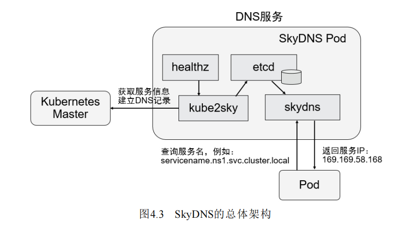
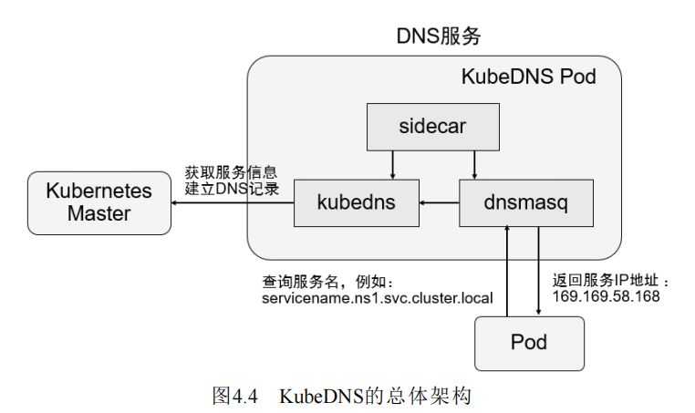
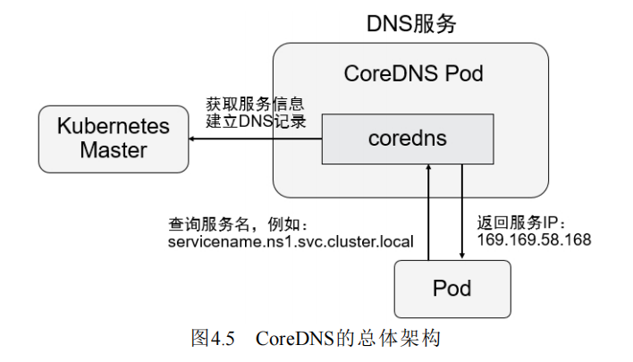

* Kubernetes的kube-system命名空间中，运行着coredns Pod——用于解析DNS Name

* 可以拥有DNS Name的资源
  * Service
  * Pod


## 1. Kubernetes DNS演进

### 1.1 SkyDNS

* Kubernetes1.2版本
* SkyDNS由4个容器组成——kube2sky，skydns，etcd，healthz
  * kube2sky——监控Kubernetes中Service资源的变化，根据Service的名称和IP地址信息生成DNS记录，并保存到etcd中
  * skydns——从etcd中读取DNS记录，并为Client提供DNS查询服务
  * healthz——提供对SkyDNS的健康检查功能



### 1.2 KubeDNS

* Kubernetes1.4版本开始使用
* KubeDNS由3个容器组成——kubedns，dnsmasq，sidecar，KubeDNS直接将DNS记录保存在内存中
  * kubedns——监控Kubernetes中Service资源的变化，根据Service的名称和IP地址信息生成DNS记录，并保存到内存中
  * dnsmasq——从kubedns获取DNS记录，提供DNS缓存，为Client提供DNS查询服务
  * sidecar——提供对kubedns和dnsmasq的健康检查功能




### 1.3 CoreDNS

* 从Kubernetes1.11开始
* CoreDNS是一个Go实现的高性能，插件式，易拓展的DNS服务端
* CoreDNS支持自定义DNS记录及配置upstream DNS Server，可以统一管理Kubernetes基于服务的内部DNS和数据中心的物理DNS




## 2. DNS拓展

* Kubelet为每个Pod都创建了一个/etc/resolv.conf文件，通过这个文件，可以拓展DNS解析

```shell
cat /etc/resolv.conf
nameserver 10.96.0.10
search promise.svc.cluster.local svc.cluster.local cluster.local
#Pod访问service，那么通过该文件，拓展为service.promise.svc.cluster.local, service.svc.cluster.local, service.cluster.local,最终得到4个DNS Name，并尝试解析这4个DNS Name
```


## 3. Service DNS

* $(service name)——只有跟Service处于同一个namespace的Pod才可以解析成功，需要通过DNS拓展
* $(service name).$(namespace)——通过DNS拓展，是可以解析的
* $(service name).$(namespace).svc.cluster.local——可以直接解析


## 4. Pod DNS

* Pod默认对应的DNS Name——`pod-ip-address.$(namespace).pod.cluster.local`（例如172-17-0-3.default.pod.cluster.local）
* 如果一个Pod属于某个Service，那么还会有一个DNS Name——`pod-ip-address.$(service-name).$(namespace).svc.cluster.local`

* Pod可以指定hostname和subdomain字段，如果指定了，那么DNS Name——`hostname.subdomain.$(namespace).svc.cluster.local`


## 5. 为Pod自定义hostname和subdomain

```yaml
apiVersion: v1
kind: Pod
metadata:
  name: web-app
  labels:
    app: web-app
  spec:
    hostname: web-app
    subdomain: my-subdomain
```


## 5. Pod的DNS策略

* Pod的DNS策略通过Pod中的dnsPolicy设置
  * Default——Pod 从运行所在的节点继承名称解析配置
  * ClusterFirst（默认值）:优先使用Kubernetes的DNS服务（如CoreDNS），将无法解析的域名转发到系统配置的上游DNS服务器
  * ClusterFirstWithHostNet——对于以 hostNetwork 方式运行的 Pod，应显式设置其 DNS 策略为ClusterFirstWithHostNet
  * None——此设置允许 Pod 忽略 Kubernetes 环境中的 DNS 设置，Pod 会使用其 `dnsConfig` 字段 所提供的 DNS 配置

```yaml
apiVersion: v1
kind: Pod
metadata:
  name: busybox
  namespace: default
spec:
  containers:
  - image: busybox:1.28
    command:
      - sleep
      - "3600"
    imagePullPolicy: IfNotPresent
    name: busybox
  restartPolicy: Always
  hostNetwork: true
  dnsPolicy: ClusterFirstWithHostNet
```


## 6. Pod的DNS配置

* 通过`dnsConfig`字段，对Pod进行DNS配置
* `dnsConfig`中可以指定以下属性
  * `nameservers`：可以让Pod使用的DNS Server的IP列表（最多3个，当`dnsPolicy`为None时，`nameservers`至少必须有一个IP）
  * `searches`：可以让Pod使用的DNS查询域名列表（最多6个）
  * `options`：对象列表，每个对象都必须有一个name，value可以没有

```yaml
apiVersion: v1
kind: Pod
metadata:
  namespace: default
  name: dns-example
spec:
  containers:
    - name: test
      image: nginx
  dnsPolicy: "None"
  dnsConfig:
    nameservers:
      - 1.2.3.4 #DNS Server IP
    searches: #用于解析成DNS Server IP
      - ns1.svc.cluster-domain.example 
      - my.dns.search.suffix
    options:
      - name: ndots
        value: "2"
      - name: edns0
```

