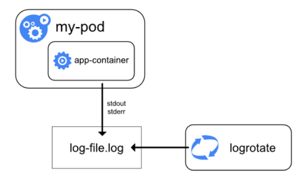
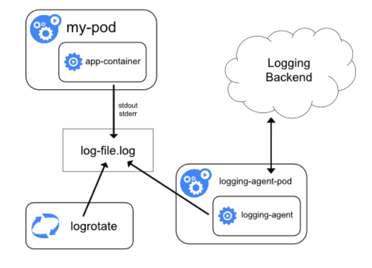
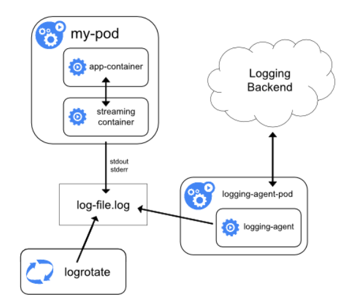
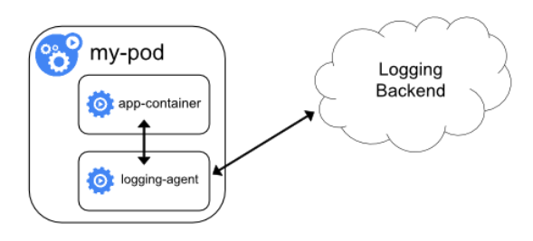
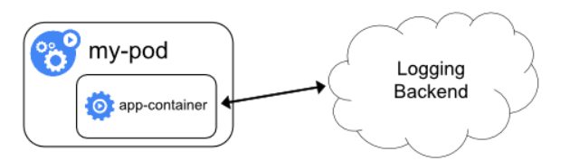

## 1. Kubernetes提供的基础日志处理

* Kubernetes，Pod中应用程序的标准处理方式——将日志通过标准输出流和标准错误流打印（System.out.println()和System.out.error() ）

* 这样，我们就可以通过`kubectl logs`获取容器中的日志

* Pod分配到一个Node上运行，该Pod产生的日志都会临时存储在Node的`/var/lib/docker/containers/$(containerId)`下（还有一个地方也有——`/var/log/containers`目录
* Pod运行产生的日志，是存储在运行Pod的Node上的，有2个明显缺陷
  * 如果没有给Pod分配Volume做日志持久化，那么Pod死亡，Node会删除Pod的日志
  * 如果Pod持续运行，那么Node上该Pod产生的日志会越来越大
* Kubernetes没有提供一个可以持久化日志的解决方案，但是有许多日志方案可以与Kubernetes集成


## 2. 节点级别的日志控制

### 2.1 标准处理



* Pod仍然采用标准输出流和标准错误流打印日志，这些日志会由Docker存储到`/var/lib/docker/containers/$(containerId)`目录中的临时日志文件中
* 节点级别的日志控制一个很重要的考量因素是实现日志轮转（Kubernetes自身不支持）
* 可以通过在每个Node上运行一个logrotate工具来实现日志轮转


### 2.2 kubelet处理

* 如果使用CRI Container Runtime，那么kubelet可以负责进行日志轮转和管理日志目录结构
* kubectl向CRI Container Runtime发送信息，让Container Runtime将容器日志写到指定位置
* kubectl有两个参数
  * `containerLogMaxSize`：每个日志文件允许的最大大小
  * `containerLogMaxFiles`：每个容器允许拥有的最大日志文件数目
* 运行`kubectl logs`时，kubelet直接从这些log file中读取日志


### 2.3 特殊处理

* 不想将应用程序的日志输出到标准输出，而是将日志直接存储到某个路径下——在Pod启动时候挂载一个Volume
* 这样做
  1. Pod宕机，日志不丢失，因为日志直接写入Volume中，而不是在Node上进行临时存储
  2. 但这样做，kubectl logs就无法查看日志了（因为kubectl logs底层是查看`/var/lib/docker/containers/$(containerId)`下的日志，这样做的话`/var/lib/docker/containers/$(containerId)`目录下的日志文件是空的，`/var/log/containers`下Pod对应的日志文件也是空的


## 3. 集群级别的日志控制

### 3.1 使用node logging agent



* 通过DaemonSet在每个Node上安装一个logging-agent
* logging-agent将Node上所有Pod产生的日志推送给Logging Backend


### 3.2 使用附属容器和logging agent



* 应用容器将日志写到volume中持久化
* sidecar container根据日志文件，将日志重定向到自己的stdout/stderr中（可以开启多个sidecar container，可以将日志文件中不同级别的日志重定向到不同的日志stdout中）
* 这个方法允许我们从应用程序中分离出多个日志流
* sidecar container还可以用于对应用容器产生的日志进行轮转

```yaml
apiVersion: v1
kind: Pod
metadata:
  name: counter
spec:
  containers:
  - name: count #应用容器
    image: busybox:1.28
    args:
    - /bin/sh
    - -c
    - >
      i=0;
      while true;
      do
        echo "$i: $(date)" >> /var/log/1.log;
        echo "$(date) INFO $i" >> /var/log/2.log;
        i=$((i+1));
        sleep 1;
      done      
    volumeMounts:
    - name: varlog
      mountPath: /var/log
  - name: count-log-1  #sidecar container
    image: busybox:1.28
    args: [/bin/sh, -c, 'tail -n+1 -F /var/log/1.log']
    volumeMounts:
    - name: varlog
      mountPath: /var/log
  - name: count-log-2  #sidecar container
    image: busybox:1.28
    args: [/bin/sh, -c, 'tail -n+1 -F /var/log/2.log']
    volumeMounts:
    - name: varlog
      mountPath: /var/log
  volumes:
  - name: varlog
    emptyDir: {}
```


### 3.3 logging agent作为附属容器



* 专门为应用创建一个附属容器，来单独进行日志收集


### 3.4 应用直接push日志

