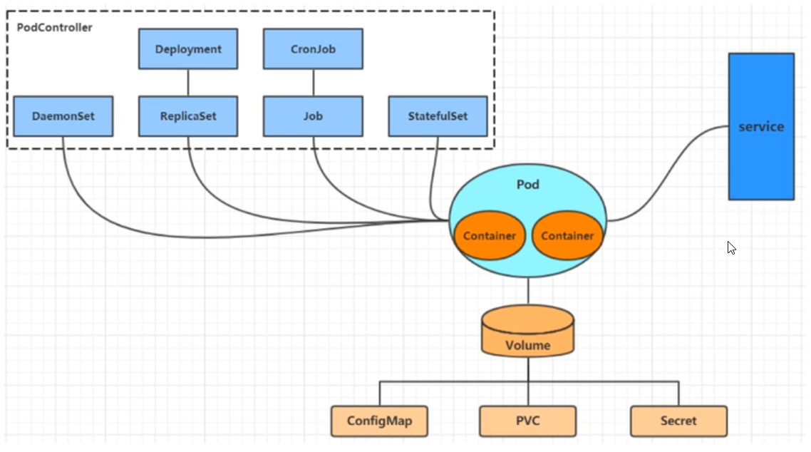

* Kubernetes将所有内容抽象为**资源**，用户通过操作资源来管理Kubernetes

* Kubernetes本质上是一个集群系统，用户可以其中部署各种服务，所谓服务，其实就是一个个容器

* Kubernetes最小管理单元是Pod，容器放在Pod中，Kubernetes通过**Pod控制器**管理Pod

* Pod可以提供服务之后——通过 **Service资源**来访问Pod中的服务，Kubernetes提供各种 **存储系统**来持久化Pod中程序的数据

##  Kubernetes资源类型

* **集群级别资源**
  * **nodes**：集群组成服务器
  * **namespaces**：隔离Pod
* **pod资源**
  * **pods**：装载容器
* **pod资源控制器**
  * **relicationcontrollers**：控制Pod资源
  * **replicasets**：控制Pod资源
  * **deployments**：控制Pod资源
  * **daemonset**：控制Pod资源
  * **jobs**：控制Pod资源
  * **cronjobs**：控制Pod资源
  * **horizontalpodautoscalers**：控制Pod资源
  * **statefulsets**：控制Pod资源
* **服务发现资源**
  * **services**：统一pod对外接口
  * **ingress**：统一pod对外接口
* **存储资源**
  * **volumeattachments**：存储
  * **persistentvolumes**：存储
  * **persistentvolumeclaims**：存储
* **配置资源**
  * **configmaps**：配置
  * **secrets**：配置