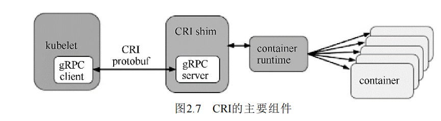

## 1. CRI概述

Kubernetes1.5引入CRI接口规范——通过插件接口模式，让Kubernetes无需重新编译即可使用更多的Container Runtime

Container Runtime只需要实现Kubernetes的CRI接口规范，即可让Kubernetes接入

## 2. CRI组件

* kubelect使用gRPC框架，通过UNIX Socket与Container Runtime直接通信，或者与CRI Shim通信
* Protocol Buffers API包含两个gRPC服务——ImageService，RuntimeService，这两个服务由Container Runtime实现
  * ImageService——从仓库拉取镜像，查看，移除镜像的接口定义
  * RuntimeService——负责Pod和容器的生命周期管理，以及与容器的交互