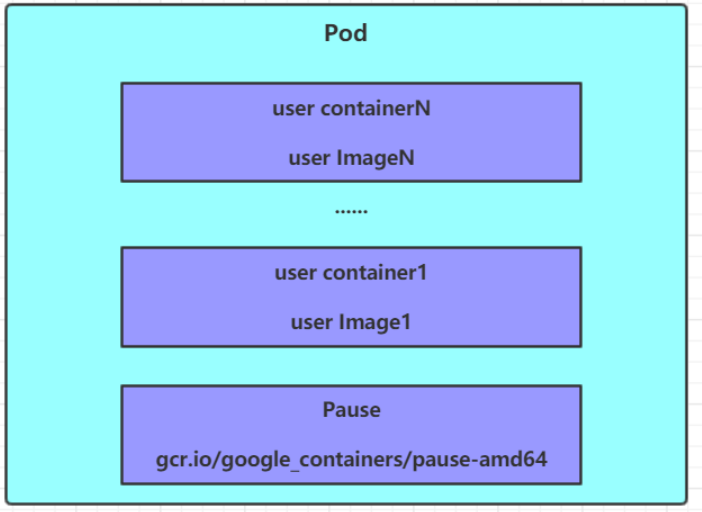

* Pod是Kubernetes集群进行管理的最小单元，程序必须部署在容器中，而容器必须存在于Pod中

* 每个Pod中默认都有一个根容器Pause

* 每个Pod中都包含一个或多个容器，容器可以分为2类

  * **用户程序所在的容器**
  * **Pause容器**——所有的Pod都有会的一个 **根容器**，其有2个作用
    * **评估整个Pod的健康状态**
    * 其上设置有Pod IP，该Pod的容器都根据此Pod IP来实现Pod通信

  按照Pod的创建方式，Pod可以分为两种类型

  * **自主式Pod**：kubernetes直接创建出来的Pod，这种pod删除后就没有了，也不会重建
  * **Pod控制器创建的Pod**：kubernetes通过控制器创建的pod，这种pod删除了之后还会自动重建



## 1. Pod资源清单

```yml
apiVersion: v1     #必选，版本号，例如v1
kind: Pod       　 #必选，资源类型，例如 Pod
metadata:       　 #必选，元数据
  name: string     #必选，Pod名称
  namespace: string  #Pod所属的命名空间,默认为"default"
  labels:       　　  #自定义标签列表
    - name: string      
    
spec:  #必选，Pod中容器的详细定义
  containers:  #必选，Pod中容器列表
  - name: string   #必选，容器名称
    image: string  #必选，容器的镜像名称
    imagePullPolicy: [ Always|Never|IfNotPresent ]  #获取镜像的策略 
    command: [string]   #容器的启动命令列表，如不指定，使用打包时使用的启动命令
    args: [string]      #容器的启动命令参数列表
    workingDir: string  #容器的工作目录
    
    volumeMounts:       #挂载到容器内部的存储卷配置
    - name: string      #引用pod定义的共享存储卷的名称，需用volumes[]部分定义的的卷名
      mountPath: string #存储卷在容器内mount的绝对路径，应少于512字符
      readOnly: boolean #是否为只读模式
      
    ports: #需要暴露的端口库号列表
    - name: string        #端口的名称
      containerPort: int  #容器需要监听的端口号
      hostPort: int       #容器所在主机需要监听的端口号，默认与Container相同
      protocol: string    #端口协议，支持TCP和UDP，默认TCP
      
    env:   #容器运行前需设置的环境变量列表
    - name: string  #环境变量名称
      value: string #环境变量的值
      
    resources: #资源限制和请求的设置
      limits:  #资源限制的设置
        cpu: string     
        memory: string  
      requests: #资源请求的设置
        cpu: string    
        memory: string
        
    lifecycle: #生命周期钩子
        postStart: #容器启动后立即执行此钩子,如果执行失败,会根据重启策略进行重启
        preStop: #容器终止前执行此钩子,无论结果如何,容器都会终止
        
    livenessProbe:  #对Pod内各容器健康检查的设置，当探测无响应几次后将自动重启该容器
      exec:       　 #对Pod容器内检查方式设置为exec方式
        command: [string]  #exec方式需要制定的命令或脚本
      httpGet:       #对Pod内个容器健康检查方法设置为HttpGet，需要制定Path、port
        path: string
        port: number
        host: string
        scheme: string
        HttpHeaders:
        - name: string
          value: string
          
      tcpSocket:     #对Pod内个容器健康检查方式设置为tcpSocket方式
         port: number
       initialDelaySeconds: 0       #容器启动完成后首次探测的时间，单位为秒
       timeoutSeconds: 0    　　    #对容器健康检查探测等待响应的超时时间，单位秒，默认1秒
       periodSeconds: 0     　　    #对容器监控检查的定期探测时间设置，单位秒，默认10秒一次
       successThreshold: 0
       failureThreshold: 0
       securityContext:
         privileged: false
         
  restartPolicy: [Always | Never | OnFailure]  #Pod的重启策略
  
  nodeName: <string> #设置NodeName表示将该Pod调度到指定到名称的node节点上
  
  nodeSelector: obeject #设置NodeSelector表示将该Pod调度到包含这个label的node上
  
  imagePullSecrets: #Pull镜像时使用的secret名称，以key：secretkey格式指定
  - name: string
  
  hostNetwork: false   #是否使用主机网络模式，默认为false，如果设置为true，表示使用宿主机网络
  
  volumes:   #在该pod上定义存储卷
  - name: string    #共享存储卷名称 （volumes类型有很多种）
    emptyDir: {}       #类型为emtyDir的存储卷，与Pod同生命周期的一个临时目录。为空值
    hostPath: string   #类型为hostPath的存储卷，表示挂载Pod所在宿主机的目录
      path: string      　　        #Pod所在宿主机的目录，将被用于同期中mount的目录
    secret:       　　　#类型为secret的存储卷，挂载集群与定义的secret对象到容器内部
      scretname: string  
      items:     
      - key: string
        path: string
    configMap:         #类型为configMap的存储卷，挂载预定义的configMap对象到容器内部
      name: string
      items:
      - key: string
        path: string
```


### 1.1 imagePullPolicy

* **Always**：总是从远程仓库拉取镜像（一直远程下载）
* **IfNotPresent**：本地有则使用本地镜像，本地没有则从远程仓库拉取镜像（本地有就本地 本地没远程下载）
* **Never**：只使用本地镜像，从不去远程仓库拉取，本地没有就报错 （一直使用本地）

> 默认值说明：
>
> 如果镜像tag为具体版本号， 默认策略是：IfNotPresent
>
> 如果镜像tag为：latest（最终版本） ，默认策略是always


### 1.2 command和args

容器创建后执行

>特别说明：
>通过上面发现command已经可以完成启动命令和传递参数的功能，为什么这里还要提供一个args选项，用于传递参数呢?这其实跟docker有点关系，kubernetes中的command、args两项其实是实现覆盖Dockerfile中ENTRYPOINT的功能。
>1 如果command和args均没有写，那么用Dockerfile的配置。
>2 如果command写了，但args没有写，那么Dockerfile默认的配置会被忽略，执行输入的command
>3 如果command没写，但args写了，那么Dockerfile中配置的ENTRYPOINT的命令会被执行，使用当前args的参数
>4 如果command和args都写了，那么Dockerfile的配置被忽略，执行command并追加上args参数


### 1.3 env

配置容器中的环境变量

```yaml
apiVersion: v1
kind: Pod
metadata:
  name: pod-env
  namespace: dev
spec:
  containers:
  - name: busybox
    image: busybox:1.30
    command: ["/bin/sh","-c","while true;do /bin/echo $(date +%T);sleep 60; done;"]
    env: # 设置环境变量列表
    - name: "username"
      value: "admin"
    - name: "password"
      value: "123456"
```


### 1.4 ports

ports的子属性有

```yaml
KIND:     Pod
VERSION:  v1
RESOURCE: ports <[]Object>
FIELDS:
   name         <string>  # 端口名称，如果指定，必须保证name在pod中是唯一的		
   containerPort<integer> # 容器暴露出来的端口
   hostPort     <integer> # 容器要在主机上公开的端口，如果设置，主机上只能运行容器的一个副本(一般省略) 
   hostIP       <string>  # 要将外部端口绑定到的主机IP(一般省略)
   protocol     <string>  # 端口协议。必须是UDP、TCP或SCTP。默认为“TCP”。
```

集群内部可以通过 **PodIP:containerPort**访问Pod内的容器


### 1.5 resources

对容器进行资源配额，有两个子属性

* **limits**：用于限制运行时容器的最大占用资源，当容器占用资源超过limits时会被终止，并进行重启
* **requests** ：用于设置容器需要的最小资源，如果环境资源不够，容器将无法启动

```yaml
apiVersion: v1
kind: Pod
metadata:
  name: pod-resources
  namespace: dev
spec:
  containers:
  - name: nginx
    image: nginx:1.17.1
    resources: # 资源配额
      limits:  # 限制资源（上限）
        cpu: "2" # CPU限制，单位是core数
        memory: "10Gi" # 内存限制
      requests: # 请求资源（下限）
        cpu: "1"  # CPU限制，单位是core数
        memory: "10Mi"  # 内存限制
```

>- cpu：core数，可以为整数或小数
>- memory： 内存大小，可以使用Gi、Mi、G、M等形式


## 2. Pod生命周期

1. **Pod创建过程**
2. 运行 **初始化容器**过程
3. 运行 **主容器**过程
   * 主容器运行前——>执行post start
   * 主容器运行时——>不断进行容器存活性探测和就绪性探测
   * 主容器停止运行前——>执行pre stop
4. **Pod终止过程**


### 2.1 pod的创建过程

1. 用户提交创建pod请求给ApiServer
2. ApiServer生成pod信息，存入etcd，返回确认信息给client
3. ApiServer开始反映etcd中pod对象的变化，其他组件通过watch机制来跟踪检查ApiServer上的变动
4. Scheduler发现有新的Pod要创建，为Pod分配主机，并将结果发送给ApiServer
5. Node节点上的Kubelet发现有Pod要调度过来，尝试调用Docker启动容器，并将结果发给ApiServer
6. ApiServer将接收到的Pod信息存入etcd

### 2.2 pod终止过程

1. 用户提交删除pod请求给ApiServer
2. ApiServer将Pod标记为terminating状态（ApiServer会给Pod一个宽限期(30s))
3. node上的kubelet检测到pod对象转变为terminating状态——启动Pod终止过程
4. Pod控制器监控到Pod的终止行为，将其从对应的Service的Pod列表中移除
5. 如果Pod定义了pre Stop，那么标记为terminating后会执行pre stop
6. Pod中的容器收到停止信息，开始停止容器
7. 如果宽限期到了，Pod中还有容器在运行，那么Pod会收到立即终止的信号
8. kubelet请求ApiServer在Pod的宽限期设为0完成删除操作，此时Pod对用户不可见

### 2.3 运行 **初始化容器**过程

**初始化容器**——在Pod的 主容器启动之前要运行的容器

* 初始化容器必须运行完成直到结束，若某初始化容器运行失败，那么Kubernetes需要重启它直到成功
* 初始化容器必须按照定义的顺序依次执行

#### **初始化容器作用**

* 提供主容器镜像中不具备的工具程序或自定义代码
* 初始化容器要先于应用容器串行启动并运行完成，因此可用于延后应用容器的启动直至其依赖的条件得到满足

#### 初始化容器配置

```yaml
apiVersion: v1
kind: Pod
metadata:
  name: pod-initcontainer
  namespace: dev
spec:
  containers:
  - name: main-container
    image: nginx:1.17.1
    ports: 
    - name: nginx-port
      containerPort: 80
  initContainers:
  - name: test-mysql
    image: busybox:1.30
    command: ['sh', '-c', 'until ping 192.168.90.14 -c 1 ; do echo waiting for mysql...; sleep 2; done;']
  - name: test-redis
    image: busybox:1.30
    command: ['sh', '-c', 'until ping 192.168.90.15 -c 1 ; do echo waiting for reids...; sleep 2; done;']
```

### 2.4 hook

hook支持三种方式定义操作

#### exec指令

```yaml
 lifecycle:
    postStart: 
      exec:
        command:
        - cat
        - /tmp/healthy
```


#### TCPSocket指令

```yaml
lifecycle:
    postStart:
      tcpSocket:
        port: 8080
```


#### HTTPGet指令

```yaml
  lifecycle:
    postStart:
      httpGet:
        path: / #URI地址
        port: 80 #端口号
        host: 192.168.5.3 #主机地址
        scheme: HTTP #支持的协议，http或者https
```


