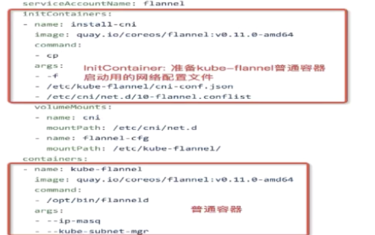
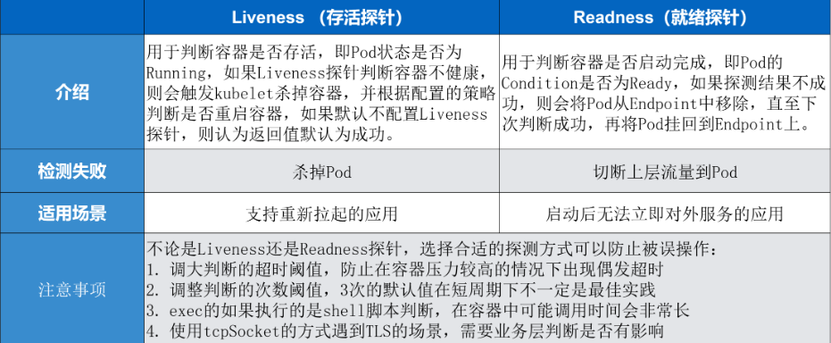
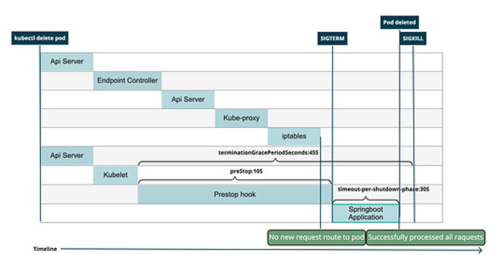

* Pod启动时是Pending状态，如果至少有一个主要容器启动成功，就会变为Running状态，并且最终可能会进入Succeeded或者Failed状态（如果Pod中有任意一个容器Terminated，那么进入Failed状态）
* 当Pod处于running状态时，kubelet可以重启Pod中的容器去处理一些错误（Kubernetes处理不同的容器状态，并决定下一步如何做让Pod再次健康）
* Pod在它的生命周期中只会被调度一次，一旦Pod被调度到某个Node上，Pod会在这个Node上不断运行直到Pod stop或者terminated


## 1. Pod生命周期

* Pod被created，分配一个唯一ID（UID），并调度到一个Node上，直到Pod delete或者termination
* 如果一个Node死亡，那么该Node上的Pod在Node变为NotReady 300s后，会调用其pod delete api进行删除
* 如果一个资源与Pod拥有相同的生命周期（例如volume），那么只有指定UID的Pod存在，该资源才会存在，如果指定UID的Pod死亡，那么即使通过控制器启动了一个相同的Pod，相关的资源也仍然被删除掉，然后创建一个新的资源绑定给新的Pod

## 2. Pod phase

* Pod的status属性是一个PodStatus对象，PodStatus对象中有一个phase属性

* phase属性有下面这些
  
  * Pending：Pod中的容器没有准备好（该阶段包含了Pod等待调度 和 从网络下载镜像）
  * Running：Pod调度到Node上，Pod中所有的容器都已经被create，并且至少有一个容器仍然running或者正在start/restart
  * Succeeded：Pod中所有的容器都成功terminated，并且不会再重启
  * Failed：Pod中所有的容器都已经terminated，并且至少有一个容器terminated失败（容器以非0状态退出，或者被系统强行终止）
  * Unknown：Pod的状态无法被获取

* 如果一个Node NotReady，那么该Node上所有的Pod的phase都会被标记为Failed

## 3. 容器state

* 每个容器都有一个state字段来代表容器状态
* state属性有下面这些
  * Waiting：容器正在执行一些启动前的操作（例如：拉取镜像，使用secret数据）
  * Running：容器正在运行（如果有postStart，那么postStart已经执行完毕）
  * Terminated：容器由于运行完成or某种原因失败（如果容器配置了preStop hook，那么preStop hook会在容器进入Terminated前执行）

## 4. restart policy

* Pod的spec下可以配置restartPolicy字段——Always，OnFailure，Never
* Pod中的所有容器共享Pod的restartPolicy
  * Always：当容器失效时，kubelet自动重启该容器
  * OnFailure：容器终止运行并且退出码不为0时，kubelet自动重启
  * Never：从不重启
* 一旦Pod中的容器退出，那么kubelet会以back-off delay重启容器(10s,20s,40s......)

## 5. Pod Conditions

* Pod的status属性是一个PodStatus对象，PodStatus对象中拥有一个PodCondition数组
* 类型
  * PodScheduled：Pod已经被调度到一个node上
  * ContainersReady：Pod中的所有容器都已经ready
  * Initialized：所有的初始化容器都已经完成
  * Ready：Pod可以处理正常处理请求，被加入到对应Service后提供服务

```java
public class PodCondition{
    private String type; //PodScheduled,ContainersReady,Initialized,Ready
    private String status; //表明该Condition是否适用——True,False,Unknown
    private LocalDateTime lastProbeTime; //Pod最后一次探测的时间
    private LocalDateTime lastTransitionTime; //Pod最后一次从一种状态转换到另一种状态的时间(最后一次status transition的时间)
    private String reason; //最后一次status transition的原因
    private String message;//关于最后一次status transition的信息
}
```

## 6. Pod就绪

* 我们可以通过spec.readinessGates.conditionType为Pod就绪添加新的PodCondition类型

```yaml
kind: Pod
spec: 
  readinessGates:
    - conditionType: "www.example.com/feature-1"
status:
  conditions:
    - type: Ready
      status: "False"
      lastProbeTime: null
      lastTransitionTime: 2018-01-01T00:00:00Z
    - type: "www.example.com/feature-1"  #额外的PodCondition
      status: "False"
      lastProbeTime: null
      lastTransitionTime: 2018-01-01T00:00:00Z
```

* 如果我们使用了自定义的PodCondition，那么只有当下面两个条件都满足时，Pod在会被判定为**Ready**
  1. Pod中所有容器都是Ready
  2. 在readinessGates中添加的自定义的PodCondition都是True
* 如果Pod中所有容器都是Ready，但是至少有一个自定义的PodCondition是missing或者False，那么Pod会被设置为 **ContainersReady**

## 7. init container

* InitContainer比普通Container先启动，直到所有的InitContainer都成功运行后，普通Container才会启动
* InitContainer是按顺序逐个启动，普通Container是一起启动
* InitContainer执行成功后就退出结束，普通Container可能一直存在
* InitContainer主要是为普通Container服务，在普通Container启动前做一些初始化工作，或者做一下check



## 8. 容器探针

* probe是kubelet对容器执行的定期诊断（kubelet在容器内执行代码or向容器发出一个网络请求）

* probe探测机制分为4种
  
  * exec——kubelet在容器内执行命令，如果命令退出的返回码是0，则诊断成功
  * grpc——使用gRPC执行一个远程调用，目标容器应该实现gRPC健康检查，如果响应状态是SERVING，那么诊断成功
  * httpGet——对容器的IP地址上指定的端口和路径执行HTTP Get请求，如果响应的状态码>=200 and <400，那么诊断成功
  * tcpSocket——对容器的IP地址上指定端口进行TCP检查，如果能够建立TCP连接，那么诊断成功
  
  ```yaml
  apiVersion: v1
  kind: Pod
  metadata:
    labels:
      test: liveness
  spec:
    containers:
    - name: liveness
      image: nginx
      livenessProbe:
        httpGet:
          path: /health #URL路径
          host: 127.0.0.1 #主机IP
          scheme: HTTP #协议，http/https
          port: 8080
          httpHeaders:
          - name: Custom-Header
            value: Awesome
          initialDelaySeconds: 3 #Pod启动后延迟多久进行一次检查
          periodSeconds: 3       #检测的时间间隔
          timeoutSeconds: 10     #检测的超时时间，在超时时间之内没有检测成功，认为失败
          successThreshold: 3    #连续探测成功多少次才认为成功(默认值为1)
          failureThreshold: 3    #探测失败的重试次数(默认值为3)，一个健康的状态连续探测3次失败，那么判断Pod处于失败状态
  ```
  
  ```yaml
  apiVersion: v1
  kind: Pod
  metadata: 
    labels:
      test: liveness
  spec:
    containers:
    - name: liveness
      image: nginx
      livenessProbe: #存活性探测
        exec:
          command:
          - cat
          - /home/work/spring.log
          initialDelaySeconds: 5
          periodSeconds: 5
  #通过cat一个具体的文件来判断当前Liveness Probe状态
  ```
  
  ```yml
    livenessProbe:
      tcpSocket:
        port: 8080
  ```

* probe探测结果
  
  * Success
  * Failure
  * Unknown

* 探测类型
  
  1. **livenessProbe**
     
     判断容器是否存活，如果失败了，那么kubelet会杀死容器，并且根据容器的重启策略重启容器，如果容器没有提供liveness probe，那么默认是Success（用于让kubelet知道什么时候重启重启）
     
     * 如果livenessProbe探测失败，那么k8s会根据设定的`restartPolicy`进行重启
  
  2. **redinessProbe**
     
     判断容器是否可以响应请求，如果readiness probe失败了，那么该Pod的IP会从Service endpoints后移除，在初始延迟前，默认为Failure，如果没有提供readinessProbe，那么默认为Success（用于知道容器什么时候可以处理请求，接受外部流量）
  
  3. **startupProbe**
     
     判断容器中的应用是否启动，如果提供了startupProbe，那么其他所有的探测都会被禁用，直到startupProbe成功，如果startupProbe失败，那么kubelet会杀死容器，然后容器根据自己的restart policy重启，如果容器没有提供startupProbe，那么默认为Success（用于知道什么时候容器中的应用已经启动了）
     
     startupProbe对于需要很长启动时间的容器非常游泳



## 9. Pod销毁

* Pod是集群节点上运行的进程，我们希望它再不被需要时优雅关闭，而不是被强制删除

* 当我们请求删除一个Pod时，会给Pod一个宽限时间，kubelet会尝试**优雅关闭Pod**，如果超过了宽限时间还没有关闭，那么才会进行强制删除
1. 使用kubectl请求删除一个Pod，默认宽限时间30s（terminationGracePeriodSeconds指定，可以调整）

2. **标记阶段**——Api-Server会将Pod打上删除标记，Pod Api Object仍然存在

3. **真正删除阶段**——运行Pod的Node上的kubelet发现Pod被打上了删除标记，那么kubelet开始**优雅关闭Pod**
   
   * 如果Pod中的容器有preStop hook，那么执行hook，如果超过了宽限时间还没执行完，那么，那么kubelet会请求将宽限时间延长2s
   
   * kubelet让container runtime向每个容器内的PID=1的进程发送**SIGTERM信号**，进程收到TERM信号后开始优雅关闭
   
   * 在kubelet优雅关闭Pod的同时，control plane将 Pod 从 service 的 endpoint 列表中摘除掉，新的流量不再转发到该 Pod
     
     （网络规则更新与Pod删除是同时进行的，无法保证网络规则更新在Pod删除前完成）

4. **真正删除阶段**——如果宽限时间超时，那么kubelet会强制关闭pod——让container runtime向容器中仍在运行的进程发送**SIGKILL信号**

5. **真正删除阶段**——Api Server收到kubelet Pod终止确认后，Api Server删除Pod Api Object，**真正完成Pod的删除**



### 强制销毁Pod

* 如果想在发出删除一个Pod的请求后，立刻完成Pod的删除，可以将terminationGracePeriodSeconds=0

* 这样一旦发出删除Pod请求，就会立刻从Api Server中删除Pod Api Object，并且会让kubelet立刻开始清除Pod，不过kubelet仍然会给Pod一个短暂的宽限时间

## 10. Pod声明周期排查故障

### 10.1 pod处于pending

pending 表示调度器没有进行介入。此时可以通过 kubectl describe pod 来查看相应的事件，如果由于资源或者说端口占用，或者是由于 node selector 造成 pod 无法调度的时候，可以在相应的事件里面看到相应的结果

### 10.2 pod处于waiting

pod 的 states 处在 waiting 的时候，通常表示说**这个 pod 的镜像没有正常拉取**，原因可能是由于这个镜像是私有镜像，但是没有配置 Pod secret；那第二种是说可能由于这个镜像地址是不存在的，造成这个镜像拉取不下来；还有一个是说这个镜像可能是一个公网的镜像，造成镜像的拉取失败

### 10.3 pod处于crashing

pod 已经被调度完成了，但是启动失败，那这个时候通常要关注的应该是这个应用自身的一个状态，并不是说配置是否正确、权限是否正确，此时需要查看的应该是 pod 的具体日志

### 10.4 pod处于running但没有正常工作

那此时比较常见的一个点就可能是由于一些非常细碎的配置，类似像有一些字段可能拼写错误，造成了 yaml 下发下去了，但是有一段没有正常地生效，从而使得这个 pod 处在 running 的状态没有对外服务，那此时可以通过 apply-validate-f pod.yaml 的方式来进行判断当前 yaml 是否是正常的，如果 yaml 没有问题，那么接下来可能要诊断配置的端口是否是正常的，以及 Liveness 或 Readiness 是否已经配置正确
